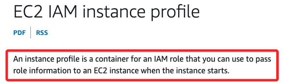

# IAM Instance Profile

_IAM Instance Profile 是 EC2 與 IAM 角色之間的橋樑；以下若使用 `90629` 操作可能會遇到 IAM 權限問題，所以使用 `90630`_

<br>

## 說明

1. 依據官網說明，`IAM Instance Profile` 是一個包含 IAM 角色的 `容器`，當 EC2 實例啟動時，可以使用這個設定檔將 IAM 角色附加到實例上，讓實例繼承角色的權限來執行受權的 AWS API 操作，如訪問 S3 或 DynamoDB 等資源，這使得應用程式能夠透過角色授權的臨時安全憑證執行相關操作。

    

<br>

2. 特別注意，`Instance Profile` 是無法直接在 IAM 主控台中進行查看與管理，但可以透過 IAM Role 頁面查看與哪些實例設定檔關聯的角色，當啟動或修改 EC2 實例時，可以選擇 IAM 角色，系統會自動建立或關聯到相應的 `Instance Profile`。此外，透過 AWS 管理控制台中的 IAM 角色頁面，還可以檢視角色的使用情況，包括該角色與哪些 EC2 實例關聯。

<br>

## MALZ & SALZ

_在官方文件中，`MALZ` 和 `SALZ` 是 AWS Managed Services (AMS) 中的兩種不同的架構_

<br>

1. `MALZ` 全名 `Multi-account Landing Zone`，這種架構提供跨多個帳戶部署工作負載的共享服務，例如訪問控制、端點安全和網絡管理；這種多帳戶架構通常適用於需要多個隔離環境的情況，例如大型組織中的不同部門。

<br>

2. `SALZ` 全名 `Single-account Landing Zone`，這是單一帳戶架構，其中所有的共享服務（如訪問控制、網絡安全等）和工作負載都部署在同一個帳戶中。這種架構適用於需要高度隔離的工作負載，但其 AWS 成本相對較高。

<br>

3. 兩種架構各有其應用場景，MALZ 更適合於需要多帳戶管理和隔離的情況，而 SALZ 則適用於單一帳戶中對安全性和隔離性要求較高的工作負載。

<br>

## 啟動環境

1. 使用 `90630` 的 `Learner Lab`；搜尋並進入 `SageMaker`。

    

<br>

2. 點擊左側 `Notebooks`。

    

<br>

3. 點擊 `Create notebook instance`。

    

<br>

4. 命名 `Mynotebook`，其餘使用預設。

    

<br>

5. 保持其他設置為預設值，點擊 `Create notebook instance`。

    

<br>

6. 建立後，Notebook 實例的狀態會先顯示為灰色的 `Pending`，當狀態變為綠色的 `InService` 時，便可繼續進行下一步，這個過程需要一點時間。

    

<br>

7. 當 Notebook 實例變為 `InService` 後可點擊 `Open JupyterLab`；其中 Jupyter 就是指傳統的 Jupyter Notebook，而 JupyterLab 則是進階版，提供更多功能，適用於複雜的工作流程。

    

<br>

8. 點擊開啟一個腳本。

    

<br>

## 使用 boto3

1. 查詢 IAM Instance Profile，以下程式碼會列出所有 IAM Instance Profiles 及其關聯的角色。

    ```python
    import boto3

    # 建立 IAM 客戶端
    iam = boto3.client('iam')

    # 查詢所有的 Instance Profiles
    response = iam.list_instance_profiles()

    # 列出所有的 Instance Profiles
    for profile in response['InstanceProfiles']:
        print(f"Profile Name: {profile['InstanceProfileName']}")
        print(f"Role(s): {[role['RoleName'] for role in profile['Roles']]}")
        print(f"Instance Profile ARN: {profile['Arn']}")
        print('---')
    ```

<br>

2. 輸出結果如下，顯示了兩個 `Profile` 的內容；第一個 `EMR_EC2_DefaultRole`  Profile 綁定了一個同名角色 `EMR_EC2_DefaultRole`，為 EMR 提供 EC2 所需的權限來操作 S3、CloudWatch 和其他 AWS 服務，而 `ARN` 就是 Profile 的唯一識別符，可將 IAM 角色與 EC2 實例關聯起來，讓這些實例可以使用角色中的權限；另一個 Profile 是 `LabInstanceProfile`，綁定的角色為 `LabRole`， 其具體權限取決於與它關聯的策略，這些策略可能允許 EC2 實例或其他資源訪問特定的 AWS 服務，如 S3、DynamoDB、SageMaker 等；透過觀察可知 Instance Profile 使 AWS 實例可獲取需要的權限來執行特定操作，而無需硬編碼 AWS 憑證，這提高了安全性和靈活性。

    

<br>

## 使用 AWS CLI

_查看具體內容_

<br>

1. 使用指令列出所有的 IAM Instance Profiles，並顯示每個配置文件的詳細信息。

    ```bash
    aws iam list-instance-profiles
    ```

<br>

2. 可加入參數 `--instance-profile-name` 查詢特定的 `Instance Profile`。

    ```bash
    aws iam get-instance-profile --instance-profile-name <InstanceProfileName>
    ```

<br>

___

_END_