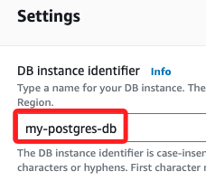

# PostgreSQL 實作

_以下說明在 RDS 上建立 PostgreSQL 引擎，以及進行必要的互動操作，並使用 Python 腳本模擬數據生成_

<br>

## 建立 PostgreSQL 引擎

1. 在主控台搜尋並進入 `RDS`。

    

<br>

2. 建立資料庫，點擊 Create database。

    

<br>

3. Engine type 選擇 PostgreSQL。

    

<br>

4. Version 選擇最新的 `PostgreSQL 16.4-R1`。

    

<br>

5. 在下方的 `Enable RDS Extended Support` 部分不要勾選，這是一個付費服務，勾選後表示當使用的資料庫主版本已經超過了 RDS 標準支援的終止日期，同意在使用這個過期版本時支付額外的費用，具體的支援終止日期可在 AWS 文件中查閱。

    

<br>

6. Templates 選擇 Free tier，也就是免費的樣板。

    

<br>

7. Settings 部分，首先任意命名如 `my-postgres-db`；特別注意，這並非資料庫名稱，而是 _資料庫實例的識別名稱_，具體來說，資料庫實例建立後，內部僅有一個預設的資料庫 `postgres`，這部分建立完成後會再作說明。

    

<br>

8. Master username 輸入管理員名稱，預設是 `postgres`，這裡使用自己慣用的名稱如 `sam6238`。

    

<br>

9. 密碼設定要輸入兩次，並記住這個密碼。

    

<br>

## 配置資料庫實例

1. 在 DB instance class 中，選擇 `db.t3.micro`，這是免費的。

    

<br>

2. Storage 部分，type 選擇標準儲存類型（`General Purpose SSD(gp2)`），Allocated storage 使用預設值 `20` GiB。

    

<br>

3. 在 `autoscalling` 部分，這裡只是簡單示範，可取消勾選以節省資源。

    

<br>

## 配置連接

1. 在計算資源部分，若有存在的 EC2 實例，可選擇 `Connect to an EC2 compute resource`；這裡選擇 `Don't connect to an EC2 compute resource`，之後再進行手動設置。

    

<br>

2. VPC 選擇預設即可。

    

<br>

3. Public access 要選擇 `Yes`，這樣便會允許來自外部的訪問。

    

<br>

4. 在 VPC 安全群組部分選擇現有的群組即可，但要特別注意，該群組必須允許 PostgreSQL 的預設端口 `5432` 入站規則，這在後續會進行檢查。

    

<br>

5. 可另外開啟一個瀏覽器頁籤並進入 EC2 主控台，在左側點擊 `Security Groups` 進入，並點擊 `default` 安全群組的 ID 進入設定畫面，

    

<br>

6. 添加進站規則，記得點擊右下角 `Save relus`。

    

<br>

7. Availability zone 選擇 `No preference`，也就是讓 AWS 自動選擇一個可用區來部署資料庫實例。

    

<br>

## 配置資料庫選項

1. Database authentication 選擇使用密碼驗證 `Password authentication`。

    

<br>

2. 在其他設置使用預設即可中，點擊 Create database 進行建立資料庫。

    

<br>

3. 資料庫的建立需要幾分鐘，過程中會在 `Status` 切換當前狀態。

    

<br>

4. 完成後的狀態顯示為 `Backing-up`，表示資料庫正在備份過程中，但不影響連接或運作資料庫；整個完成會顯示 `Available`，點擊進入查看。

    

<br>

5. 需要幾項資訊，其一是 `Endpoint`。

    

<br>

## 關於資料庫名稱

1. 點擊進入資料庫後，可切換到 `Configuration` 頁籤。

    

<br>

2. 其中 `DB name` 顯示為 `-`；特別注意，在資料庫實例設定過程中，並無指定預設資料庫的步驟，因為 RDS 建立的是一個資料庫實例，而不是具體的資料庫；另外，RDS 會自動建立一個預設的資料庫 postgres，但不會顯示具體的資料庫名稱，所以在後續步驟中，可直接使用這個資料庫進行連接和操作。

    

<br>

## 連線資料庫 

_使用 Python 腳本模擬數據並與 PostgreSQL 進行互動_

<br>

1. 在本地開發環境或 EC2 實例上，確保安裝了 `psycopg2`，使用以下指令安裝。

    ```bash
    pip install psycopg2-binary
    ```

<br>

2. 連接到 PostgreSQL。

    ```python
    import psycopg2
    from psycopg2 import sql
    import random

    # 使用資料庫連接信息
    db_host = 'my-postgres-db.cacwqxy1xikj.us-east-1.rds.amazonaws.com'
    # 先連接到預設的 postgres 資料庫
    db_name = 'postgres'
    db_user = '<填入帳號>'
    db_password = '<填入密碼>'
    db_port = 5432

    # 連接到 PostgreSQL 預設資料庫
    try:
        conn = psycopg2.connect(
            host=db_host,
            database=db_name,
            user=db_user,
            password=db_password,
            port=db_port
        )
        # 關閉自動交易模式以允許執行 CREATE DATABASE
        conn.autocommit = True
        print("成功連接到 PostgreSQL 預設資料庫")
    except Exception as e:
        print(f"連接失敗: {e}")
        # 如果連接失敗，確保 conn 設置為 None
        conn = None

    # 如果連接成功，先建立新的資料庫
    if conn is not None:
        cursor = conn.cursor()
        
        # 建立新的資料庫 my_postgres_db
        try:
            cursor.execute('CREATE DATABASE my_postgres_db;')
            print("成功建立資料庫 my_postgres_db")
        except Exception as e:
            print(f"資料庫建立失敗: {e}")
        
        # 關閉游標和連接
        cursor.close()
        conn.close()

    # 連接到新建立的資料庫 my_postgres_db
    db_name = 'my_postgres_db'

    try:
        conn = psycopg2.connect(
            host=db_host,
            database=db_name,
            user=db_user,
            password=db_password,
            port=db_port
        )
        print(f"成功連接到新建立的資料庫 {db_name}")
    except Exception as e:
        print(f"連接失敗: {e}")
        conn = None

    # 如果連接成功，繼續操作
    if conn is not None:
        # 建立游標來執行 SQL 指令
        cursor = conn.cursor()

        # 建立一個表格
        cursor.execute('''
            CREATE TABLE IF NOT EXISTS employees (
                id SERIAL PRIMARY KEY,
                name VARCHAR(100),
                age INT,
                department VARCHAR(50)
            );
        ''')
        conn.commit()

        # 使用隨機數據插入模擬數據
        names = ["Alice", "Bob", "Charlie", "David", "Eve"]
        departments = ["HR", "IT", "Finance", "Marketing", "Sales"]

        for _ in range(10):
            name = random.choice(names)
            age = random.randint(22, 60)
            department = random.choice(departments)
            cursor.execute('''
                INSERT INTO employees (name, age, department)
                VALUES (%s, %s, %s);
            ''', (name, age, department))

        conn.commit()

        # 查詢並打印表中的數據
        cursor.execute('SELECT * FROM employees;')
        rows = cursor.fetchall()
        for row in rows:
            print(row)

        # 關閉游標和連接
        cursor.close()
        conn.close()
    ```

<br>

## 終端機指令

1. 更新。

    ```bash
    brew update
    ```

<br>

2. 安裝 `psql` 工具，特別注意，這裡要適配 AWS 中的版本。

    ```bash
    brew install postgresql@16
    ```

<br>

3. 編輯環境參數。

    ```bash
    code ~/.zshrc
    ```

<br>

4. 更新 PATH。

    ```bash
    export PATH="/opt/homebrew/opt/postgresql@16/bin:$PATH"
    ```

<br>

5. 套用更新。

    ```bash
    source ~/.zshrc
    ```

<br>

6. 重啟終端，查詢當前指令路徑。

    ```bash
    which psql
    ```

<br>

7. 若要停止服務，例如停止 `15`。

    ```bash
    brew services stop postgresql@16 
    ```

<br>

8. 重啟服務。

    ```bash
    brew services restart postgresql@16
    ```

<br>

9. 使用 `psql` 連接資料庫；參數 `-h` 指定資料庫的端點、`-U` 指定資料庫的用戶名、`-d` 指定資料庫名稱、`-p` 指定端口。

    ```bash
    psql -h my-postgres-db.cacwqxy1xikj.us-east-1.rds.amazonaws.com -U sam6238 -d my_postgres_db -p 5432
    ```

<br>

10. 輸入密碼後便可連接成功。

    

<br>

## 其他常用 `psql` 指令

1. 查看所有表。

    ```sql
    \dt
    ```

    

<br>

2. 查看資料庫中的數據。

    ```sql
    SELECT * FROM employees;
    ```

    

<br>

3. 退出 `psql`，會退回到終端機指令中。

    ```sql
    \q
    ```

    

<br>

## 刪除建立的資料庫

1. 連接到預設的 `postgres` 資料庫，因為無法刪除當前正在使用的資料庫。

    ```bash
    psql -h my-postgres-db.cacwqxy1xikj.us-east-1.rds.amazonaws.com -U sam6238 -d postgres -p 5432
    ```

    

<br>

2. 連接成功，可使用 `DROP DATABASE` 指令來刪除您建立的資料庫。

    ```sql
    DROP DATABASE my_postgres_db;
    ```

    

<br>

## 使用腳本查詢

1. 使用 psycopg2 庫來查詢資料庫列表。如果刪除成功，該資料庫將不會出現在查詢結果中。

    ```python
    import psycopg2
    from psycopg2 import sql

    # 使用資料庫連接信息
    db_host = 'my-postgres-db.cacwqxy1xikj.us-east-1.rds.amazonaws.com'
    # 連接到預設的 postgres 資料庫
    db_name = 'postgres'
    db_user = '<填入帳號>'
    db_password = '<填入密碼>'
    db_port = 5432

    # 連接到 PostgreSQL 資料庫
    try:
        conn = psycopg2.connect(
            host=db_host,
            database=db_name,
            user=db_user,
            password=db_password,
            port=db_port
        )
        conn.autocommit = True
        print("成功連接到 PostgreSQL 資料庫")
    except Exception as e:
        print(f"連接失敗: {e}")
        # 如果連接失敗，確保 conn 設置為 None
        conn = None

    # 如果連接成功，查詢所有資料庫
    if conn is not None:
        cursor = conn.cursor()

        try:
            # 查詢資料庫列表
            cursor.execute("SELECT datname FROM pg_database;")
            databases = cursor.fetchall()

            print("當前資料庫列表：")
            for db in databases:
                print(db[0])

            # 確認資料庫是否存在
            database_to_check = 'my_postgres_db'
            if (database_to_check,) not in databases:
                print(f"資料庫 '{database_to_check}' 已不存在。")
            else:
                print(f"資料庫 '{database_to_check}' 仍然存在。")
        
        except Exception as e:
            print(f"查詢失敗: {e}")
        
        # 關閉游標和連接
        cursor.close()
        conn.close()
    ```

    

<br>

___

_END_