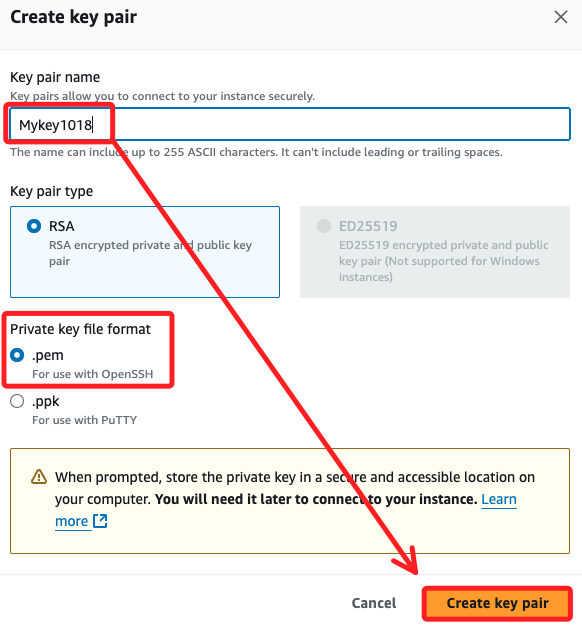
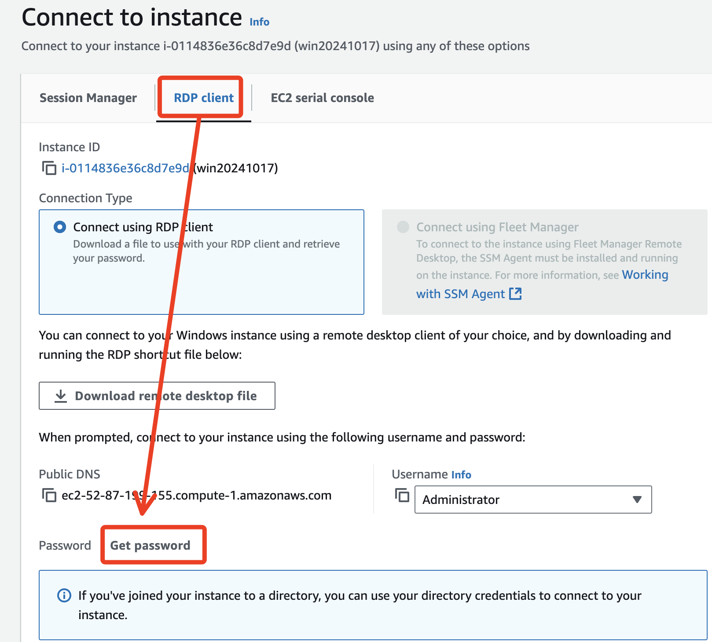
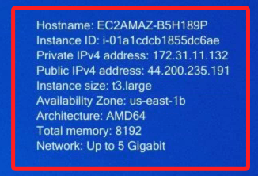
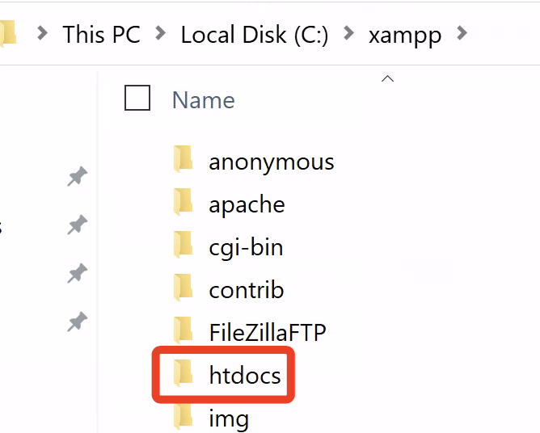

# 建立網站

<br>

## 建立 EC2 實例

1. 使用 Learner Lab

<br>

2. 進入 EC2

<br>

3. 建立一個 Win 的 Instance；都使用基本的配置

    

<br>

4. 建立 key pair

    

<br>

5. 安全群組設定全開。

    

<br>

## 使用 AWS CLI 連線

1. 確認當前用戶。

    ```bash
    aws sts get-caller-identity
    ```

<br>

2. 返回下的結果，顯示角色 ARN，角色名稱就是 `voclabs`；特別注意，其中 `user2069478` 就是當前 AWS 會話中的一個具體用戶身份，附加在 voclabs 角色之下，用來追蹤和標識用戶的操作。

    ```json
    {
        "UserId": "AROARVNR2UBM6YZZVY4SF:user2069478=_________",
        "Account": "114726445145",
        "Arn": "arn:aws:sts::114726445145:assumed-role/voclabs/user2069478=_________"
    }
    ```

<br>

3. 列出角色的附加權限

    ```bash
    aws iam list-attached-role-policies --role-name voclabs
    ```

<br>

4. 檢查該角色的內嵌策略

    ```bash
    aws iam list-role-policies --role-name voclabs
    ```

<br>

## 取得帳號密碼

1. 連線。

    

<br>

2. 切換到遠端桌面，點擊取得密碼。

    

<br>

3. 選取 `*.pem` 上傳，並點擊 `Decrypt password` 將 `Private Key` 解密成密碼。

    

<br>

4. 這組密碼是可讀的。

    

<br>

##

1. 下載遠端桌面

    

<br>

2. 連線。

    

<br>

3. 輸入密碼之後確認。

    

<br>

4. 是。

    

<br>

5. 完成連線。

    

<br>

6. 點擊允許之後會顯示相關資訊。

    

<br>

## 啟動後

1. 安裝 `XAMPP`

    

<br>

2. 安裝好之後，可瀏覽 C 槽中的目錄 `htdocs`，這就是用來存放網頁的目錄。



3. 編輯任意 index.html 文本

4. 進入 XAMPP，啟動 Apach

## 嘗試使用 CLI 連線 Win 主機

1. 查詢 instance ID
```bash
i-0114836e36c8d7e9d
```

2. 查詢公共IP

```bash
52.87.199.155
```

## Win

1. 預設防火牆是關閉的


2. 全部打開


3. XAMPP 預設瀏覽 index.php，所以更名為 index1.php

4. xx

```bash
aws ec2 authorize-security-group-ingress --group-id sg-0ec93dbaf10be1cb7 --protocol tcp --port 445 --cidr 52.87.199.155/32
```

5. 