# 建立 Windows Server

_使用 Learner Lab 資源建立一個 Windows Server 的 EC2 實例，將在後續步驟中用於作為網站伺服器_

<br>

## 建立 EC2 實例

_進入 AWS 主控台_

<br>

1. 進入 EC2。

    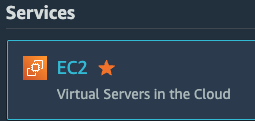

<br>

2. 點擊 `Launch instance`，任意命名如 `MyInstance1018`。

    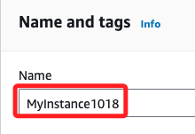

<br>

3. OS 選擇 `Windows`，`Amazon Machine Image` 選用 `Microsoft Windows Server 2022 Base`。

    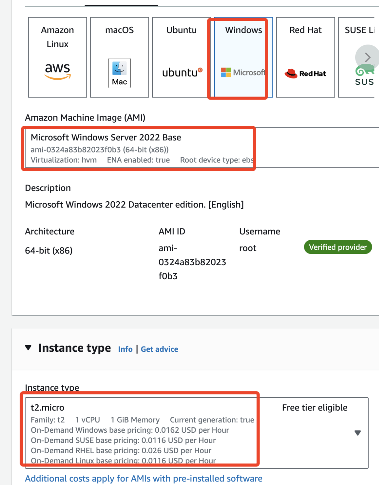

<br>

4. 在 Instance type 部分，選擇 `t2.micro` 即可，這裡為了提升效能，所以選擇 `t3.large`。

    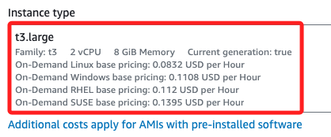

<br>

5. 點擊 `Create new key pair` 建立新的 Key pair；命名 `MyKey1018`，其餘採用預設；點擊右下角 `Create key pair` 完成建立，此時會自動下載同名密鑰文件到本地電腦。

    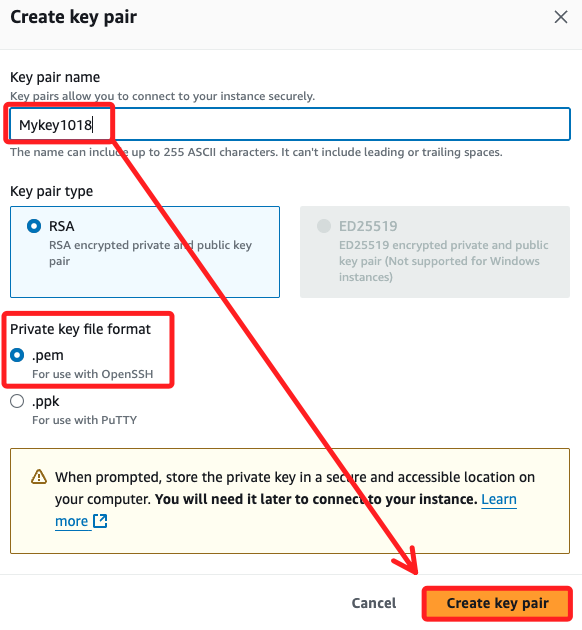

<br>

6. `Firewall (security groups)` 的設定全部點選，也就是開啟 HTTPS 及 HTTP 的進站規則。

    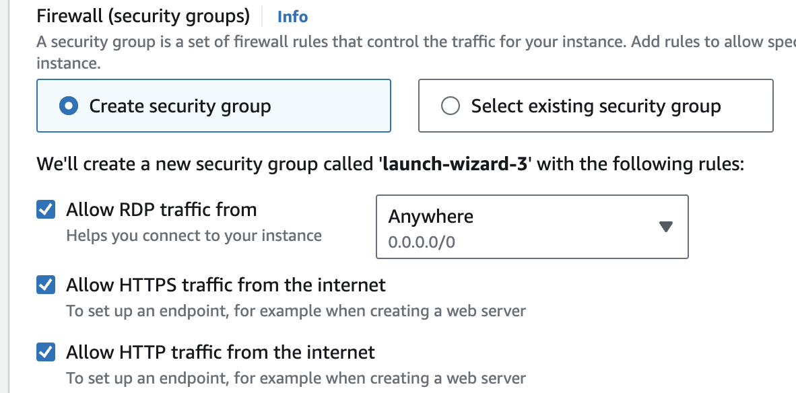

<br>

## 設置 Advanced details

_以下列舉 User data 的設定值，在這裡僅安裝 Python。_

<br>

1. 展開 `Advanced details` 並滑動到該區塊最下方會看到 `User data`，可用於自動化伺服器配置，節省手動安裝和設定的時間；特別注意，`User data` 預設有 `16KB` 的大小限制，並且只會在實例第一次啟動時執行，如果想讓指令每次重啟時都執行，需要將腳本放入 `C:\ProgramData\Amazon\EC2-Windows\Launch\Scripts\.`。

    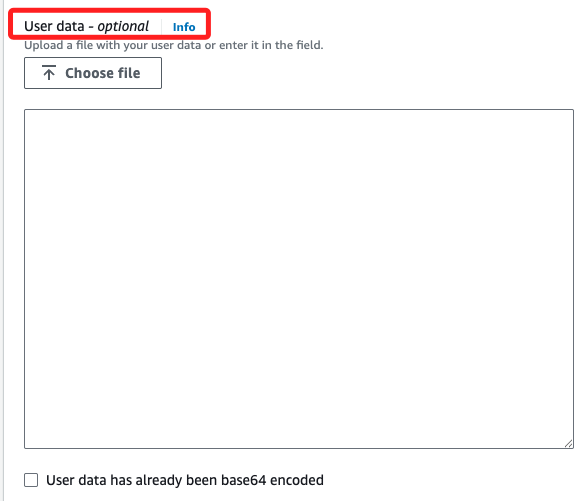

<br>

2. 這裡僅先嘗試安裝指定版本的 Python，安裝後將 `Python` 加入環境變數路徑，最後刪除安裝檔；在 `Powershell` 中使用 `Invoke-WebRequest` 下載 XAMPP，相關指引與規範可參考 [官網](https://docs.aws.amazon.com/AWSEC2/latest/UserGuide/user-data.html?icmpid=docs_ec2_console#user-data-powershell)。

    ```bash
    <powershell>
    # 下載並安裝 Python
    Invoke-WebRequest -Uri "https://www.python.org/ftp/python/3.10.0/python-3.10.0-amd64.exe" -OutFile "C:\python-installer.exe"
    Start-Process -FilePath "C:\python-installer.exe" -ArgumentList "/quiet InstallAllUsers=1 PrependPath=1" -Wait
    Remove-Item -Path "C:\python-installer.exe"
    </powershell>
    ```

<br>

## 補充說明 User Data 的設置

_對於其他可透過 `PowerShell` 指令預先安裝的項目做簡單說明；特別說明，這些指令在實例啟動後皆可在 `Powershell` 中運行，假如使用 AWS 圖形化介面建立實例，也可以寫在 Userdata 中。_

<br>

1. 在實例啟動時自動更新。

    ```bash
    <powershell>
    Install-WindowsUpdate -AcceptAll -AutoReboot
    </powershell>
    ```

<br>

2. 安裝 `Google Chrome`。 

    ```bash
    <powershell>
    Invoke-WebRequest -Uri "https://dl.google.com/chrome/install/375.126/chrome_installer.exe" -OutFile "C:\chrome_installer.exe"
    Start-Process -FilePath "C:\chrome_installer.exe" -ArgumentList "/silent /install" -Wait
    Remove-Item -Path "C:\chrome_installer.exe"
    </powershell>
    ```

<br>

3. 安裝 `XAMPP`，設定為 `靜默模式`，安裝完畢刪除安裝檔案，然後使用 `Start-Process` 指令批次啟動 `XAMPP` 管理的 `Apache` 和 `MySQL` 服務。

    ```bash
    <powershell>
    Invoke-WebRequest -Uri "https://sourceforge.net/projects/xampp/files/XAMPP%20Windows/8.2.12/xampp-windows-x64-8.2.12-0-VS16-installer.exe/download" -OutFile "C:\xampp-installer.exe"

    Start-Process -FilePath "C:\xampp-installer.exe" -ArgumentList "--mode unattended --unattendedmodeui none --prefix C:\xampp" -Wait

    Remove-Item -Path "C:\xampp-installer.exe"

    Start-Process -FilePath "C:\xampp\apache_start.bat" -Wait
    Start-Process -FilePath "C:\xampp\mysql_start.bat" -Wait
    </powershell>
    ```

<br>

4. 安裝 `IIS 網頁伺服器`。

    ```bash
    <powershell>
    Install-WindowsFeature -name Web-Server -IncludeManagementTools
    </powershell>
    ```

<br>

## 補充說明 Userdata 的 CMD 指令

1. 更新防火牆規則。

    ```bash
    <persist>
    rem 啟動 Apache 和 MySQL
    cd C:\xampp
    apache_start.bat
    mysql_start.bat

    rem 設定防火牆規則，允許 HTTP (80), HTTPS (443) 和 MySQL (3306) 的入站連接
    netsh advfirewall firewall add rule name="Allow HTTP" dir=in action=allow protocol=TCP localport=80
    netsh advfirewall firewall add rule name="Allow HTTPS" dir=in action=allow protocol=TCP localport=443
    netsh advfirewall firewall add rule name="Allow MySQL" dir=in action=allow protocol=TCP localport=3306

    </persist>
    ```

<br>

2. 指定腳本在每次啟動實例時都執行。

    ```bash
    <persist>true</persist>
    ```

<br>

## 補充說明 Userdata 其他規範

1. 若運行多項功能，只需要添加一次 `Section` 語句。

<br>

2. `Userdata` 腳本有預設的執行時間限制，如果腳本過長或過於複雜，某些命令可能無法完全執行。

<br>

## 建立並預覽指令

1. 點擊 `Launch instance` 之前，下方有個 `Preview code`，先點擊查看；右側會顯示指令預覽，這裡先做紀錄，之後再來透過指令重新建立一次。

    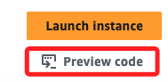

<br>

2. 包含了三個部分，分別是 `CreateSecurityGroup`、`AuthorizeSecurityGroupIngress`、`RunInstances`。

    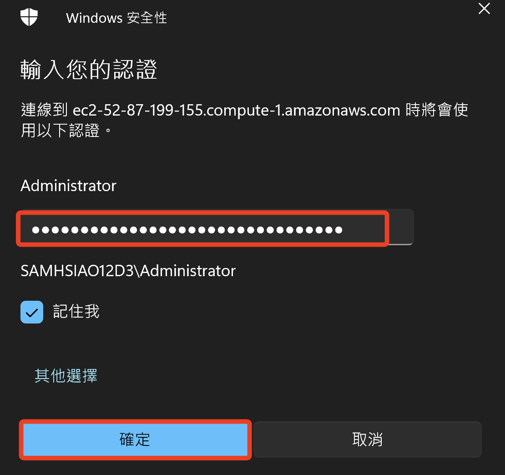

<br>

3. `CreateSecurityGroup` 區塊預設會建立名為 `launch-wizard-1` 的安全群組，並附加到指定的 `VPC`。

    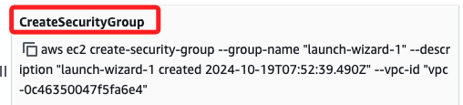

<br>

4. `AuthorizeSecurityGroupIngress` 會自動依據安全群組為 `ID` 為 `sg-preview-1` 的安全群組設置 `入口規則（Ingress Rules）`，也可稱為 `進站規則（Inbound Rules）`。

    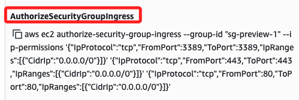

<br>

5. `RunInstances` 進行啟動 EC2 實例；這段指令很長，會依據各項設定自動生成。

    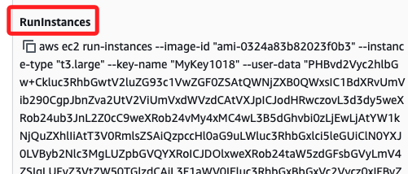

<br>

6. 點擊 `Download` 下載語法備用。

    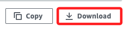

<br>

## 使用圖形化介面建立實例

1. 點擊 `Launch instance`。

    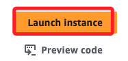

<br>

2. 沒特殊狀況就會顯示 `Success`，但這僅是完成設定，實例尚未完成啟動，回到 EC2 清單查看。

    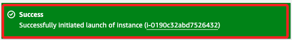

<br>

## 使用 CLI 建立實例

_使用相同的設置所下載的語法文件 `console-to-code.txt` 在本地的終端機中運行，並藉此比較相同設置卻出現的錯誤日誌；透過 CLI 建立實例時出現了錯誤，特別是在處理 User Data 部分。_

<br>

1. 首先建立安全群組並取得 ID，特別注意，假如是再次運行並沿用現有安全群組，可查詢安全群組 ID 即可。

<br>

2. 第二段語句是設定安全群組的入站規則，將 ID 填入範例語句中即可運行；同樣的，假如沿用現有安全群組，可視狀況進行設定。

<br>

3. 建立實例，這裡要將安全群組 ID 填入，假如需要再次建立，需對實例名稱重新定義；特別注意最後一個參數 `--count`，預設建立一個實例，假如要批次建立可在這填入數值。

<br>

4. 若希望輸出會自動顯示，不需要手動逐頁查看，可在指令尾端加上參數 `--no-paginate`，這指令會顯示所有輸出，且在執行完畢後自動返回命令行。

    ```bash
    --no-paginate
    ```

<br>

## 準備紀錄用文檔

_接下來會有一些資訊需要記錄備用，在一般正式的 Lab 中會建議使用 Cloud9 做紀錄，但這個 Lab 並未授權，請自行使用任意文件編輯器做紀錄。_

<br>

1. 建立文檔後，先貼上以下內容，這將用於建立終端機視窗的 `區域變數`；其中 `Username` 及 `Shared_Name_of_Drive_C` 已填入預設的內容 `Administrator`、`C_Drive`，若沿用則無需更改。

    ```bash
    # 第一部分：複製 AWS CLI 貼上，格式不重要，稍後會直接覆蓋
    [default]
    aws_access_key_id=
    aws_secret_access_key=
    aws_session_token=

    # 第二部分：在操作步驟中逐一複製
    Instance_ID=
    Public_IPv4_address=
    Security_groups=
    Username=Administrator
    Password=''
    Shared_Name_of_Drive_C=C_Drive

    # 第三部分：建立環境變數
    export AWS_ACCESS_KEY_ID=$aws_access_key_id
    export AWS_SECRET_ACCESS_KEY=$aws_secret_access_key
    export AWS_SESSION_TOKEN=$aws_session_token
    ```

<br>

2. 延續前一點，文件底部三行是終端機指令，用於建立環境變數提供 AWS CLI 及 AWS SDK 使用，在後續步驟複製後即可在終端機內貼上運行。

    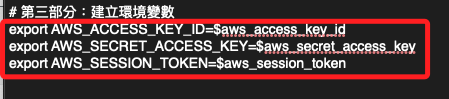

<br>

## 準備 AWS CLI 環境所需配置

_在等待實例初始化同時，可先進行 CLI 環境設置_

<br>

1. 回到 Lab 主頁面，點擊右上角的文字圖標 `! AWS Details`。

    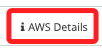

<br>

2. 在 `AWS CL` 尾端點擊 `Show` 展開內容。

    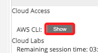

<br>

3. 複製展開後的內容，這是 AWS CLI 所需資訊，包含 ID、Key、Token；貼到前面步驟所建立的文檔中。

    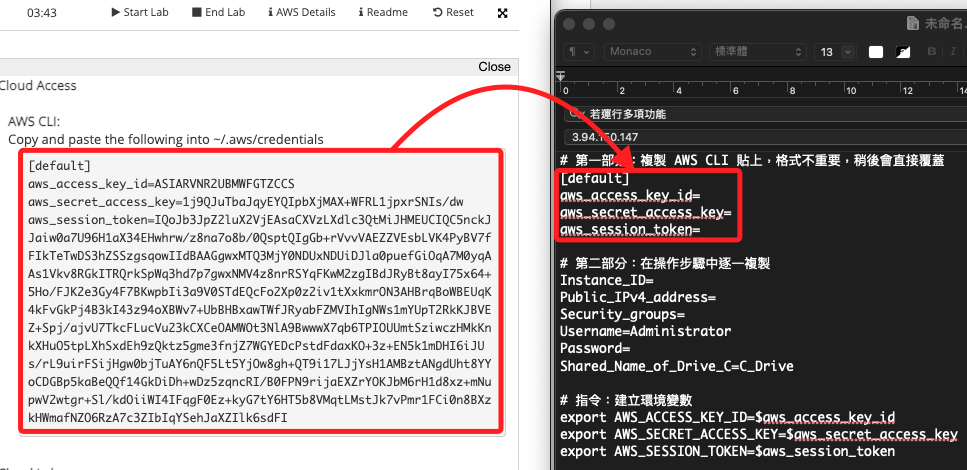

<br>

4. 直接覆蓋原本 `第一部分` 的內容即可，貼上時特別注意尾端不要添加多餘的空格或換行符號，因為後續將直接用於建立環境變數。

    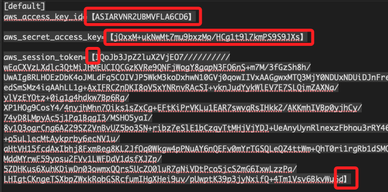

<br>

5. 先將第一部分指令從 `[default]` 以下進行複製並貼在終端機中。

    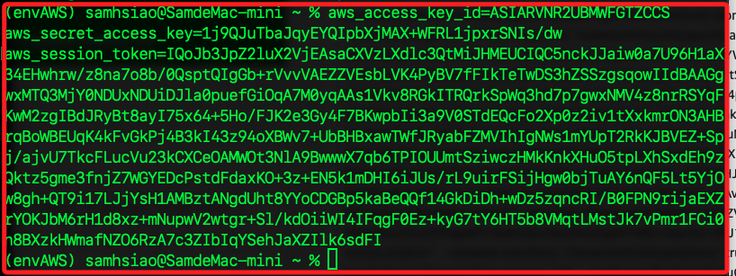

<br>

6. 接著複製第三部分在終端機中運行；這是透過 `export` 指令加上符號 `$` 來 `引用` 第一部分的 `區域變數` 進行環境變數設置；特別注意，因為暫時未使用 AWS SDK，所以不對其他變數進行設置，僅針對 CLI 中會使用到的這三個變數進行設置。

    ```bash
    export AWS_ACCESS_KEY_ID=$aws_access_key_id
    export AWS_SECRET_ACCESS_KEY=$aws_secret_access_key
    export AWS_SESSION_TOKEN=$aws_session_token
    ```

<br>

7. 特別說明 `變數或環境變數` 的生命週期，皆僅限於當前終端視窗，關閉視窗這些變數就會被刪除；在新的工作視窗若需要使用這些變數，必須重新執行以下區塊的指令。

    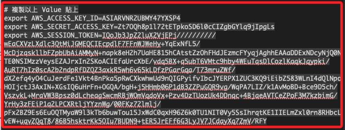

<br>

## 進行 AWS CLI 環境配置

_在 Lab 環境中可以省略這個步驟_

<br>

1. 特別說明，因為 `環境變數` 的優先權是在 `設定檔` 之前，而在 Lab 中 _一定要_ 透過環境變數設定 `Token` 進行授權，而 `TOKEN` 一但設定後必須與環境變數中的 `ID` 和 `KEY` 相對應才會生效；假如沒有找到對應的設定則會讀取 `~/.aws` 中的授權資訊，但是在 `~/.aws` 中無法設定 Token，所以在 Lab 環境是將無法這樣配置的。

    ```bash
    aws configure
    ```

    

<br>

2. 這些文檔的具體位置是在 `~/.aws` 中，此處暫不贅述。

    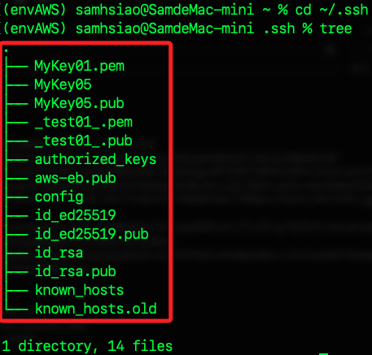

<br>

## 檢查 AWS CLI 設置已完成

_運行以下基本指令來確認設置_

<br>

1. 確認當前用戶。

    ```bash
    aws sts get-caller-identity
    ```

    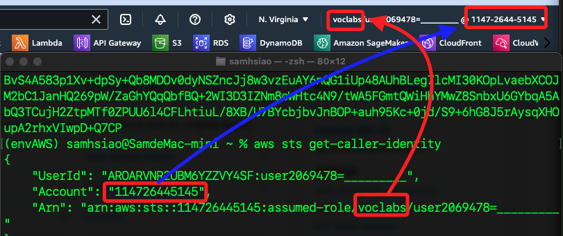

<br>

2. 返回的結果中會顯示角色的 `資源名稱（ARN）`，在這就是 `voclabs`；特別注意，其中 `user2069478` 是當前 AWS 會話中的一個具體 `用戶身份`，附加在 `voclabs` 角色之下，用來追蹤和標識用戶的操作。

    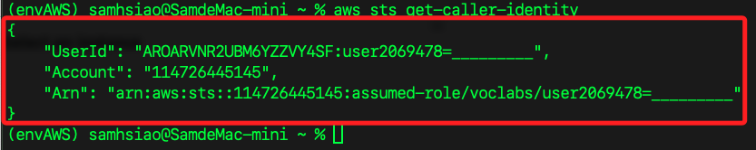

<br>

3. 列出角色的附加權限。

    ```bash
    aws iam list-attached-role-policies --role-name voclabs
    ```

    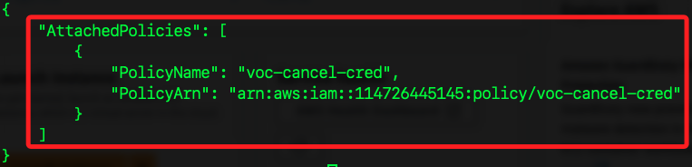

<br>

4. 檢查該角色的內嵌策略。

    ```bash
    aws iam list-role-policies --role-name voclabs
    ```

    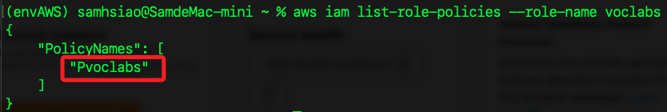

<br>

5. 關於跟 `Lab` 相關的角色，可進入主控台查看如下；具體點擊查看可以知道，Lab 環境對於角色的授權相當有限，此處不做贅述。

    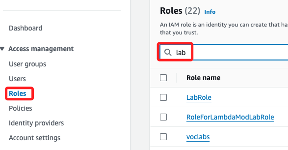

<br>

## 取得實例連線的帳號與密碼

_回到 EC2 實例，這時應該已經完成 `Status check`，特別注意，並非以 `Instance state` 的 `Running` 作為確認資訊，而是要確認實例已經功過檢查。_

<br>

1. 務必確認所有狀態都已完成。

    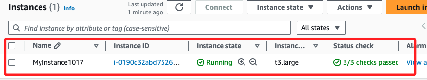

<br>

2. 勾選實例，先複製下方 `ID` 及 `IP` 到紀錄中；特別注意，`ID` 並不包含尾端括號及括號內字串，點擊複製圖標時，也不會將其複製，此後不再贅述。

    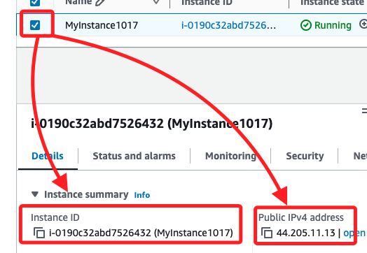

<br>

3. 接著切換到 `Security` 頁籤，複製 `Security groups` 的 `ID` 到紀錄中。

    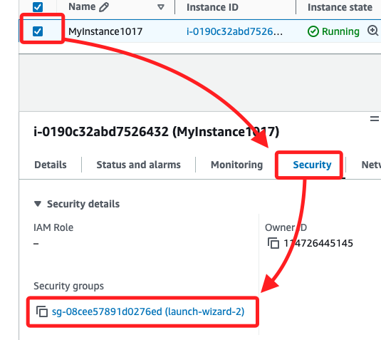

<br>

4. 接著點擊上方頁籤中的 `Connect`。

    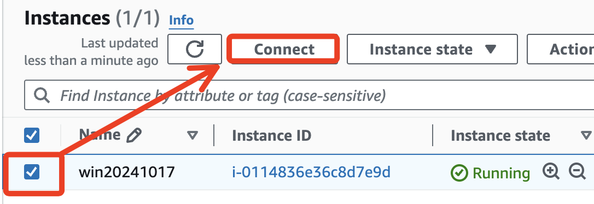

<br>

5. 切換到 `RDP client` 頁籤，點擊下方 `Get password`。

    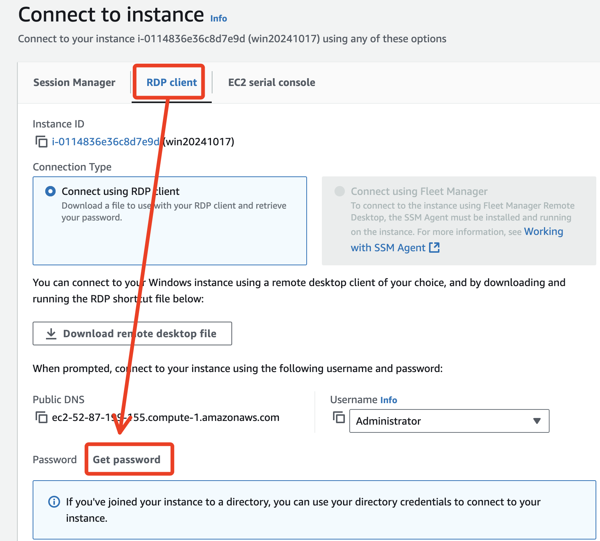

<br>

6. 點擊 `Upload private key file` 上傳密鑰，選取前面步驟下載到本地的密鑰文件 `*.pem`，選取後點擊右下角 `Decrypt password` 將 `Private Key` 解密成密碼。

    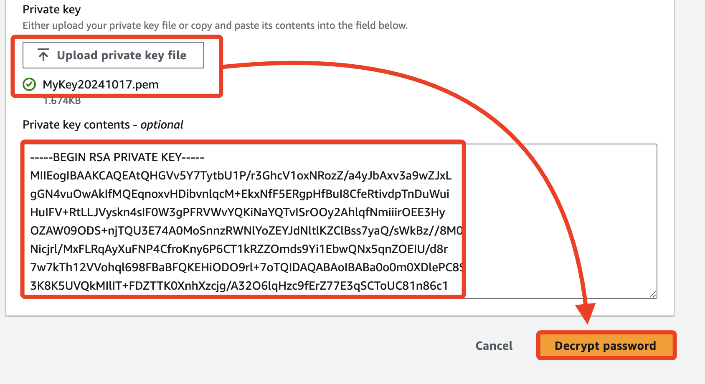

<br>

7. 解密後可看到這組密碼是可讀的；紀錄其中 `Username`、`Password`。

    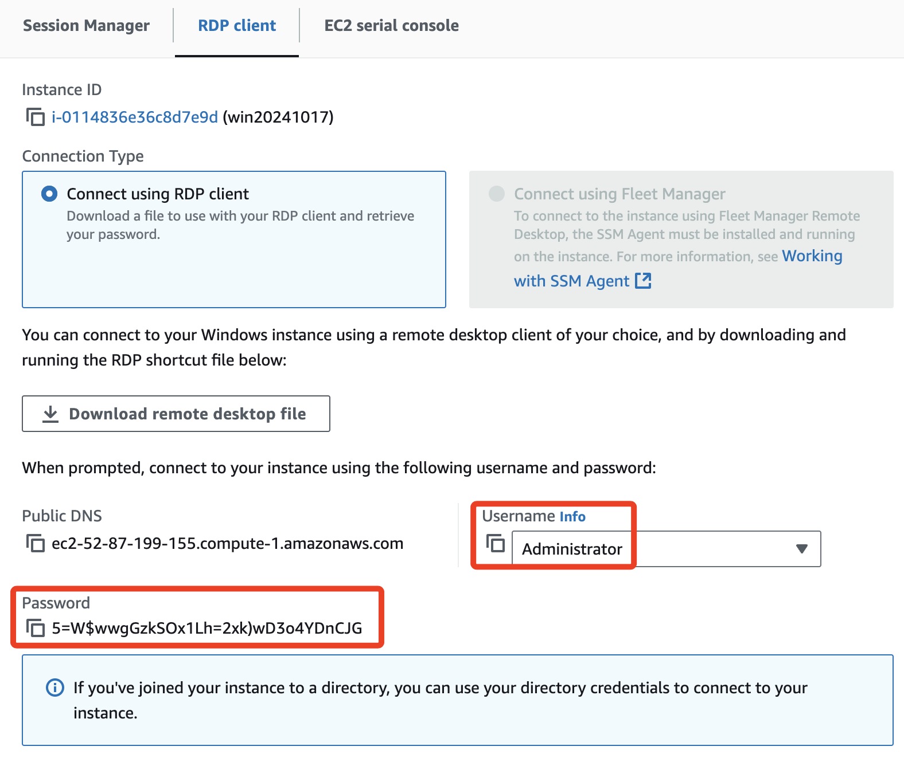

<br>

8. 至此 `第二部分` 也完全填補完成，複製後貼到終端機運行一次。

    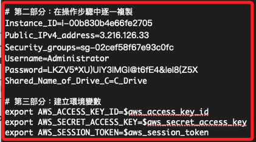

<br>

9. 特別說明，解密後的密碼有時會包含括號 `)`、驚嘆號 `!` 等特殊字元，這些字元作為指令運行時會被解析為特殊符號；所以在密碼的部分使用單引號 `''` 將字串包覆，特別注意，要使用單引號而不是雙引號。

    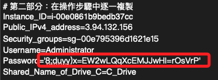

<br>

10. 點擊 `Download remote desktop file` 下載連線遠端桌面所需連結。

    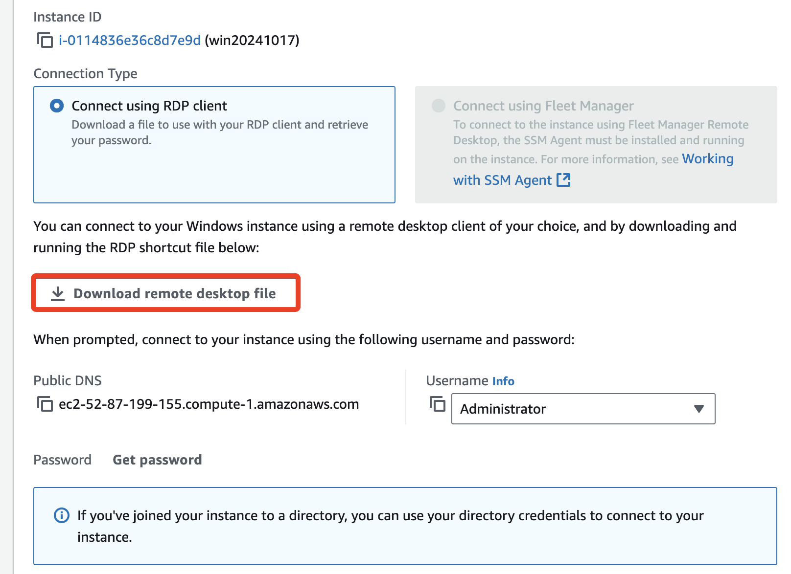

<br>

## 連線

_以下步驟可能因為使用的遠端工具不同而不同_

<br>

1. 點擊下載的 `*.rdp` 文件進行連線；這是一個與實例同名的文件。

    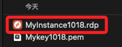

<br>

2. 勾選並點擊 `連線`。

    

<br>

3. 輸入密碼並勾選 `記住我`，然後點擊 `確認`。

    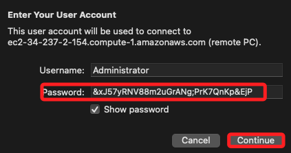

<br>

4. 勾選 `不要再詢問` 後點擊 `是`。

    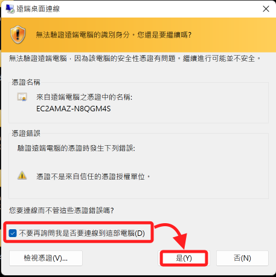

<br>

5. 進入到桌面，會詢問是否允許其他設備在網路上發現這台電腦，點擊 `YES` 即可。

    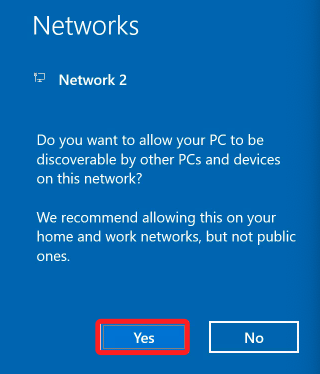

<br>

6. 假如在 `Userdata` 還寫入了其他應用如 `Chrome` 等的安裝指令時，啟動就會看到桌面捷徑。

    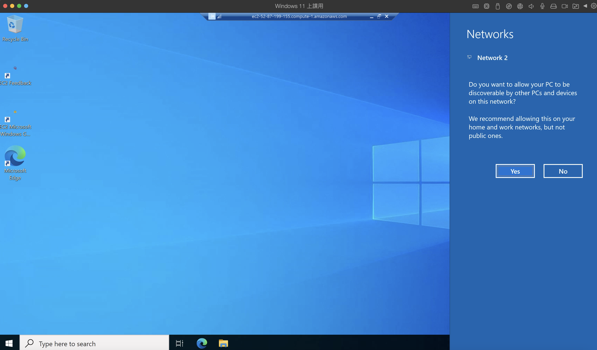

<br>

7. 畫面右側會有詳細連線資訊。

    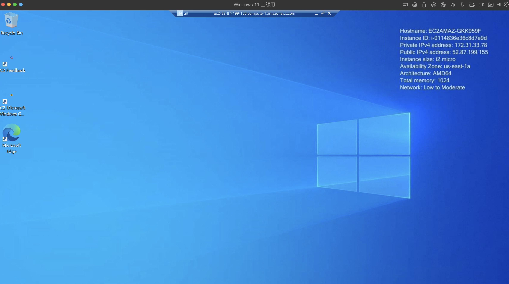

<br>

8. 開啟 Windows 的 CMD，透過指令 `python --version` 驗證 `Python` 版本以確定完成安裝。

    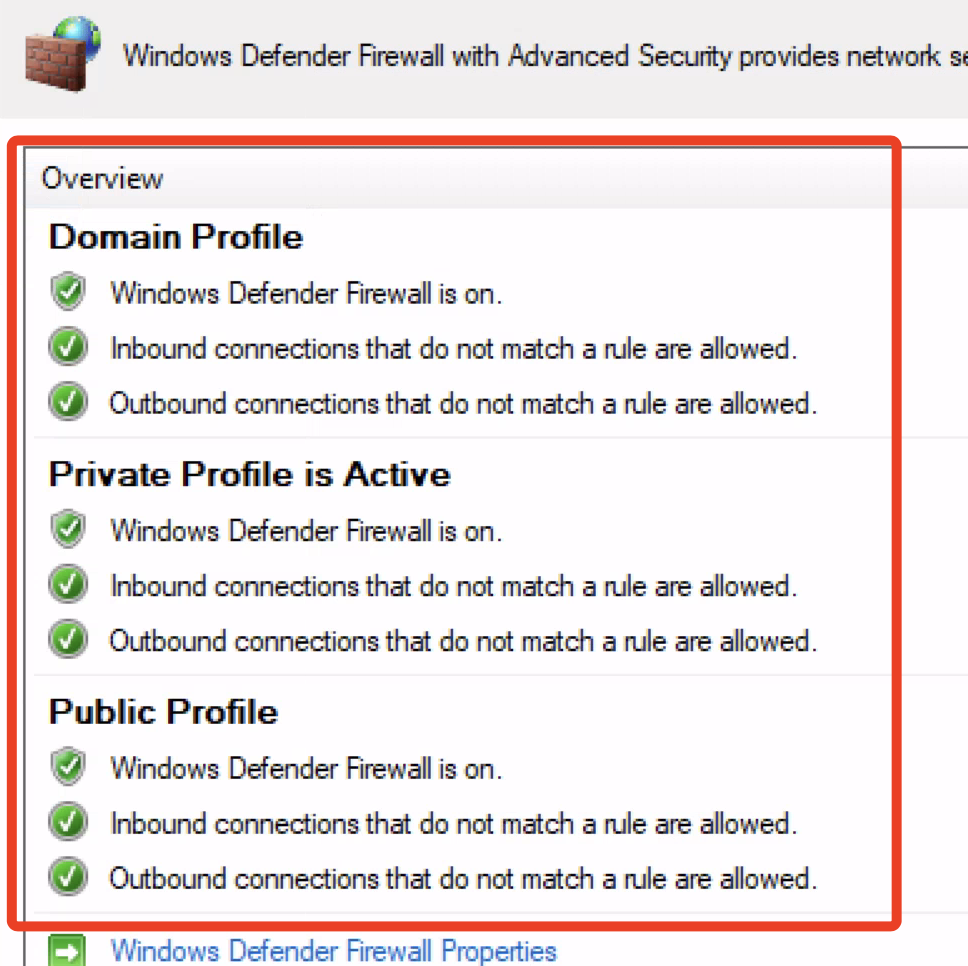

<br>

## 關於使用 AWS CLI 建立實例的錯誤

1. 使用 CLI 建立並登入伺服器後，透過查詢 `Python` 版本會發現 `Python` 並未順利完成安裝，這就代表 `User Data` 並未順利進行。

    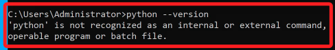

<br>

2. 觀察實例日誌文檔顯示，系統在解析 `User Data` 時先嘗試 YAML 格式失敗，然後退回至 XML 格式也失敗；日誌文檔位置在 `C:\ProgramData\Amazon\EC2Launch\log\` 中。

    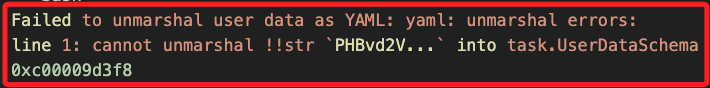

<br>

## 驗證 `base64` 編碼

_透過反向編碼驗證_

<br>

1. 在前面步驟中，因為輸入的指令是 `明文` 的，下方這個勾選框可以不用選。

    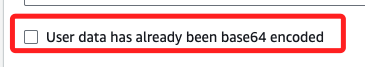

<br>

2. 在點擊 `Preview code` 後，在預覽視窗中可看到所生成的指令自動將 `Powershell` 指令轉換成 `base64` 編碼。

    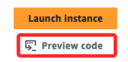

<br>

3. 實例建立後，卻會在日誌中會看到如下的訊息表示 `User Data` 被編碼成為 `Base64` 格式，但沒有使用 `Base64` 解碼來解析它。

    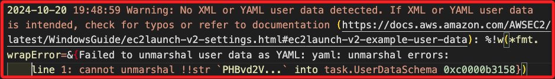

<br>

4. 進一步透過指令從指定的實例中取得解碼後的 User Data 並儲存在變數 `UserDataDecoded` 中；特別注意，取回的內容雖已成功解碼，但仍是以 `Base64` 編碼的形式保存在變數中。

    ```bash
    USER_DATA_DECODE=$(aws ec2 describe-instance-attribute --instance-id $Instance_ID --attribute userData --query "UserData.Value" --output text | base64 --decode)
    ```

<br>

5. 透過解碼來查看內容，可以確認內容是正確的，但是 AWS 卻無法順利解析，這應該是 AWS 的一個 Bug。

    ```bash
    echo $USER_DATA_DECODE | base64 --decode
    ```

    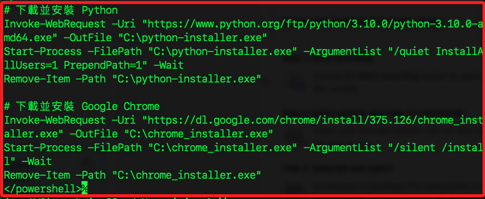

<br>

## 重新編輯 User Data

_特別注意，這裡無法透過編輯 `User Data` 進行修正，因為在預設情況下，`User Data` 只會在首次啟動時執行；如需在每次啟動皆運行 `User Data` 需添加語句 `<persist>true</persist>`；同理，當 `User Data` 只運行一次時，對其進行編輯後重啟並不會生效，所以有修改需求時，需在建立實例時便預先寫入語句 `Userdata`；以下僅就修改方式做補充說明，另外，實例並無重啟的功能，所謂的重啟泛指停止之後再啟動。_

<br>

1. 首先，系統會要求停止啟動中的實例才允許進行編輯。

    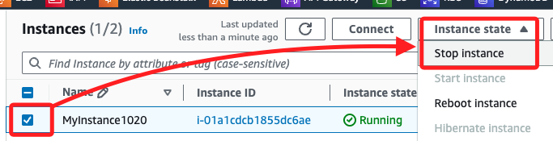

<br>

2. 展開 `Actions` 選單，在 `Instance setting` 中點擊 `Edit user data`。

    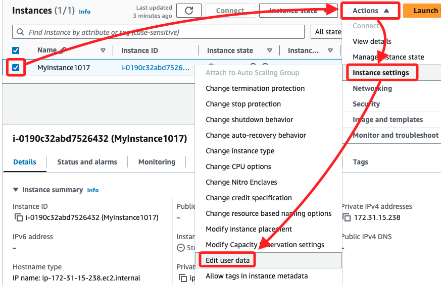

<br>

3. 使用預選的 `Modify user data text` 選項以編輯方式進行修正，將更新代碼填寫在下方輸入框中，完成後點擊 `Save`。

    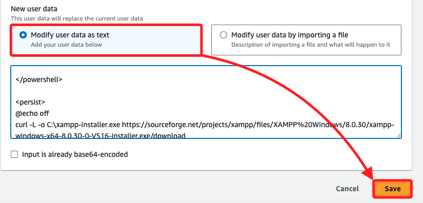

<br>

4. 重新啟動實例。

    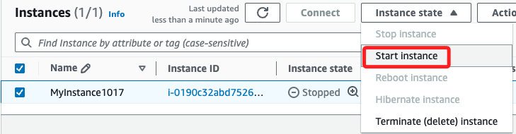

<br>

5. 實例重啟之後必須下載新的 `remote desktop file` 進行連線。

    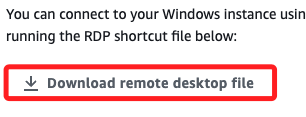

<br>

## 關於生成實例的錯誤處理

_可積極地進行例外捕捉，或在錯誤發生後觀察日誌_

<br>

1. 在 `PowerShell` 中可加入 `例外捕捉` 語句進行錯誤處理，確保初始化過程不會因為錯誤而中斷，以下就安裝 `Python` 作為示範，加入 `try...catch` 拋出可能的錯誤。

    ```bash
    try {
        Invoke-WebRequest -Uri "https://www.python.org/ftp/python/3.10.0/python-3.10.0-amd64.exe" -OutFile "C:\python-installer.exe"
        Start-Process -FilePath "C:\python-installer.exe" -ArgumentList "/quiet InstallAllUsers=1 PrependPath=1" -Wait
        Remove-Item -Path "C:\python-installer.exe"
    } catch {
        Write-Host "Python 安裝失敗: $_"
    }
    ```

<br>

2. 若要在日誌中查看實例運行，展開 `Actions` 選單，在 `Monitor and troubleshoot` 中點擊 `Get system log` 可查看實例運行的紀錄文件。

    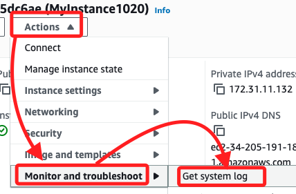

<br>

3. 安裝完成後，可在實例的檔案管理中在以下路徑查看日誌，其中 `agent.log`、`bench.log`、`console.log` 皆紀錄了部分 `User Data` 相關資訊；其中 `agent` 說明 `EC2Launch agent` 操作，`bench` 部分紀錄系統與網路資源，`console` 部分是紀錄控制台訊息。

    ```bash
    C:\ProgramData\Amazon\EC2Launch\log\
    ```

    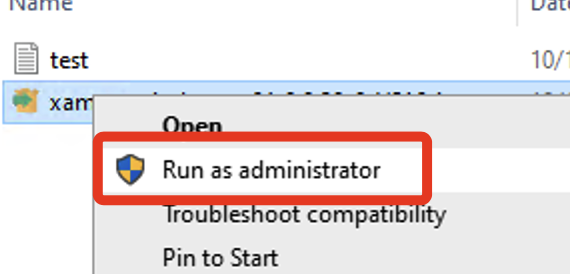

<br>


## 手動 安裝 XAMPP

_使用 CMD 指令在 Windows 伺服器中安裝 XAMPP 來管理 Apache 服務_

<br>

1. 進入 Windows 伺服器的檔案總管，在 `Downloads` 資料夾的路徑欄中輸入 `cmd` 開啟 CMD。

    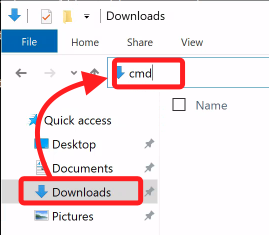

<br>

2. 預設就會使用 `Administrator` 身份開啟，CMD 所在路徑就是 `Downloads`。

    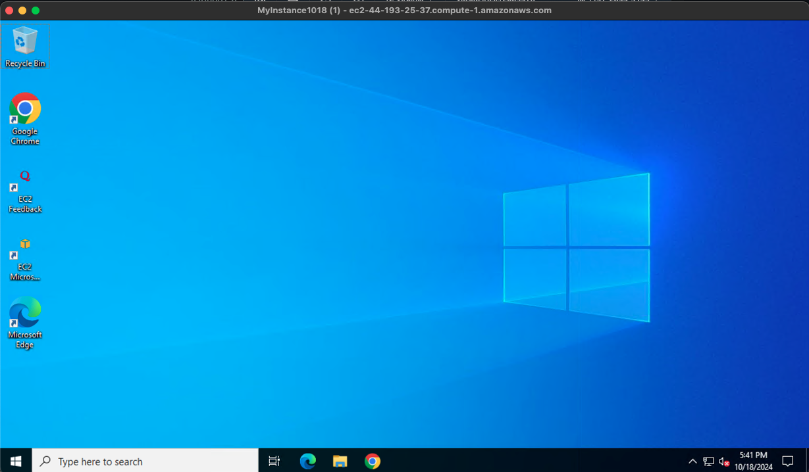

<br>

3. 接著使用指令下載 XAMPP 安裝程式；版本資訊可參考 [官網](https://www.apachefriends.org/zh_tw/download.html)，這裡下載的是 `8.2.12`。

    ```bash
    curl -L -o C:\xampp-installer.exe https://sourceforge.net/projects/xampp/files/XAMPP%20Windows/8.2.12/xampp-windows-x64-8.2.12-0-VS16-installer.exe/download
    ```

    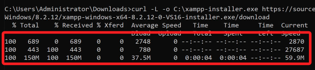

<br>

4. 使用無人值守模式自動化部署、安裝 `XAMPP` 到 `C:\xampp` 目錄；`unattended` 模式下安裝過程不會提示用戶進行任何輸入或確認；`無人值守` 模式對於自動化部署來說非常實用，
安裝會在完全無需手動的看框下使用預設選項進行。

    ```bash
    C:\xampp-installer.exe --mode unattended --unattendedmodeui none --prefix C:\xampp
    ```

<br>

5. 因為畫面不會有任何顯示，若要查詢安裝進度，需查看 `安裝進程是否結束` 來確定安裝是否完成；這個過程約略需要五分鐘，甚至更多。

    ```bash
    tasklist | findstr /I "xampp-installer"
    ```

<br>

6. 直到確認進程消失代表安裝已經結束，然後再繼續後續步驟。

    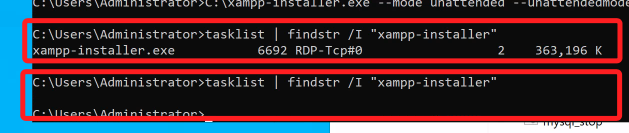

<br>

7. 刪除安裝檔案。

    ```bash
    del C:\xampp-installer.exe
    ```

<br>

8. 啟動 Apache 和 MySQL 服務；使用 `start` 指令載不阻塞終端的情況下同時啟動以下兩個服務，`""` 是提供給 `start` 指令的終端機空標題；`/min` 參數來最小化批次運行，這樣第二個指令視窗不會等待使用者按下 `ENTER`。

    ```bash
    start /min "" C:\xampp\apache_start.bat
    start /min "" C:\xampp\mysql_start.bat
    ```

<br>

9. 啟動 XAMPP 應用。

    ```bash
    start "" C:\xampp\xampp-control.exe
    ```

<br>

10. 應用程式視窗，可看到兩個服務已經啟動，並且顯示了運行端口。

    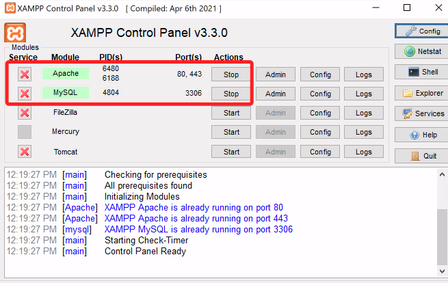

<br>

___

_END_