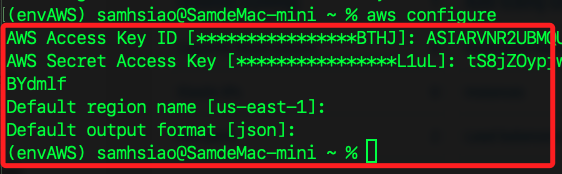

# 建立 Windows Server

_使用 Learner Lab 資源建立一個 Windows Server 的 EC2 實例，將在後續步驟中用於作為網站伺服器_

<br>

## 建立 EC2 實例

_進入 AWS 主控台_

<br>

1. 進入 EC2。

    

<br>

2. 點擊 `Launch instance`，命名為 `MyInstance1018`。

    

<br>

3. 建立一個 Windows 的 Instance，Image 選用 `Microsoft Windows Server 2022 Base`。

    

<br>

4. 在 Instance type 部分，選擇 `t2.micro` 即可，這裡我為了提升效能，所以選擇 `t3.large`。

    

<br>

5. 點擊 `Create new key pair` 建立新的 Key pair；命名 `MyKey1018`，其餘採用預設。

    

<br>

6. `Firewall (security groups)` 的設定全部點選。

    

<br>

## 建立並預覽指令

1. 點擊 `Launch instance` 之前，下方有個 `Prevuew code`，先點擊查看；右側會顯示指令預覽，這裡先做紀錄，之後再來透過指令重新建立一次。

    

<br>

2. CreateSecurityGroup。

    ```bash
    aws ec2 create-security-group --group-name "launch-wizard-1" --description "launch-wizard-1 created 2024-10-17T16:52:15.514Z" --vpc-id "vpc-0c46350047f5fa6e4"
    ```

<br>

3. AuthorizeSecurityGroupIngress。

    ```bash
    aws ec2 authorize-security-group-ingress --group-id "sg-preview-1" --ip-permissions '{"IpProtocol":"tcp","FromPort":3389,"ToPort":3389,"IpRanges":[{"CidrIp":"0.0.0.0/0"}]}' '{"IpProtocol":"tcp","FromPort":443,"ToPort":443,"IpRanges":[{"CidrIp":"0.0.0.0/0"}]}' '{"IpProtocol":"tcp","FromPort":80,"ToPort":80,"IpRanges":[{"CidrIp":"0.0.0.0/0"}]}' 
    ```

<br>

4. RunInstances。

    ```bash
    aws ec2 run-instances --image-id "ami-0324a83b82023f0b3" --instance-type "t3.large" --key-name "Mykey1018" --network-interfaces '{"AssociatePublicIpAddress":true,"DeviceIndex":0,"Groups":["sg-preview-1"]}' --credit-specification '{"CpuCredits":"unlimited"}' --tag-specifications '{"ResourceType":"instance","Tags":[{"Key":"Name","Value":"MyInstance1018"}]}' --metadata-options '{"HttpEndpoint":"enabled","HttpPutResponseHopLimit":2,"HttpTokens":"required"}' --private-dns-name-options '{"HostnameType":"ip-name","EnableResourceNameDnsARecord":true,"EnableResourceNameDnsAAAARecord":false}' --count "1"
    ```

<br>

5. 點擊 `Launch instance`。

    

<br>

## 使用 AWS CLI 連線

_接下來會交叉使用 CLI 與面板，所以先進行 CLI 環境設置_

<br>

1. 回到 Lab 主頁面，點擊 `! AWS Details`。

    

<br>

2. 紀錄 AWS CLI 所需資訊，包含 ID、Key、Token。

    

<br>

3. 在本機開啟終端機進行設置。

    ```bash
    aws configure
    ```

    

<br>

4. 還要進行環境參數設置。

    ```bash
    export AWS_ACCESS_KEY_ID=<複製-ID-貼上>
    export AWS_SECRET_ACCESS_KEY=<複製-KEY-貼上>
    export AWS_SESSION_TOKEN=<複製-TOKEN-貼上>
    ```

<br>

## 運行指令確認設置完成

1. 確認當前用戶。

    ```bash
    aws sts get-caller-identity
    ```

    

<br>

2. 返回的結果中會顯示角色 ARN，角色名稱就是 `voclabs`；特別注意，其中 `user2069478` 是當前 AWS 會話中的一個具體用戶身份，附加在 `voclabs` 角色之下，用來追蹤和標識用戶的操作。

    ```json
    {
        "UserId": "AROARVNR2UBM6YZZVY4SF:user2069478=_________",
        "Account": "114726445145",
        "Arn": "arn:aws:sts::114726445145:assumed-role/voclabs/user2069478=_________"
    }
    ```

<br>

3. 列出角色的附加權限。

    ```bash
    aws iam list-attached-role-policies --role-name voclabs
    ```

    

<br>

4. 檢查該角色的內嵌策略。

    ```bash
    aws iam list-role-policies --role-name voclabs
    ```

    

<br>

## 取得帳號密碼

_回到 EC2 實例，這時應該已經完成 `Running`_

<br>

1. 選取後，可在下方的 `Details` 及 `Security` 頁籤中紀錄幾項資訊。

    ```bash
    [default]
    aws_access_key_id=
    aws_secret_access_key=
    aws_session_token=

    Instance ID=
    Public IPv4 address=
    Security groups=
    Username=Administrator
    Password=
    ```

<br>

2. 接著點擊上方 `Connect`。

    

<br>

3. 切換到 `RDP client` 頁籤，點擊下方 `Get password`。

    

<br>

4. 點擊 `Upload private key file` 上傳密鑰，選取前面步驟下載到本地的密鑰文件 `*.pem`，選取後點擊右下角 `Decrypt password` 將 `Private Key` 解密成密碼。

    

<br>

5. 解密後可看到這組密碼是可讀的；紀錄其中 `Username`、`Password`。

    

<br>

6. 點擊 `Download remote desktop file` 下載連線遠端桌面所需連結。

    

<br>

## 連線

1. 點擊下載的 `*.rdp` 文件進行連線。

    

<br>

2. 輸入密碼，點擊 `Continue`。

    

<br>

3. 依據使用不同的連線工具會有不同的連線過程，這裡使用 MacOS 的 `Remote Desktop`，然後進入桌面完成連線。

    

<br>

4. 點擊 `Yes` 後會顯示相關資訊。

    

<br>

___

_END_