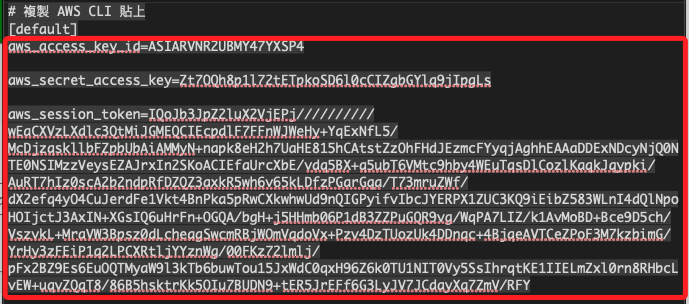
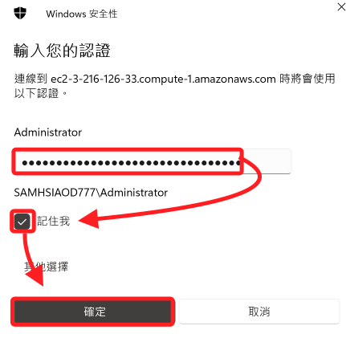
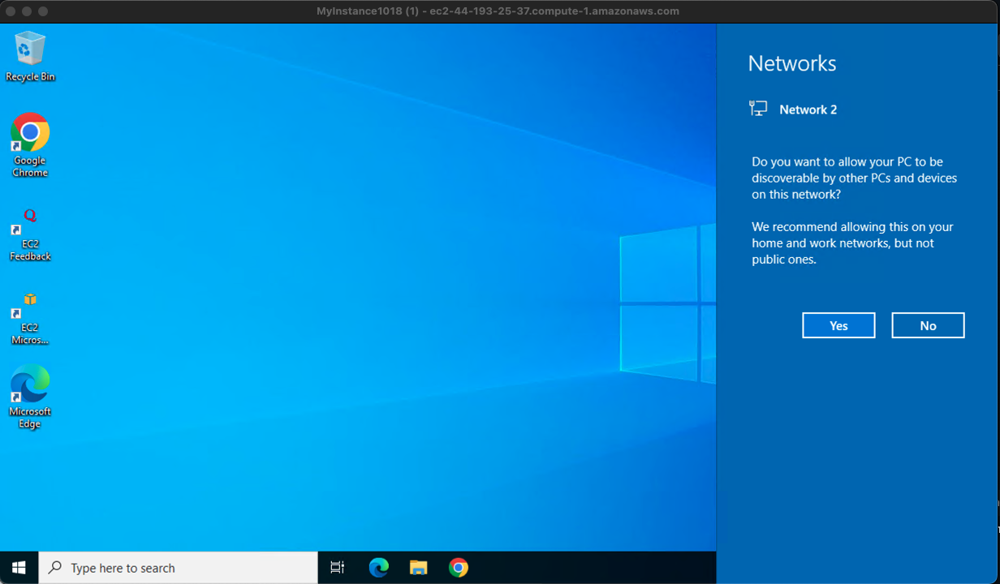
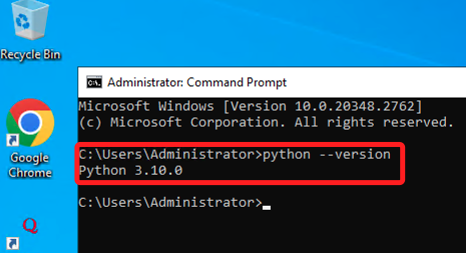

# 建立 Windows Server

_使用 Learner Lab 資源建立一個 Windows Server 的 EC2 實例，將在後續步驟中用於作為網站伺服器_

<br>

## 建立 EC2 實例

_進入 AWS 主控台_

<br>

1. 進入 EC2。

    

<br>

2. 點擊 `Launch instance`，任意命名如 `MyInstance1018`。

    

<br>

3. OS 選擇 `Windows`，`Amazon Machine Image` 選用 `Microsoft Windows Server 2022 Base`。

    

<br>

4. 在 Instance type 部分，選擇 `t2.micro` 即可，這裡為了提升效能，所以選擇 `t3.large`。

    

<br>

5. 點擊 `Create new key pair` 建立新的 Key pair；命名 `MyKey1018`，其餘採用預設；點擊右下角 `Create key pair` 完成建立，此時會自動下載同名密鑰文件到本地電腦。

    

<br>

6. `Firewall (security groups)` 的設定全部點選，也就是開啟 HTTPS 及 HTTP 的進站規則。

    

<br>

## 關於 Advanced details

_實作 User data；進階操作_

<br>

1. 展開 `Advanced details` 並滑動到該區塊最下方會看到 `User data`，可用於自動化伺服器配置，節省手動安裝和設定的時間；特別注意，`User data` 預設有 `16KB` 的大小限制，並且只會在實例第一次啟動時執行，如果想讓指令每次重啟時都執行，需要將腳本放入 `C:\ProgramData\Amazon\EC2-Windows\Launch\Scripts\.`。

    

<br>

2. 透過 `PowerShell` 指令在實例啟動時自動更新。

    ```bash
    <powershell>
    Install-WindowsUpdate -AcceptAll -AutoReboot
    </powershell>
    ```

<br>

3. 安裝 `Python`，並將 Python 加入環境變數路徑，最後刪除安裝檔。

    ```bash
    <powershell>
    Invoke-WebRequest -Uri "https://www.python.org/ftp/python/3.10.0/python-3.10.0-amd64.exe" -OutFile "C:\python-installer.exe"
    Start-Process -FilePath "C:\python-installer.exe" -ArgumentList "/quiet InstallAllUsers=1 PrependPath=1" -Wait
    Remove-Item -Path "C:\python-installer.exe"
    </powershell>
    ```

<br>

4. 安裝 Google Chrome。 

    ```bash
    <powershell>
    Invoke-WebRequest -Uri "https://dl.google.com/chrome/install/375.126/chrome_installer.exe" -OutFile "C:\chrome_installer.exe"
    Start-Process -FilePath "C:\chrome_installer.exe" -ArgumentList "/silent /install" -Wait
    Remove-Item -Path "C:\chrome_installer.exe"
    </powershell>
    ```

<br>

5. 安裝 XAMPP。

    ```bash
    <powershell>
    # 使用 curl 下載 XAMPP
    curl -L -o C:\xampp-installer.exe https://sourceforge.net/projects/xampp/files/XAMPP%20Windows/8.2.12/xampp-windows-x64-8.2.12-0-VS16-installer.exe/download

    # 靜默安裝 XAMPP 到指定目錄
    Start-Process -FilePath "C:\xampp-installer.exe" -ArgumentList "--mode unattended --unattendedmodeui none --prefix C:\xampp" -Wait

    # 刪除 XAMPP 安裝程式
    Remove-Item -Path "C:\xampp-installer.exe"

    # 啟動 Apache 和 MySQL
    Start-Process -FilePath "C:\xampp\apache_start.bat" -Wait
    Start-Process -FilePath "C:\xampp\mysql_start.bat" -Wait

    </powershell>
    ```

<br>


6. 其他安裝；暫時不用加入 `user data`，持續補充。

    ```bash
    <powershell>
    # 安裝 IIS (網頁伺服器)
    Install-WindowsFeature -name Web-Server -IncludeManagementTools

    </powershell>
    ```

<br>

7. 更新防火牆，暫時不用加入 `user data`。

    ```bash
    <persist>
    rem 啟動 Apache 和 MySQL
    cd C:\xampp
    apache_start.bat
    mysql_start.bat

    rem 設定防火牆規則，允許 HTTP (80), HTTPS (443) 和 MySQL (3306) 的入站連接
    netsh advfirewall firewall add rule name="Allow HTTP" dir=in action=allow protocol=TCP localport=80
    netsh advfirewall firewall add rule name="Allow HTTPS" dir=in action=allow protocol=TCP localport=443
    netsh advfirewall firewall add rule name="Allow MySQL" dir=in action=allow protocol=TCP localport=3306

    </persist>
    ```

<br>

8. 若運行多項功能，只需要添加一次 Section 語句；以下將預設進行系統更新，並安裝 Python、Chrome 及 XAMPP；另外，在此先不進行啟動應用，也不要設置防火牆。

    ```bash
    <powershell>
    Install-WindowsUpdate -AcceptAll -AutoReboot

    Invoke-WebRequest -Uri "https://www.python.org/ftp/python/3.10.0/python-3.10.0-amd64.exe" -OutFile "C:\python-installer.exe"
    Start-Process -FilePath "C:\python-installer.exe" -ArgumentList "/quiet InstallAllUsers=1 PrependPath=1" -Wait
    Remove-Item -Path "C:\python-installer.exe"

    Invoke-WebRequest -Uri "https://dl.google.com/chrome/install/375.126/chrome_installer.exe" -OutFile "C:\chrome_installer.exe"
    Start-Process -FilePath "C:\chrome_installer.exe" -ArgumentList "/silent /install" -Wait
    Remove-Item -Path "C:\chrome_installer.exe"

    curl -L -o C:\xampp-installer.exe https://sourceforge.net/projects/xampp/files/XAMPP%20Windows/8.2.12/xampp-windows-x64-8.2.12-0-VS16-installer.exe/download

    C:\xampp-installer.exe --mode unattended --unattendedmodeui none --prefix C:\xampp

    del C:\xampp-installer.exe

    cd C:\xampp
    apache_start.bat
    mysql_start.bat

    </powershell>
    ```

<br>

## 建立並預覽指令

1. 點擊 `Launch instance` 之前，下方有個 `Preview code`，先點擊查看；右側會顯示指令預覽，這裡先做紀錄，之後再來透過指令重新建立一次。

    

<br>

2. 包含了三個部分，分別是 `CreateSecurityGroup`、`AuthorizeSecurityGroupIngress`、`RunInstances`。

    

<br>

3. `CreateSecurityGroup` 區塊預設會建立名為 `launch-wizard-1` 的安全群組，並附加到指定的 `VPC`。

    

<br>

4. `AuthorizeSecurityGroupIngress` 會自動依據安全群組為 `ID` 為 `sg-preview-1` 的安全群組設置 `入口規則（Ingress Rules）`，也可稱為 `進站規則（Inbound Rules）`。

    

<br>

5. `RunInstances` 進行啟動 EC2 實例；這段指令很長，會依據各項設定自動生成。

    

<br>

6. 點擊 `Download` 下載語法備用。

    

<br>

7. 點擊 `Launch instance`。

    

<br>

8. 沒特殊狀況就會顯示 `Success`，但這僅是完成設定，實例尚未完成啟動，回到 EC2 清單查看。

    

<br>

## 準備紀錄用文檔

_接下來會有一些資訊需要記錄備用，在一般正式的 Lab 中會建議使用 Cloud9 做紀錄，但這個 Lab 並未授權，請自行使用任意文件編輯器做紀錄。_

<br>

1. 建立文檔後，先貼上以下內容；這裡特別使用全形的引號 `【】`，僅是基於有利於區別字串資訊內容與引號，無其他用意，`Username` 部分已填入預設的內容 `Administrator`。

    ```bash
    [default]
    aws_access_key_id=【】
    aws_secret_access_key=【】
    aws_session_token=【】

    Instance ID=【】
    Public IPv4 address=【】
    Security groups=【】
    Username=【Administrator】
    Password=【】
    ```

<br>

## 使用 AWS CLI 連線

_在等待實例初始化同時，可先進行 CLI 環境設置_

<br>

1. 回到 Lab 主頁面，點擊右上角的文字圖標 `! AWS Details`。

    

<br>

2. 在 `AWS CL` 尾端點擊 `Show` 展開內容。

    

<br>

3. 紀錄 AWS CLI 所需資訊，包含 ID、Key、Token。

    

<br>

4. 複製貼上過程中要特別注意尾端不要添加多餘的空格或換行符號，可自行加入 `括號` 來避免低級錯誤。

    

<br>

5. 開啟終端機進行環境參數設置。

    ```bash
    export AWS_ACCESS_KEY_ID=<複製-ID-貼上>
    export AWS_SECRET_ACCESS_KEY=<複製-KEY-貼上>
    export AWS_SESSION_TOKEN=<複製-TOKEN-貼上>
    ```

<br>

6. 設定 AWS 內建文檔；特別說明，在 Lab 環境中其實可不用執行 `aws configure`，因為環境變數的優先權是在設定檔之前，而 Token 必須透過環境變數設定，如果只設置 `TOKEN` 但沒有設置相應的 `ID` 和 `KEY` 到環境變數，AWS CLI 會無法進行身份驗證。

    ```bash
    aws configure
    ```

    

<br>

## 運行指令確認設置完成

1. 確認當前用戶。

    ```bash
    aws sts get-caller-identity
    ```

    

<br>

2. 返回的結果中會顯示角色 ARN，角色名稱就是 `voclabs`；特別注意，其中 `user2069478` 是當前 AWS 會話中的一個具體用戶身份，附加在 `voclabs` 角色之下，用來追蹤和標識用戶的操作。

    

<br>

3. 列出角色的附加權限。

    ```bash
    aws iam list-attached-role-policies --role-name voclabs
    ```

    

<br>

4. 檢查該角色的內嵌策略。

    ```bash
    aws iam list-role-policies --role-name voclabs
    ```

    

<br>

## 取得帳號密碼

_回到 EC2 實例，這時應該已經完成 `Status check`，特別注意，並非以 `Instance state` 的 `Running` 作為確認資訊，而是要確認實例已經功過檢查。_

<br>

1. 務必確認所有狀態都已完成。

    

<br>

2. 勾選實例，先複製下方 `ID` 及 `IP` 到紀錄中；特別注意，`ID` 並不包含尾端括號及括號內字串，點擊複製圖標時，也不會將其複製，此後不再贅述。

    

<br>

3. 接著切換到 `Security` 頁籤，複製 `Security groups` 的 `ID` 到紀錄中。

    

<br>

4. 接著點擊上方頁籤中的 `Connect`。

    

<br>

5. 切換到 `RDP client` 頁籤，點擊下方 `Get password`。

    

<br>

6. 點擊 `Upload private key file` 上傳密鑰，選取前面步驟下載到本地的密鑰文件 `*.pem`，選取後點擊右下角 `Decrypt password` 將 `Private Key` 解密成密碼。

    

<br>

7. 解密後可看到這組密碼是可讀的；紀錄其中 `Username`、`Password`。

    

<br>

8. 點擊 `Download remote desktop file` 下載連線遠端桌面所需連結。

    

<br>

## 連線

1. 點擊下載的 `*.rdp` 文件進行連線；這是一個與實例同名的文件。

    

<br>

2. 輸入密碼，點擊 `Continue`。

    

<br>

3. 依據使用不同的連線工具會有不同的連線過程，這裡使用 MacOS 的 `Remote Desktop`，然後進入桌面完成連線。

    

<br>

4. 點擊 `Yes` 後完成啟動；可以看到桌面已經安裝了 Google Chrome。

    

<br>

5. 畫面右側會有詳細連線資訊。

    

<br>

6. 透過在終端機中查詢 Python 版本以確定完成安裝。

    

<br>

## 無法順利連線

_假如無法連線_

<br>

1. 停止實例。

    

<br>

2. 點擊 `Edit user data`。

    

<br>

3. 預設以編輯方式進行修正 `Modify user data text`，完成後點擊 `Save`。

    

<br>

4. 重新啟動實例。

    

<br>

5. 下載新的 `remote desktop file`。

    

<br>

## 使用例外捕捉

1. 在 `PowerShell`  中可加入簡單的錯誤處理，確保過程中出現問題使腳本中斷。

    ```bash
    try {
        # 安裝 Python
        Invoke-WebRequest -Uri "https://www.python.org/ftp/python/3.10.0/python-3.10.0-amd64.exe" -OutFile "C:\python-installer.exe"
        Start-Process -FilePath "C:\python-installer.exe" -ArgumentList "/quiet InstallAllUsers=1 PrependPath=1" -Wait
        Remove-Item -Path "C:\python-installer.exe"
    } catch {
        Write-Host "Python 安裝失敗: $_"
    }
    ```

<br>

___

_END_