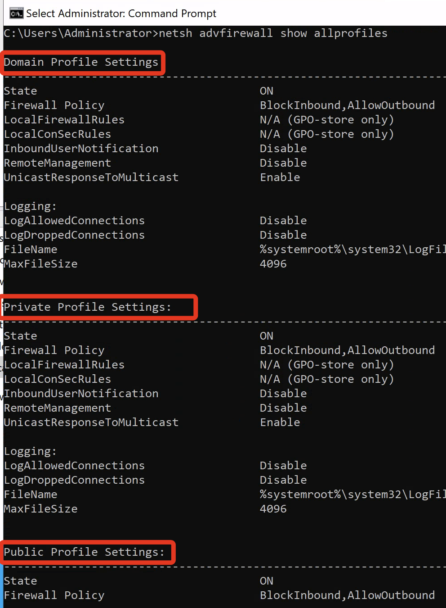
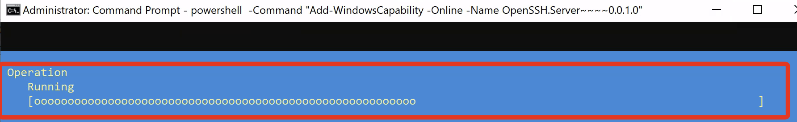
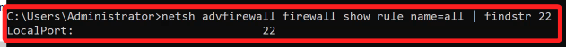
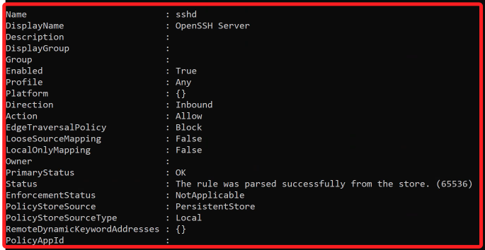
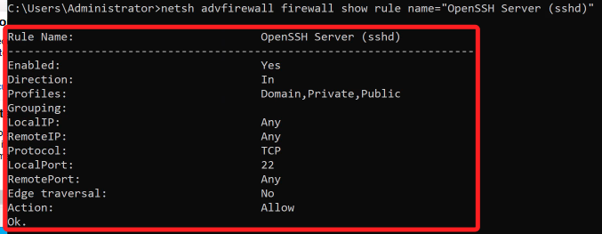
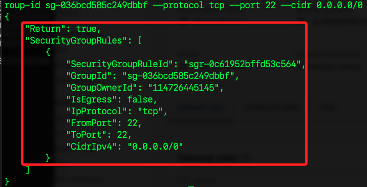
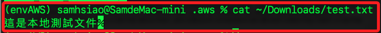

# 訪問 Windows Server 磁區

_以下將 SMB 及 SSH 訪問伺服器磁區_

<br>

## 設定磁區共享

_先分享 Windows 主機的磁區 C_

<br>

1. 在 `C` 槽點擊 `屬性`。

    

<br>

2. 切換到 `Sharing` 點擊 `Advanced Sharing`。

    

<br>

3. 勾選並點擊 `OK`。

    

<br>

4. 以下是在 Windows Server 上使用指令建立磁區 C 的分享，並設定名稱為 `C_Drive`。

    ```bash
    net share C_Drive=C:\ /grant:everyone,full
    ```

    

<br>

5. 查詢磁區分享狀態。

    ```bash
    net share
    ```

    

<br>

6. 刪除指定磁區分享，例如刪除 `C$`。

    ```bash
    net share C$ /delete
    ```

    

<br>

7. 刪除 C_Drive 共享。

    ```bash
    net share C_Drive /delete
    ```

    

<br>

8. 務必記得再次建立分享。

    ```bash
    net share C_Drive=C:\ /grant:everyone,full
    ```

<br>

## 建立新的入站規則

_後續步驟也會安裝 `SMB`，所以要添加進站規則；回到本地電腦的終端機。_

<br>

1. 設置安全組允許 SMB 進站規則，預設端口是 `445`；以下指令開放所有IP訪問伺服器上的 `445` 端口；特別說明，指令中的 `$Security_groups` 就是儲存在變數中 `EC2` 安全群組的 `ID`，在後續的指令中也會這樣取值，不再贅述。

    ```bash
    aws ec2 authorize-security-group-ingress --group-id $Security_groups --protocol tcp --port 445 --cidr 0.0.0.0/0
    ```

<br>

2. 假如要針對指定設備開放設定如下，僅需替換其中 `<指定設備-IP>`。

    ```bash
    aws ec2 authorize-security-group-ingress --group-id <EC2-安全群組-ID> --protocol tcp --port 445 --cidr <指定設備-IP>/32
    ```

    

<br>

3. 可進入安全群組查看設定是否完成。

    

<br>

## 通過 SMB 連接到 C 盤

_示範環境是 macOS 系統，Linux 相同_

<br>

1. 先使安裝 smbclient；特別注意，這個安裝步驟很久，可先去忙別的。

    ```bash
    brew install samba
    ```

<br>

2. 使用指令連線，請務必確認 `共享名稱`，在前面步驟中，將 C 的共享名稱設定為 `C-Drive`；。

    ```bash
    smbclient //$Public_IPv4_address/$Shared_Name_of_Drive_C -U Administrator
    ```

<br>

3. 輸入密碼；特別注意，這個密碼是看不到的，除此之外，密碼的部分就是字串，無法以變數替代。

    

<br>

4. 退回本地電腦終端。

    ```bash
    exit
    ```

    

<br>

## 檢查 Samba 伺服器配置文件

_確認已經退回到本地終端機中；這裡要檢查 `smb.conf` 是否已經存在，如果不存在會導致 `testparm` 錯誤。_

<br>

1. 檢查該文件是否存在於指定路徑；因為是由 `Homebrew` 管理，所以會在這個路徑中，若是其他安裝方式，也可能會在 `/etc/samba/smb.conf` 路徑中。

    ```bash
    ls /opt/homebrew/etc/smb.conf
    ```

<br>

2. 無論文件是否存在，皆可使用以下指令對文件 `smb.conf` 進行編輯，不存在就會先建立；這裡使用 `VSCode`，若使用 `Nano` 則將 `code` 改為 `nano` 即可。

    ```bash
    code /opt/homebrew/etc/smb.conf
    ```

<br>

3. 確認或添加以下內容到文件中；這是一個基本的 `SMB` 設置，它將 `/tmp` 目錄作為共享目錄並允許訪客訪問。

    ```bash
    [global]
        workgroup = WORKGROUP
        security = user
        map to guest = Bad User

    [shared]
        path = /tmp
        read only = no
        guest ok = yes
    ```

<br>

4. 運行指令 `testparm` 測試配置，這是 `Samba 伺服器` 的一個診斷工具，用來驗證 `Samba` 的配置文件是否正確；如果配正確會顯示 `Loaded services file OK.` 等相關訊息；按下 `ENTER` 可以退出測試狀態。

    ```bash
    testparm
    ```

    

<br>

## Windows Server 防火牆設置

_回到 Windows 伺服器中_

<br>

1. 在 Windows 系統搜尋欄中搜尋並點擊 `Check firewall status` 進入設定。

    

<br>

2. 點擊 `Advanced Settings`。

    

<br>

3. 點擊 `Action Properties`。

    

<br>

4. 把三個 Profile 的 Inbound connections 都設定為 `Allow`，然後點擊 `OK`。

    

<br>

## 使用指令設定防火牆

_與前面步驟相同，是在 Windows 伺服器中設定_

<br>

1. 首先查看防火牆詳細資訊。

    ```bash
    netsh advfirewall show allprofiles
    ```

    

<br>

2. 允許 Domain Profile 的入站連接。

    ```bash
    netsh advfirewall set domainprofile firewallpolicy allowinbound,allowoutbound
    ```

<br>

3. 允許 Private Profile 的入站連接。

    ```bash
    netsh advfirewall set privateprofile firewallpolicy allowinbound,allowoutbound
    ```

<br>

4. 允許 Public Profile 的入站連接。

    ```bash
    netsh advfirewall set publicprofile firewallpolicy allowinbound,allowoutbound
    ```

<br>

5. 設定完成如下。

    

<br>

6. 進入防火牆設定中查看。

    

<br>

7. 檢查設定後的防火牆狀態。

    ```bash
    netsh advfirewall show allprofiles state
    ```

    

<br>

## 安裝 OpenSSH Server

_在 Windows 伺服器安裝 `OpenSSH Server` 可提供基於 `SSH` 協議的遠程連接方式；以下在 Windows CMD 運行。_

<br>

1. 安裝 `OpenSSH Server`。

    ```bash
    powershell -Command "Get-WindowsCapability -Online | Where-Object Name -like 'OpenSSH.Server*'"
    powershell -Command "Add-WindowsCapability -Online -Name OpenSSH.Server~~~~0.0.1.0"
    ```

<br>

2. 等待上方進度條顯示完成；這約略需要一分鐘。

    

<br>

3. 立即啟動 SSH 服務，並設置為開機自動啟動。

    ```bash
    powershell -Command "Start-Service sshd"
    powershell -Command "Set-Service -Name sshd -StartupType 'Automatic'"
    ```

<br>

4. 查詢當前 `端口 22` 的規則。

    ```bash
    netsh advfirewall firewall show rule name=all | findstr 22
    ```

<br>

5. 結果代表防火牆中有與端口 `22` 相關的規則存在，但沒有更多詳細的信息顯示。

    

<br>

6. 手動設置 `22 端口` 的防火牆規則，並任意命名如 `OpenSSH Server`。

    ```bash
    powershell -Command "New-NetFirewallRule -Name sshd -DisplayName 'OpenSSH Server' -Enabled True -Direction Inbound -Protocol TCP -Action Allow -LocalPort 22"
    ```

    

<br>

7. 查詢設定結果。

    ```bash
    netsh advfirewall firewall show rule name="OpenSSH Server"
    ```

    

<br>

## 透過 SCP 傳送文件

_需添加實例的進站規則_

<br>

1. 可在實例中手動編輯 `Inbound Rule` 添加 `SSH`。

    

<br>

2. 這裡示範使用 CLI 快速建立；以下 AWS CLI 指令要在本地電腦運行。

    ```bash
    aws ec2 authorize-security-group-ingress --group-id $Security_groups --protocol tcp --port 22 --cidr 0.0.0.0/0
    ```

    

<br>

3. 傳送本機建立任意文件到 Windows，這裡示範使用 `~/Downloads` 中的 `test.txt`，文件內僅有簡單字串如下。

    

<br>

4. ，傳送到 Windows C 槽的根目錄。

    ```bash
    scp ~/Downloads/test.txt Administrator@$Public_IPv4_address:C:
    ```

<br>

5. 第一次連線會詢問是否確定，輸入 `yes` 後還要輸入密碼，然後就會立即傳送文件。

    

<br>

6. 透過 smb 連線並查看。

    ```bash
    smbclient //<EC2-公共-IP>/<共享名稱-C-槽> -U Administrator
    ```

    

<br>

7. 下載為指定名稱；在 smb 中並無查看內容的指令，但是可以透過指令下載查看，特別注意，下載的文件會在使用 `smbclient` 登入的路徑中。

    ```bash
    get test.txt test02.txt
    ```

    <br>

8. 使用 `exit` 指令退出連線，並在路徑中使用 `ls` 指令查詢，就會看到下載的文件了。

    

<br>

## MacOS 使用 Finder 連線

1. `Finder` > `前往` > `連接伺服器`。

    

<br>

2. 輸入 IP 後點擊 `連線`。

    ```bash
    smb://<EC2-公共-IP>
    ```

    

<br>

3. 再次點擊連線。

    

<br>

4. 帳戶會預設為本地使用者名稱，要改為 `Administrator`，並且輸入連線密碼。

    

<br>

5. 確認名稱正確，點擊右下角 `好` 來進行裝載卷宗。

    

<br>

6. 完成時可在 Finder 中查看到這個裝載的卷宗。

    

<br>

___

_END_