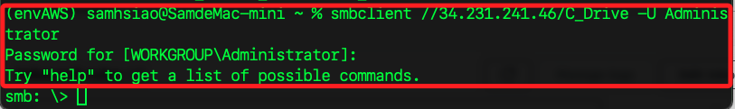
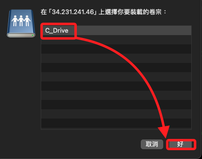

# 訪問 Windows Server 磁區

<br>

## 設定磁區共享

_先分享 Windows 主機的磁區 C_

<br>

1. 在 `C` 槽點擊 `屬性`。

    

<br>

2. 切換到 `Sharing` 點擊 `Advanced Sharing`。

    

<br>

3. 勾選並點擊 `OK`。

    

<br>

4. 若使用指令建立磁區分享。

    ```bash
    net share C_Drive=C:\ /grant:everyone,full
    ```

    

<br>

5. 查詢磁區分享狀態。

    ```bash
    net share
    ```

    

<br>

6. 刪除指定磁區分享，例如刪除 `C$`。

    ```bash
    net share C$ /delete
    ```

    

<br>

7. 刪除 C_Drive 共享。

    ```bash
    net share C_Drive /delete
    ```

    

<br>

## 建立新的入站規則

_接下來要安裝 SMB，所以要添加進站規則；回到 EC2 主控台_

<br>

1. 設置安全組允許 SMB 進站規則，預設端口是 `445`；以下指令開放所有IP訪問伺服器上的 445 端口。

    ```bash
    aws ec2 authorize-security-group-ingress --group-id <EC2-安全群組-ID> --protocol tcp --port 445 --cidr 0.0.0.0/0
    ```

<br>

2. 假如要針對指定設備開放，設定如下。

    ```bash
    aws ec2 authorize-security-group-ingress --group-id <EC2-安全群組-ID> --protocol tcp --port 445 --cidr <指定設備-IP>/32
    ```

    

<br>

3. 可進入安全群組查看設定是否完成。

    

<br>

## 通過 SMB 連接到 C 盤

_示範環境是 macOS 系統，Linux 相同_

<br>

1. 先使安裝 smbclient；特別注意，這個安裝步驟很久，可先去忙別的。

    ```bash
    brew install samba
    ```

<br>

2. 使用指令連線，請務必確認 `共享名稱`，在前面步驟中，將 C 的共享名稱設定為 `C-Drive`。

    ```bash
    smbclient //<EC2-公共-IP>/<共享名稱-C-槽> -U Administrator
    ```

<br>

3. 輸入密碼；特別注意，這個密碼是看不到的。

    

<br>

4. 退回本地電腦終端。

    ```bash
    exit
    ```

    

<br>

## 檢查 smb.conf 文件是否存在

_確認已經退回到本地終端機中_

<br>

1. 檢查該文件是否存在於指定路徑；如果文件不存在會導致 `testparm` 錯誤。

    ```bash
    ls /opt/homebrew/etc/smb.conf
    ```

<br>

2. 假如文件已經存在可跳過這個步驟，否則進行手動建立 `smb.conf`，這裡使用 `VSCode`，若使用 Nano 則將 `code` 改為 `nano` 即可。

    ```bash
    code /opt/homebrew/etc/smb.conf
    ```

<br>

3. 添加以下內容到文件中；這是一個基本的 SMB 設置，它將 `/tmp` 目錄作為共享目錄並允許訪客訪問。

    ```bash
    [global]
        workgroup = WORKGROUP
        security = user
        map to guest = Bad User

    [shared]
        path = /tmp
        read only = no
        guest ok = yes
    ```

<br>

4. 再次運行 `testparm` 測試配置；如果配置文件正確，應該會顯示 `Loaded services file OK.` 的相關訊息。

    ```bash
    testparm
    ```

    

<br>

## Windows Server 防火牆設置

_回到 Windows 伺服器中_

<br>

1. 搜尋進入 `Check firewall status`。

    

<br>

2. 點擊 `Advanced Settings`。

    

<br>

3. 點擊 `Action Properties`。

    

<br>

4. 把三個 Profile 的 Inbound connections 都設定為 `Allow`，然後點擊 `OK`。

    

<br>

5. 或使用指令進行查看防火牆狀態。

    ```bash
    netsh advfirewall show allprofiles
    ```

<br>

6. 開啟 Domain Profile 防火牆。

    ```bash
    netsh advfirewall set domainprofile state on
    ```

<br>

7. 開啟 Private Profile 防火牆。

    ```bash
    netsh advfirewall set privateprofile state on
    ```

<br>

8. 開啟 Public Profile 防火牆。

    ```bash
    netsh advfirewall set publicprofile state on
    ```
<br>

9. 設定完成如下。

    

<br>

10. 或進入防火牆設定中查看。

    

<br>

## 在 Windows 安裝 OpenSSH Server

1. 在 Windows CMD 中運行以下指令安裝 OpenSSH Server。

    ```bash
    powershell -Command "Get-WindowsCapability -Online | Where-Object Name -like 'OpenSSH.Server*'"
    powershell -Command "Add-WindowsCapability -Online -Name OpenSSH.Server~~~~0.0.1.0"
    ```

<br>

2. 啟動並設置 SSH 服務自動啟動。

    ```bash
    powershell -Command "Start-Service sshd"
    powershell -Command "Set-Service -Name sshd -StartupType 'Automatic'"
    ```

<br>

3. 假如需要手動開放防火牆上的 22 端口。

    ```bash
    powershell -Command "New-NetFirewallRule -Name sshd -DisplayName 'OpenSSH Server (sshd)' -Enabled True -Direction Inbound -Protocol TCP -Action Allow -LocalPort 22"
    ```

<br>

## 透過 SCP 傳送文件

1. 在 主控台中編輯 Inbound Rule 添加 SSH。

    

<br>

2. 傳送本機建立任意文件到 Windows，這裡示範使用 `~/Downloads` 中的 `test.txt`，傳送到 Windows C 槽的 `test` 目錄。

    ```bash
    scp test.txt Administrator@<EC2-公共-IP>:C:/test
    ```

<br>

3. 第一次連線會詢問是否確定，輸入密碼後會立即傳送文件。

    

<br>

4. 透過 smb 連線並查看。

    

<br>

## MacOS 使用 Finder 連線

1. `Finder` > `前往` > `連接到伺服器`。

    

<br>

2. 輸入並連線。

    ```bash
    smb://<EC2-公共-IP>
    ```

    

<br>

3. 再次點擊連線。

    

<br>

4. 輸入帳戶 `Administrator` 及密碼。

    

<br>

5. 加載卷宗。

    

<br>

6. 完成時可在 Finder 中查看。

    

<br>

## 關於防火牆

_後補_

<br>

1. 透過終端機查詢防火牆狀態。

    ```bash
    netsh advfirewall show allprofiles state
    ```

<br>

___

_END_