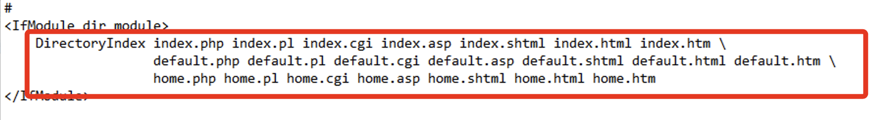

# 關於 XAMPP 的安裝

_在前面的步驟中，已示範進入伺服器終端機進行安裝，這裡則是基於開啟了 SSH 之後，示範使用 SSH 端口進行傳送並安裝的步驟。_

<br>

## 在 Windows Server 開啟瀏覽器進行

_補充説一下，傳統的使用瀏覽器訪問病下載安裝的步驟在此不加贅述，但這樣做依舊是可行的，只是伺服器規格太低，操作網頁瀏覽很吃力，所以不建議這樣操作。_

<br>

## 在本機下載並透過 SSH 傳送

1. 在本機下載 `XAMPP`；選擇合適的版本下載。

    

<br>

2. 使用 `SCP` 指令，將下載的執行檔案傳送到 Windwos 伺服器的 `C:/test`。

    ```bash
    scp xampp-windows-x64-8.0.30-0-VS16-installer.exe Administrator@34.237.2.154:C:/test
    ```

<br>

3. 速度實在有點慢。

    

<br>

## 安裝

1. 點擊安裝；安裝設定都使用預設即可。

    

<br>

2. 安裝好之後會自動啟動，先開啟 `Apache`。

    

<br>

3. 可瀏覽 C 槽中的 `xampp` 目錄中看到子目錄 `htdocs`，這就是用來存放網頁的目錄。

    

<br>

4. 編輯任意 index.html 文本。

<br>

5. 複製到 `htdocs`。

    ```bash
    scp index.html Administrator@34.237.2.154:C:/xampp/htdocs
    ```

<br>

## XAMPP 的 Apache Web 設定文件

1. 位於 `XAMPP` 安裝目錄下的 `apache/conf` 資料夾中，主要的設定文件是 `httpd.conf`；另外，與虛擬主機相關的設定通常會放在 `apache/conf/extra/` 目錄下的 `httpd-vhosts.conf` 文件中。

<br>

2. Apache 伺服器會根據 `DirectoryIndex` 指令來設定當訪問主機時應該載入哪個 `index` 檔案；預設順序如下，可自訂優先順序。

    

<br>

3. 可以簡單修改如下。

    ```bash
    DirectoryIndex index.html index.php
    ```

<br>

4. 儲存變更後，重新啟動 Apache 服務以應用更改；使用 XAMPP 控制面板來重啟 Apache 伺服器。

<br>

5. 使用 EC2 公共 IP 進行訪問。

    

<br>

6. 假如沒有編輯優先權，可將 `index.php` 更名為 `index1.php`。

<br>

___

_END_