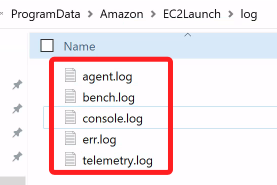
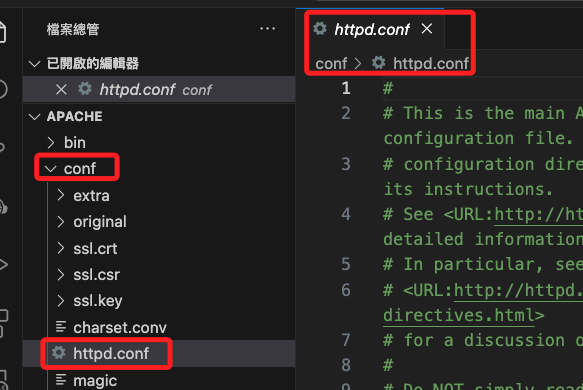
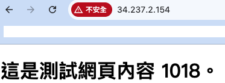

# 關於 XAMPP 的安裝

_在前面的步驟中，已示範進入伺服器終端機進行安裝，這裡則是基於開啟了 SSH 之後，示範使用 SSH 端口進行傳送並安裝的步驟，若已安裝完成，可僅測試文件傳輸、不要重複安裝。_

<br>

## 在本機下載並透過 SSH 傳送

1. 在本機下載 `XAMPP`；選擇合適的版本下載。

    

<br>

2. 使用 `SCP` 指令，將下載的執行檔案傳送到 Windwos 伺服器的 `C:/test`。

    ```bash
    scp xampp-windows-x64-8.0.30-0-VS16-installer.exe Administrator@34.237.2.154:C:/test
    ```

<br>

3. 速度實在有點慢。

    

<br>

## 安裝

1. 點擊安裝；安裝設定都使用預設即可。

    

<br>

2. 安裝好之後會自動啟動，先開啟 `Apache`。

    

<br>

## 建立網站文件

1. 這個目錄 `C > xampp > htdocs` 就是 XAMPP 預設用來存放網頁的位置。

    

<br>

2. 在本地編輯任意 index.html 文本。

    ```bash
    code ~/Downloads/index.html
    ```

<br>

3. 使用快速鍵 `!` 簡單編輯。

    ```html
    <!DOCTYPE html>
    <html lang="en">
        <head>
            <meta charset="UTF-8">
            <meta name="viewport" content="width=device-width, initial-scale=1.0">
            <title>測試網頁</title>
        </head>
        <body>
            <H1>這是測試網頁內容 1018。</H1>
        </body>
    </html>
    ```

<br>

4. 複製到 `htdocs`，要輸入密碼。

    ```bash
    scp ~/Downloads/index.html Administrator@<實例-公共-IP>:C:/xampp/htdocs
    ```

<br>

5. 這時若進行訪問 `公共 IP`，會看到以下預設的內容，但並非前面步驟上傳的文本，這是因為 `XAMPP` 管理站台預設以 `index.php` 為優先，這部分與 `Apache` 預設不同。

    

<br>

## XAMPP 的 Apache Web 設定文件

_以下將進行優先權設定；假如只是要進行測試且不編輯優先權，可將 `index.php` 更名為 `index1.php`，此處不贅述。_

<br>

1. 設定文件位於 `XAMPP` 安裝目錄下的 `apache/conf` 資料夾中，主要的設定文件是 `httpd.conf`；另外，與虛擬主機相關的設定通常會放在 `apache/conf/extra/` 目錄下的 `httpd-vhosts.conf` 文件中；因為前面已經設置了 SMB，所以可直接在本地用 VSCode 開啟編輯。

    

<br>

2. Apache 伺服器會根據 `DirectoryIndex` 指令來設定當訪問主機時應該載入哪個 `index` 檔案；預設順序如下，可透變編輯自訂優先順位。

    

<br>

3. 可以簡單修改如下，其他先刪除無妨。

    ```bash
    <IfModule dir_module>
        DirectoryIndex index.html index.php
    </IfModule>
    ```

<br>

4. 儲存變更後，重新啟動 Apache 服務以應用更改；可使用 `XAMPP` 控制面板來重啟 Apache 伺服器，或使用以下指令進行，強制終止所有 httpd.exe 進程，然後重啟服務，並透過 `/b` 參數指定在背景運行。

    ```bash
    start "" /b taskkill /IM httpd.exe /F
    start "" /b C:\xampp\apache_start.bat
    ```

<br>

5. 使用 EC2 公共 IP 進行訪問。

    

<br>

___

_END_