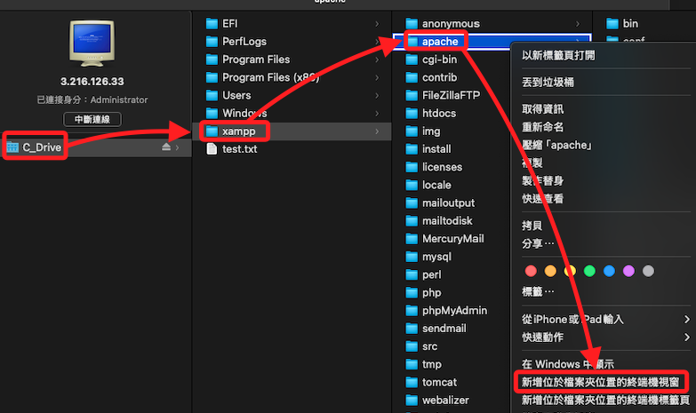
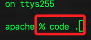
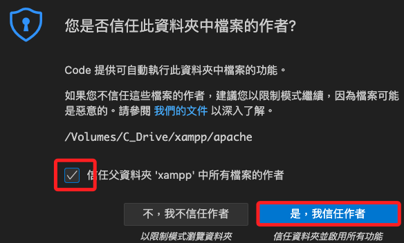

# 建立網站

_在 Windows 伺服器中建立網站，並使用 XAMPP 管理香過福物_

<br>

## 建立網站文本

1. 使用 XAMPP 管理站台時，文本的預設路徑在 `C > xampp > htdocs`。

    

<br>

2. 基於編輯效率，先在本地編輯任意 `index.html` 文本，完成後再上傳；開啟新的終端機運行以下指令。

    ```bash
    code ~/Downloads/index.html
    ```

<br>

3. 使用 VSCode 的快速鍵 `!` 編輯簡單網頁。

    ```html
    <!DOCTYPE html>
    <html lang="en">
        <head>
            <meta charset="UTF-8">
            <meta name="viewport" content="width=device-width, initial-scale=1.0">
            <title>測試網頁</title>
        </head>
        <body>
            <H1>這是測試網頁內容 1018。</H1>
        </body>
    </html>
    ```

<br>

4. 透過 scp 傳輸到 `htdocs`，加上 `sshpass -p $Password` 就不用輸入密碼了。

    ```bash
    sshpass -p $Password scp ~/Downloads/index.html Administrator@$Public_IPv4_address:C:/xampp/htdocs
    ```

<br>

5. 這時若進行訪問 `公共 IP`，會看到以下預設的內容，但並非前面步驟上傳的文本，這是因為 `XAMPP` 管理站台預設以 `index.php` 為優先，這部分與 `Apache` 預設不同。

    

<br>

## XAMPP 的 Apache Web 設定文件

_以下將進行優先權設定；假如只是要進行測試且不編輯優先權，可將 `index.php` 更名為 `index1.php`，此處不贅述。_

<br>

1. 設定文件位於 `XAMPP` 安裝目錄下的 `apache/conf` 資料夾中，主要的設定文件是 `httpd.conf`；另外，與虛擬主機相關的設定通常會放在 `apache/conf/extra/` 目錄下的 `httpd-vhosts.conf` 文件中；這裡使用前面透過 SMB 連線的遠端磁區，直接在本地用 VSCode 開啟文件進行編輯。

<br>

2. 首先開啟終端機，找到 `xampp` 下的 `apache` 然後點擊右鍵開啟終端機；特別注意，也是可以再進到下一層 `conf` 再開啟終端。

    

<br>

3. 在終端機中輸入 `code .` 表示在當前路徑啟動 `VSCode`。

    

<br>

4. 勾選 `信任...` 後點擊 `是，我信任...`。

    

<br>

5. 接著點擊要編輯的文件 `httpd.conf`。

    

<br>

6. 特別說明，`Apache 伺服器` 會根據 `DirectoryIndex` 語句來設定優先權，決定訪問主機時會載入哪個 `index` 文本；所以搜尋關鍵字 `DirectoryIndex` 找到代碼區塊，可看到預設的順序如下，`index.php` 的優先順位是最高的，這就是為何即便上傳了 `index.html` 一就會看到預設的首頁。

    

<br>

7. 簡單修改如下，其他先刪除無妨。

    ```bash
    <IfModule dir_module>
        DirectoryIndex index.html index.php
    </IfModule>
    ```

<br>

8. 儲存變更後，重新啟動 Apache 服務以應用更改；可使用 `XAMPP` 控制面板來重啟 Apache 伺服器，或使用以下指令進行，強制終止所有 httpd.exe 進程，然後重啟服務，並透過 `/b` 參數指定在背景運行。

    ```bash
    start "" /b taskkill /IM httpd.exe /F
    start "" /b C:\xampp\apache_start.bat
    ```

<br>

9. 使用 EC2 公共 IP 進行訪問。

    

<br>

___

_END_