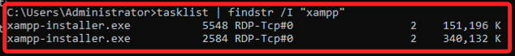

# 指令安裝

<br>

## 下載與安裝

1. 下載。

    ```bash
    curl -L -o C:\xampp-installer.exe https://sourceforge.net/projects/xampp/files/XAMPP%20Windows/8.0.30/xampp-windows-x64-8.0.30-0-VS16-installer.exe/download
    ```

<br>

2. 安裝。

    ```bash
    C:\xampp-installer.exe --mode unattended --unattendedmodeui none --prefix C:\xampp
    ```

<br>

3. 刪除安裝檔。

    ```bash
    del C:\xampp-installer.exe
    ```

<br>

4. 顯示安裝目錄。

    ```bash
    dir C:\xampp
    ```

<br>

## 查看

1. 檢查是否正在安裝。

    ```bash
    tasklist | findstr /I "xampp"
    ```

<br>

2. 安裝進行中，有兩個進程正在運行，安裝尚未完成；一旦主安裝進程結束，則表示安裝程式已經完成；安裝程式不會自動退出，所以會有一個進程需要手動結束，這裡不予處理。

    

<br>

3. 啟動 Apache。

    ```bash
    C:\xampp\apache_start.bat
    ```

<br>

4. 開啟防火牆。

    ```bash
    # rem 設定防火牆規則，允許 HTTP (80), HTTPS (443) 和 MySQL (3306) 的入站連接

    # rem 允許 HTTP (80) 端口的入站流量
    netsh advfirewall firewall add rule name="Allow HTTP" dir=in action=allow protocol=TCP localport=80

    # rem 允許 HTTPS (443) 端口的入站流量
    netsh advfirewall firewall add rule name="Allow HTTPS" dir=in action=allow protocol=TCP localport=443

    # rem 允許 MySQL (3306) 端口的入站流量
    netsh advfirewall firewall add rule name="Allow MySQL" dir=in action=allow protocol=TCP localport=3306
    ```

<br>

## 轉換為 User Data

1. 依據以上成功運行的指令所編輯。

    ```bash
    <persist>
    @echo off
    curl -L -o C:\xampp-installer.exe https://sourceforge.net/projects/xampp/files/XAMPP%20Windows/8.0.30/xampp-windows-x64-8.0.30-0-VS16-installer.exe/download

    rem 靜默安裝 XAMPP 到 C:\xampp
    C:\xampp-installer.exe --mode unattended --unattendedmodeui none --prefix C:\xampp

    rem 刪除安裝檔
    del C:\xampp-installer.exe

    </persist>
    ```

<br>


2. 關於防火牆的相關設置暫時不加入。

    ```bash
    <persist>
    rem 啟動 Apache 和 MySQL
    cd C:\xampp
    apache_start.bat
    mysql_start.bat

    rem 設定防火牆規則，允許 HTTP (80), HTTPS (443) 和 MySQL (3306) 的入站連接

    rem 允許 HTTP (80) 端口的入站流量
    netsh advfirewall firewall add rule name="Allow HTTP" dir=in action=allow protocol=TCP localport=80

    rem 允許 HTTPS (443) 端口的入站流量
    netsh advfirewall firewall add rule name="Allow HTTPS" dir=in action=allow protocol=TCP localport=443

    rem 允許 MySQL (3306) 端口的入站流量
    netsh advfirewall firewall add rule name="Allow MySQL" dir=in action=allow protocol=TCP localport=3306

    rem 顯示防火牆狀態以確認
    netsh advfirewall show allprofiles state
    </persist>
    ```

<br>

___

_未完_