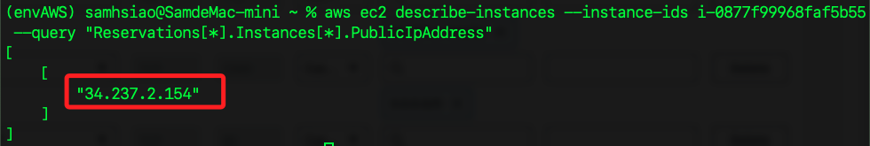
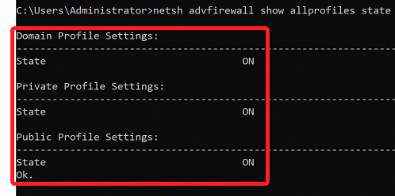

# 指令彙整

<br>

## Windows CMD

<br>

## AWS CLI

1. 獲取 EC2 公共 IP。

    ```bash
    aws ec2 describe-instances --instance-ids <EC2-實例-ID> --query "Reservations[*].Instances[*].PublicIpAddress"
    ```

    

<br>

## Winodws CMD 指令

1. 查詢防火牆狀態。

    ```bash
    netsh advfirewall show allprofiles state
    ```

    

<br>


___

_持續補充_