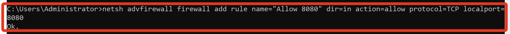
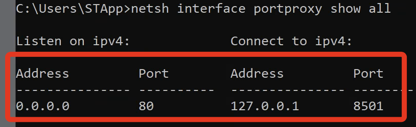
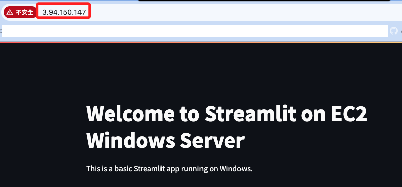
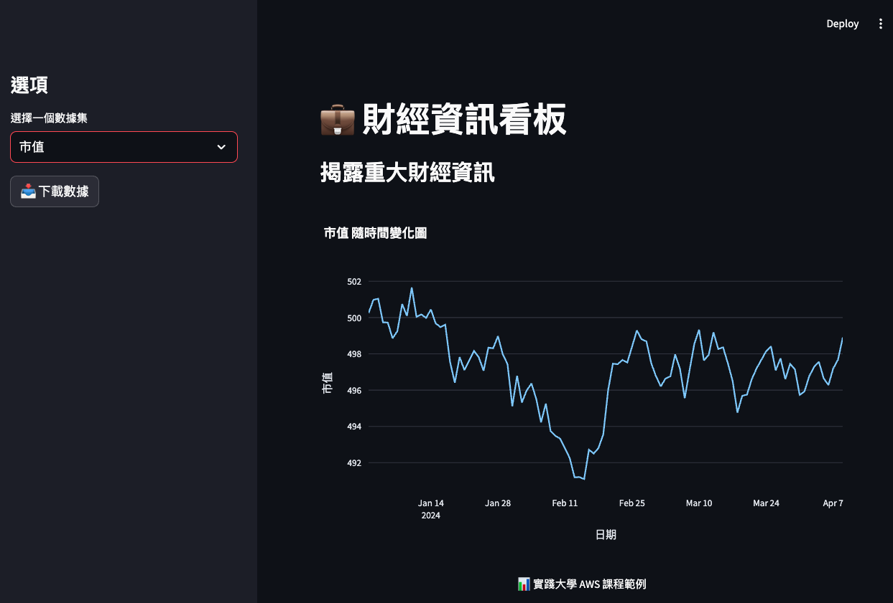

# 端口轉發

_`XAMPP` 預設將 `80` 端口給 `Apache` 使用，所以需要讓 `Apache` 先釋放這個端口；另外，在此之前已經允許 `80` 與 `8501` 端口防火牆，這裡不贅述。_

<br>

## 釋放端口

1. 編輯 `C:\xampp\apache\conf\httpd.conf` 文件，將 `Apache` 監聽端口改為其他任意未使用的端口，如 `8080`。

    ```bash
    Listen 8080
    ```

<br>

2. 重新啟動 `XAMPP` 的 `Apache` 來套用變更。

    ```bash
    C:\xampp\apache\bin\httpd.exe -k restart
    ```

<br>

## 重新定向

1. 使用 `Windows` 的 `netsh` 工具將被釋放的 `80` 端口轉發到 `8501` 端口。

    ```bash
    netsh interface portproxy add v4tov4 listenport=80 listenaddress=0.0.0.0 connectport=8501 connectaddress=127.0.0.1
    ```

    

<br>

2. 確認端口轉發設置成功。

    ```bash
    netsh interface portproxy show all
    ```

    

<br>

## 訪問

1. 使用公共 IP 訪問 Windows Server 上的 Streamlit 應用，確定設定無誤後，進一步優化腳本。

    

<br>

2. 優化腳本，先安裝套件。

    ```bash
    pip install plotly pandas
    ```

<br>

3. 編輯腳本 `app.py`。

    ```python
    import streamlit as st
    import pandas as pd
    import plotly.express as px
    import numpy as np

    # 設定 Streamlit 網頁配置
    st.set_page_config(
        page_title="財經看板",
        layout="wide",
        initial_sidebar_state="expanded"
    )

    # 設定主題為深色模式
    st.markdown("""
        <style>
            body {
                background-color: #0e1117;
                color: white;
            }
            .stButton>button {
                background-color: #00aaff;
                color: white;
                border: none;
                padding: 10px 24px;
                border-radius: 5px;
            }
            .stPlotlyChart {
                background-color: #0e1117;
            }
            .stSidebar {
                background-color: #1c1e27;
            }
        </style>
        """, unsafe_allow_html=True)

    # 網頁標題
    st.title("💼 財經資訊看板")
    st.subheader("揭露重大財經資訊")

    # 側邊欄選擇
    st.sidebar.title("選項")
    selected_metric = st.sidebar.selectbox(
        "選擇一個數據集",
        ["股票價格", "交易量", "市值"]
    )

    # 假設的財務數據
    data = {
        '日期': pd.date_range(start='2024-01-01', periods=100, freq='D'),
        '股票價格': pd.Series(np.random.randn(100).cumsum() + 50),
        '交易量': pd.Series(np.random.randint(100, 1000, size=100)),
        '市值': pd.Series(np.random.randn(100).cumsum() + 500)
    }

    df = pd.DataFrame(data)

    # 繪製選擇的數據圖表
    fig = px.line(
        df, x='日期', 
        y=selected_metric, 
        title=f'{selected_metric} 隨時間變化圖'
    )
    fig.update_layout(
        paper_bgcolor='#0e1117', 
        plot_bgcolor='#0e1117', 
        font=dict(color="white")
    )
    st.plotly_chart(fig, use_container_width=True)

    # 添加下載按鈕
    st.sidebar.download_button(
        label="📥 下載數據",
        data=df.to_csv(index=False).encode('utf-8'),
        file_name='financial_data.csv',
        mime='text/csv'
    )

    # 頁尾
    st.markdown("""
        <div style='text-align: center; padding: 10px 0;'>
            <small>📊 實踐大學 AWS 課程範例</small>
        </div>
        """, unsafe_allow_html=True)
    ```

<br>

4. 再次刷新或重新訪問。

    

<br>

___

_END_