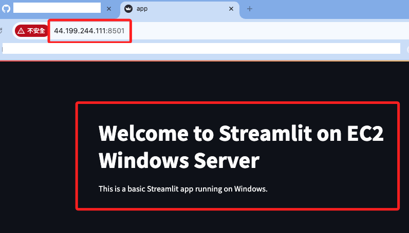
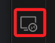
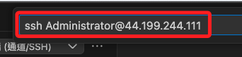
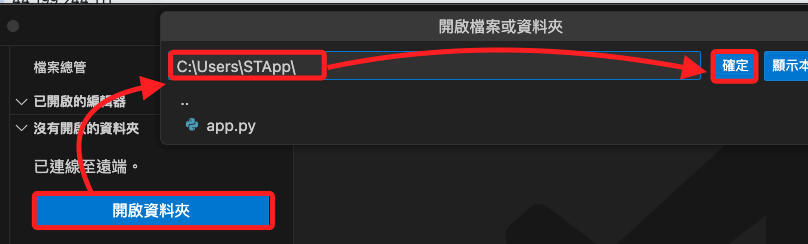

# 運行 Streamlit 網站

_既然前面已經安裝了 Python，這裡簡單做一個 Streamlit 網站_

<br>

## 步驟如下

1. 在 Windows 伺服器上安裝 Streamlit，這裡就不建立虛擬環境了。

    ```bash
    pip install streamlit
    ```

<br>

2. 透過檢查版本確認安裝已經完成。

    ```bash
    streamlit --version
    ```

<br>

3. 使用 SMB 連線的磁區開啟 VSCode 編輯 Streamlit 應用，新增並編輯主腳本 `app.py`。

    ```python
    import streamlit as st

    st.title("Welcome to Streamlit on EC2 Windows Server")
    st.write("This is a basic Streamlit app running on Windows.")
    ```

<br>

4. 在 Windows 防火牆中允許 8501 埠的入站連接。

    ```bash
    netsh advfirewall firewall add rule name="Allow Streamlit" dir=in action=allow protocol=TCP localport=8501
    ```

<br>

5. 在 EC2 安全群組中允許入站的 8501 埠。

    ```bash
    aws ec2 authorize-security-group-ingress --group-id <安全群組-ID> --protocol tcp --port 8501 --cidr 0.0.0.0/0
    ```

<br>

6. 在 Windows 運行 Streamlit 應用。

    ```bash
    streamlit run app.py
    ```

<br>

7. 使用 EC2 公共 IP 訪問您的 Streamlit 應用，網址必須加上端口。

    ```bash
    http://<EC2-公共-IP>:8501
    ```

    

<br>

## 關於使用 VSCode 連線

_在前面的步驟中，透過 SMB 的連線開啟了 VSCode，但這樣的運作顯得有點效率不佳，以下改用 SSH。_

<br>

1. 開啟 VSCode，選取左側 `遠端總管`。

    

<br>

2. 在上方彈窗中輸入 `ssh` 連線指令。

    ```bash
    ssh Administrator@<EC2-公共-IP>
    ```

    

<br>

3. 點擊 `開啟資料夾`，然後選取路徑後點擊 `確定`；進入後即可進行編輯，另外會有許多彈窗通知，該確認的確認、該安裝的安裝即可。

    

<br>

___

_END_