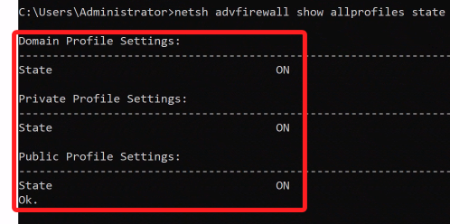

# AWS CLI 指令彙整

<br>

## AWS CLI

1. 獲取 EC2 公共 IP。

    ```bash
    aws ec2 describe-instances --instance-ids <EC2-實例-ID> --query "Reservations[*].Instances[*].PublicIpAddress"
    ```

    

<br>

1. 檢查 EC2 實例的狀態。

   ```bash
   aws ec2 describe-instance-status --instance-ids <EC2-ID>
   ```

2. 啟動 EC2 實例。

   ```bash
   aws ec2 start-instances --instance-ids <EC2-ID>
   ```

3. 停止 EC2 實例：

   ```bash
   aws ec2 stop-instances --instance-ids <EC2-ID>
   ```

4. 重新啟動 EC2 實例：

   ```bash
   aws ec2 reboot-instances --instance-ids <EC2-ID>
   ```

## Winodws CMD 指令

1. 查詢防火牆狀態。

    ```bash
    netsh advfirewall show allprofiles state
    ```

    

<br>


___

_持續補充_