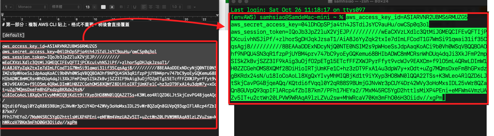
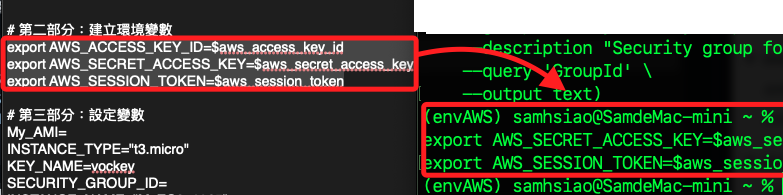
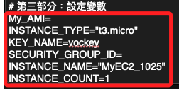
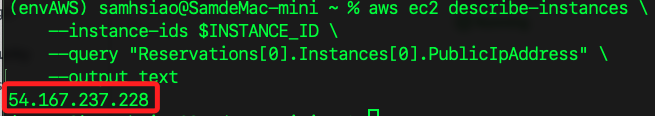
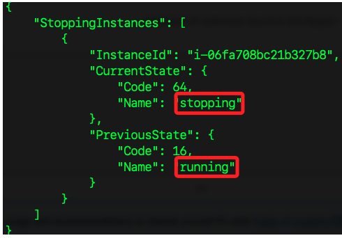

# Elastic IPs

_以下步驟從建立 EC2 實例開始，然後綁定到 Elastic IP，最後並完整刪除所有建立的資源。_

<br>

## 準備工作

_從準備文檔開始_

<br>

1. 準備一個記錄用的文檔；`第三部分` 中的變數將於後續步驟中自動完成，無需任何手動編輯；另外，在建立變數的同時，要將變數自動化寫入文檔也是可行的，或是寫入 `.zshrc` 或其他腳本，在後續自動化工作中透過 `source` 來完成導入也都是可行的方案，這裡暫時不實作。

    ```bash
    # 第一部分：複製 AWS CLI 貼上，格式不重要，稍後會直接覆蓋
    [default]
    aws_access_key_id=
    aws_secret_access_key=
    aws_session_token=

    # 第二部分：建立環境變數
    export AWS_ACCESS_KEY_ID=$aws_access_key_id
    export AWS_SECRET_ACCESS_KEY=$aws_secret_access_key
    export AWS_SESSION_TOKEN=$aws_session_token

    # 第三部分：設定變數
    My_AMI=
    INSTANCE_TYPE="t3.micro"
    KEY_NAME=vockey
    SECURITY_GROUP_ID=
    INSTANCE_NAME="MyEC2_1025"
    INSTANCE_COUNT=1
    INSTANCE_ID=
    EIP_ALLOC_ID=
    EIP_ASSOC_ID=
    ```

<br>

2. 打開 Lab 入口畫面，點擊 `AWS Details` 中 `AWS CLI` 右側的 `show` 展開內容。

    

<br>

3. 緊接著開啟新的終端機視窗，把三個變數直接貼上。

    

<br>

4. 接著要將三個變數寫入環境參數中；複製 `第二部分` 到終端機畫面中執行即可；相同步驟之後不再贅述。

    

<br>

5. 將 `第三部分` 也貼上終端機上運行，其中有幾個尚未填入值的變數，將在後續步驟中自動傳完成，無需手動編輯。

    

<br>

## 建立安全群組

1. 使用命令建立安全群組，指令已經建立了變數，會自動將回傳的 `GroupId` 存入變數 `SECURITY_GROUP_ID` 中。

    ```bash
    SECURITY_GROUP_ID=$(aws ec2 create-security-group \
        --group-name MySecurityGroup_1025 \
        --description "Security group for MyEC2_1025 instance" \
        --query 'GroupId' \
        --output text)
    ```

<br>

2. 輸出 `SECURITY_GROUP_ID` 來檢查是否正確儲存了安全群組 ID。

    ```bash
    echo $SECURITY_GROUP_ID
    ```

<br>

3. 可進入主控台查看驗證。

    

<br>

4. 使用變數來配置安全群組的入站規則，允許 HTTP 和 HTTPS 流量。

    ```bash
    aws ec2 authorize-security-group-ingress \
        --group-id $SECURITY_GROUP_ID \
        --protocol tcp --port 80 --cidr 0.0.0.0/0

    aws ec2 authorize-security-group-ingress \
        --group-id $SECURITY_GROUP_ID \
        --protocol tcp --port 443 --cidr 0.0.0.0/0
    ```

<br>

5. 可在主控台的 `Inbound rules` 頁籤中查看。

    

<br>

## 查詢 AMI

1. 使用 AWS Systems Manager 查詢最新的 AMI，並將結果寫入變數 `My_AMI`。

    ```bash
    My_AMI=$(aws ssm get-parameters \
        --names /aws/service/ami-amazon-linux-latest/al2023-ami-kernel-default-x86_64 \
        --query 'Parameters[0].Value' \
        --output text)
    ```

<br>

2. 輸出查看。

    ```bash
    echo $My_AMI
    ```

<br>

3. 也可以進入主控台點擊 `Launch instance` 查看，可知預設選用的 AMI 也是相同 ID。

    

<br>

## 建立 EC2

1. 建立 EC2 實例；特別注意，JSON 格式必須以雙引號包圍變數的值，其中若有變數，則將前後引號 `"` 改為 `\"` 反斜線作為插補符號；這裡將提取結果中的實例 ID 並儲存在變數 `INSTANCE_ID`。

    ```bash
    INSTANCE_ID=$(aws ec2 run-instances \
    --image-id $My_AMI \
    --instance-type $INSTANCE_TYPE \
    --key-name "vockey" \
    --network-interfaces "[{\"AssociatePublicIpAddress\":true,\"DeviceIndex\":0,\"Groups\":[\"$SECURITY_GROUP_ID\"]}]" \
    --credit-specification '{"CpuCredits":"standard"}' \
    --tag-specifications '{"ResourceType":"instance","Tags":[{"Key":"Name","Value":"MyEC2_1025"}]}' \
    --metadata-options '{"HttpEndpoint":"enabled","HttpPutResponseHopLimit":2,"HttpTokens":"required"}' \
    --private-dns-name-options '{"HostnameType":"ip-name","EnableResourceNameDnsARecord":true,"EnableResourceNameDnsAAAARecord":false}' \
    --count $INSTANCE_COUNT \
    --query 'Instances[0].InstanceId' \
    --output text
    ) 
    ```

<br>

2. 使用 CLI 建立 EC2 實例時，會傳回完整的 EC2 實例資訊，可查看各部細節是否與預期相同；以下已經加入註解說明。

    ```json
    {
        // 預留代碼，代表此次建立 EC2 實例的請求
        "ReservationId": "r-0560080ddee450880",
        // AWS 帳戶 ID
        "OwnerId": "114726445145",
        "Groups": [],
        // 以下是 Instances 細節
        "Instances": [
            {
                // 處理器架構
                "Architecture": "x86_64",
                // 區塊設備映射，例如 EBS 卷的掛載點
                "BlockDeviceMappings": [],
                // 客戶端憑證，可用於確保避免重複執行
                "ClientToken": "8e2f3354-330f-4ca8-851b-9515b1695e7b",
                // 啟用 EBS 優化
                "EbsOptimized": false,
                // 支持高效能網路加速，也就是 `Elastic Network Adapter`
                "EnaSupport": true,
                // 超級管理程式的類型
                "Hypervisor": "xen",
                // 關於網路介面的資訊
                "NetworkInterfaces": [
                    {
                        "Attachment": {
                            // 附加到實例的時間
                            "AttachTime": "2024-10-26T05:01:37.000Z",
                            "AttachmentId": "eni-attach-02d9f76769992dba9",
                            // 實例終止時會自動刪除這個網路介面
                            "DeleteOnTermination": true,
                            "DeviceIndex": 0,
                            // 附加狀態
                            "Status": "attaching",
                            "NetworkCardIndex": 0
                        },
                        "Description": "",
                        // 該網路介面使用的安全群組
                        "Groups": [
                            {
                                "GroupId": "sg-09009cdc06d644886",
                                "GroupName": "MySecurityGroup_1025"
                            }
                        ],
                        "Ipv6Addresses": [],
                        // 網路介面的 MAC 地址
                        "MacAddress": "0e:67:cc:5f:14:5b",
                        "NetworkInterfaceId": "eni-0af2fa58cf15393e9",
                        "OwnerId": "114726445145",
                        // 私有 DNS 名稱
                        "PrivateDnsName": "ip-172-31-39-253.ec2.internal",
                        "PrivateIpAddress": "172.31.39.253",
                        "PrivateIpAddresses": [
                            {
                                "Primary": true,
                                "PrivateDnsName": "ip-172-31-39-253.ec2.internal",
                                "PrivateIpAddress": "172.31.39.253"
                            }
                        ],
                        // 是否啟用源/目的地檢查，這在作爲 NAT 實例時需要禁用
                        "SourceDestCheck": true,
                        "Status": "in-use",
                        "SubnetId": "subnet-0cc36d446109b00cb",
                        "VpcId": "vpc-0c46350047f5fa6e4",
                        "InterfaceType": "interface"
                    }
                ],
                // 根設備的名稱
                "RootDeviceName": "/dev/xvda",
                // 根設備類型
                "RootDeviceType": "ebs",
                "SecurityGroups": [
                    {
                        "GroupId": "sg-09009cdc06d644886",
                        "GroupName": "MySecurityGroup_1025"
                    }
                ],
                "SourceDestCheck": true,
                // 狀態
                "StateReason": {
                    "Code": "pending",
                    "Message": "pending"
                },
                // 標籤
                "Tags": [
                    {
                        "Key": "Name",
                        "Value": "MyEC2_1025"
                    }
                ],
                // 虛擬化類型
                "VirtualizationType": "hvm",
                // CPU 配置
                "CpuOptions": {
                    "CoreCount": 1,
                    "ThreadsPerCore": 2
                },
                "CapacityReservationSpecification": {
                    "CapacityReservationPreference": "open"
                },
                // Metadata 的配置資訊
                "MetadataOptions": {
                    "State": "pending",
                    "HttpTokens": "required",
                    "HttpPutResponseHopLimit": 2,
                    "HttpEndpoint": "enabled",
                    "HttpProtocolIpv6": "disabled",
                    "InstanceMetadataTags": "disabled"
                },
                // 安全區域選項
                "EnclaveOptions": {
                    // 沒有啟用 AWS Nitro Enclaves
                    "Enabled": false
                },
                // 引導模式為 UEFI 優先
                "BootMode": "uefi-preferred",
                "PrivateDnsNameOptions": {
                    "HostnameType": "ip-name",
                    "EnableResourceNameDnsARecord": true,
                    "EnableResourceNameDnsAAAARecord": false
                },
                // 維護選項
                "MaintenanceOptions": {
                    // 自動恢復設定為 default
                    "AutoRecovery": "default"
                },
                // 當前的引導模式
                "CurrentInstanceBootMode": "uefi",
                // 實例 ID
                "InstanceId": "i-06fa708bc21b327b8",
                // ImageId
                "ImageId": "ami-06b21ccaeff8cd686",
                // 實例當前的狀態
                "State": {
                    // 狀態碼 0 表示初始化中
                    "Code": 0,
                    "Name": "pending"
                },
                "PrivateDnsName": "ip-172-31-39-253.ec2.internal",
                "PublicDnsName": "",
                // 狀態轉換原因，通常在實例終止或停止時會有描述
                "StateTransitionReason": "",
                // 使用的密鑰名稱，用於 SSH 連接
                "KeyName": "vockey",
                "AmiLaunchIndex": 0,
                "ProductCodes": [],
                "InstanceType": "t3.micro",
                // 啟動時間
                "LaunchTime": "2024-10-26T05:01:37.000Z",
                "Placement": {
                    "GroupName": "",
                    "Tenancy": "default",
                    "AvailabilityZone": "us-east-1a"
                },
                // 監控狀態
                "Monitoring": {
                    "State": "disabled"
                },
                "SubnetId": "subnet-0cc36d446109b00cb",
                "VpcId": "vpc-0c46350047f5fa6e4",
                "PrivateIpAddress": "172.31.39.253"
            }
        ]
    }
    ```

<br>

3. 補充說明其中 `ClientToken`，這是 AWS 用來確保 `請求冪等性（idempotency）` 的機制，在此機制下，即使相同的請求被多次發送，系統也只會執行一次並返回相同的結果；這樣的機制尤其在網路不穩定或因故多次重新發送請求的情況下特別需要；在用戶端不確定先前的請求是否成功時，可以重發請求，而 AWS 會透過 ClientToken 來識別這些請求是否重複，這樣就可避免不必要的資源建立或重複操作。

<br>

## 查詢實例 ID

_在之前步驟中，已經透過指令將實例 ID 存在在變數中，這裡補充說明其他取得 ID 的指令，以下的指令都會得到相同結果，此處不展示結果。_

<br>

1. 使用標籤名稱 `MyEC2_1025` 查詢。

    ```bash
    aws ec2 describe-instances \
        --filters "Name=tag:Name,Values=MyEC2_1025" \
        --query "Reservations[*].Instances[*].InstanceId" \
        --output text
    ```

<br>

2. 可使用實例的指定屬性查詢 ID，或查詢其他屬性，這裡舉例使用私有 IP 查詢 ID，私有 IP 考可從建立 EC2 的輸出中查詢，鍵名為 `PrivateIpAddress`，此處範例的實際值為 `172.31.39.253`。

    ```bash
    aws ec2 describe-instances \
        --filters "Name=private-ip-address,Values=172.31.39.253" \
        --query "Reservations[*].Instances[*].InstanceId" \
        --output text
    ```

<br>

3. 假如有數個實例，或是有其他同名的已終止實例，可使用指令查詢狀態為 `running` 的實例並列出 ID。

    ```bash
    aws ec2 describe-instances \
        --filters "Name=instance-state-name,Values=running" \
        --query "Reservations[*].Instances[*].InstanceId" \
        --output text
    ```

<br>

## Elastic IP

_建立並綁定到 EC2 實例_

<br>

1. 使用 `allocate-address` 指令申請一個 Elastic IP，以下指令將返回的 `AllocationId` 儲存於變數 `EIP_ALLOC_ID`，以利後續用於綁定給 EC2。

    ```bash
    EIP_ALLOC_ID=$(aws ec2 allocate-address --query 'AllocationId' --output text)
    ```

<br>

2. 查詢固定 IP 是否確實寫入變數。

    ```bash
    echo $EIP_ALLOC_ID
    ```

<br>

3. 使用 `associate-address` 指令將 Elastic IP 綁定到指定的 EC2 實例上，指令中會自動讀取已儲存變數這裡需要提供實例的 `InstanceId`，以及第一步取得的 `AllocationId`；另外，EC2 實例的 ID 已存在變數 `$INSTANCE_ID` 中，假如不存在可手動存入，此處不贅述。

    ```bash
    aws ec2 associate-address --instance-id $INSTANCE_ID --allocation-id $EIP_ALLOC_ID
    ```

    

<br>

4. 查看已分配的 Elastic IP 地址及其相關資訊。

    ```bash
    aws ec2 describe-addresses \
        --query "Addresses[*].{PublicIP:PublicIp, AllocationId:AllocationId, InstanceId:InstanceId}" \
        --output table
    ```

    

<br>

5. 確認 EC2 實例是否已成功綁定 Elastic IP。

    ```bash
    aws ec2 describe-instances \
        --instance-ids $INSTANCE_ID \
        --query "Reservations[*].Instances[*].{InstanceId:InstanceId, PublicIpAddress:PublicIpAddress}" \
        --output table
    ```

    

<br>

6. 特別注意，`allocate-address` 預設會申請一個標準的 Elastic IP，如果需要申請指定區域的 Elastic IP，可以使用參數 `--domain vpc`，但在綁定 Elastic IP 時，務必確保實例和 Elastic IP 位於相同的 VPC。

<br>

## 解除綁定並刪除 Elastic IP

_以下使用已儲存的 `EIP_ALLOC_ID` 變數進行解除綁定和釋放 Elastic IP_

<br>

1. 使用 `EIP_ALLOC_ID` 查詢對應的 `AssociationId` 並儲存到變數 `EIP_ASSOC_ID`。

    ```bash
    EIP_ASSOC_ID=$(aws ec2 describe-addresses \
        --allocation-ids $EIP_ALLOC_ID \
        --query "Addresses[0].AssociationId" \
        --output text)
    ```

<br>

2. 確保已取得有效的 `EIP_ASSOC_ID`，然後解除綁定。

    ```bash
    aws ec2 disassociate-address --association-id $EIP_ASSOC_ID
    ```

<br>

3. 解除綁定後，查詢實例新的公有 IP。

    ```bash
    aws ec2 describe-instances \
        --instance-ids $INSTANCE_ID \
        --query "Reservations[0].Instances[0].PublicIpAddress" \
        --output text
    ```

<br>

4. 從輸出中可知 IP 已經改變。

    

<br>

5. 再次運行以下指令，查詢所有 Elastic IP 的當前狀態。

    ```bash
    aws ec2 describe-addresses \
        --query "Addresses[*].{PublicIP:PublicIp, AllocationId:AllocationId, InstanceId:InstanceId}" \
        --output table
    ```

    _已無關聯_

    

<br>

6. 釋放已無關聯的 Elastic IP。

    ```bash
    aws ec2 release-address --allocation-id $EIP_ALLOC_ID
    ```

<br>

7. 確認 Elastic IP 是否已成功釋放。

    ```bash
    aws ec2 describe-addresses \
        --allocation-ids $EIP_ALLOC_ID \
        --query "Addresses[*].{PublicIp:PublicIp, AllocationId:AllocationId}" \
        --output table
    ```

<br>

8. 若已成功釋放，指令會無顯示錯誤 `InvalidAllocationID.NotFound`，表示該 Elastic IP 已經刪除。

    

<br>

## 刪除 EC2 實例和安全群組

1. 停止 EC2 實例。

    ```bash
    aws ec2 stop-instances --instance-ids $INSTANCE_ID
    ```

    

<br>

2. 確認實例已停止；特別注意，當狀態到達之前會持續等待，一旦狀態達成且沒有錯誤，CLI 就會安靜地退出，不回傳訊息。

    ```bash
    aws ec2 wait instance-stopped --instance-ids $INSTANCE_ID
    ```

<br>

3. 刪除 EC2 實例。

    ```bash
    aws ec2 terminate-instances --instance-ids $INSTANCE_ID
    ```

    

<br>

4. 確認實例已刪除。

    ```bash
    aws ec2 wait instance-terminated --instance-ids $INSTANCE_ID
    ```

<br>

5. 刪除安全群組。

    ```bash
    aws ec2 delete-security-group --group-id $SECURITY_GROUP_ID
    ```

<br>

6. 驗證 EC2 實例是否已刪除。

    ```bash
    aws ec2 describe-instances --instance-ids $INSTANCE_ID
    ```

<br>

7. 驗證安全群組是否已刪除。

    ```bash
    aws ec2 describe-security-groups --group-ids $SECURITY_GROUP_ID
    ```

    

<br>

___

_END_