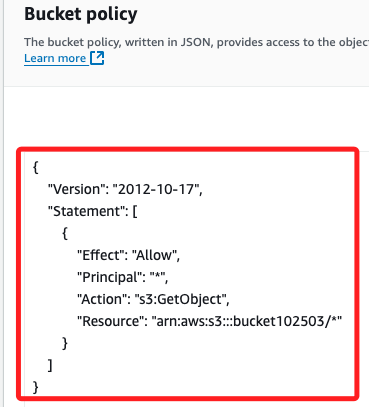
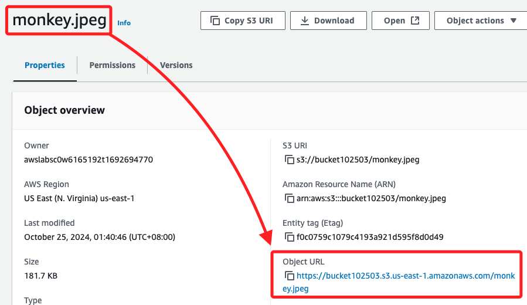
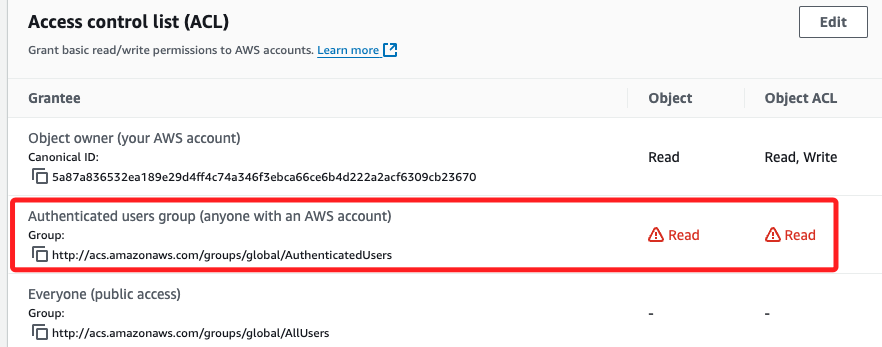

# 流水筆記

_以下先使用主控台面板建立一個 Bucket，然後再使用 CLI 建立並操作新的物件，藉此對比兩個 Bucket 內容來了解操作流程。_

<br>

## 建立 S3 Bucket

_使用主控台介面建立 Bucket 實例_

<br>

1. 進入 S3 的 Bucket，點擊 `Create bucket` 建立 Bucket。

    

<br>

2. 命名如 `bucket102501`

<br>

3. 選擇 `ACLs enabled`

    

<br>

4. `Block Public Access settings` 預設是全部勾選的，也就是啟動了封鎖；特別注意，這時的勾選狀態顯示如下，之後會再來來觀察。

    

<br>

5. 手動將勾選取消，也就是不進行封鎖，所以在下方要點擊 `I acknowledge ...` 表示知悉風險。

    

<br>

6. 其他設定不變，點擊 `Create bucket` 完成建立 bucket。

    

<br>

## 準備工作

_AWS CLI_

<br>

1. 開啟之前的操作文本，在 `第二部分` 加入三個變數 `Bucket_name`、`My_region`、`Canonical_ID`，其中  `Bucket_name` 填入 `mybuctket1025`，`My_region` 使用預設的 `us-east-1`，`Canonical_ID` 是用戶帳號的唯一識別碼，當 CLI 操作需要為某個 AWS 帳戶授權時，會使用 `Canonical User ID` 來識別該帳戶，例如授予不同 AWS 帳戶對 S3 資源的訪問權限時會用到。

    ```bash
    # 第一部分：複製 AWS CLI 貼上，格式不重要，稍後會直接覆蓋
    [default]
    aws_access_key_id=
    aws_secret_access_key=
    aws_session_token=

    # 第二部分：在操作步驟中逐一複製
    Instance_ID=
    Public_IPv4_address=
    Security_groups=
    Username=Administrator
    Password=''
    Shared_Name_of_Drive_C=C_Drive
    # 加入
    Bucket_name=
    My_region=us-east-1
    Canonical_ID=

    # 第三部分：建立環境變數
    export AWS_ACCESS_KEY_ID=$aws_access_key_id
    export AWS_SECRET_ACCESS_KEY=$aws_secret_access_key
    export AWS_SESSION_TOKEN=$aws_session_token
    ```

<br>

2. 建立環境變數，假如其他部分已經設定過，可先複製以下兩行設定到終端機中建立，這裡假設新 Bucket 名稱是 `bucket102503`；假如初次建立，可省略 `EC2` 實例的部分；特別說明，這裡使用的名稱 `bucket102503` 是為了區別 `bucket102501`，以利後續的步驟比較。

    ```bash
    Bucket_name=bucket102503
    My_region=us-east-1
    ```

<br>

3. 完成準備工作後，務必先檢查當前登入資訊。

    ```bash
    aws sts get-caller-identity
    ```

<br>

4. 確認為自己 Learner Lab 的 ID。

    

<br>

## 使用 AWS CLI 建立 Bucket 

1. 建立新的 Bucket，完成後會傳回新的 Bucket 的名稱。

    ```bash
    aws s3api create-bucket --bucket $Bucket_name --region $My_region
    ```

    

<br>

2. 取消 S3 Bucket 的公共存取限制，也就是取消勾選預設的封鎖設定；注意，這個指令並無回傳值。

    ```bash
    aws s3api put-public-access-block --bucket $Bucket_name --public-access-block-configuration BlockPublicAcls=false,IgnorePublicAcls=false,BlockPublicPolicy=false,RestrictPublicBuckets=false
    ```

<br>

3. 進入主控台查看，這時候的狀態是 `off`，也就是並未進行封鎖。

    

<br>

4. 允許所有人訪問該 Bucket 中的所有對象；特別注意，這樣設定後，所有上傳的文件都是公開的。

    ```bash
    policy=$(cat << EOF
    {
        "Version": "2012-10-17",
        "Statement": [
            {
            "Effect": "Allow",
            "Principal": "*",
            "Action": "s3:GetObject",
            "Resource": "arn:aws:s3:::$Bucket_name/*"
            }
        ]
    }
    EOF
    )

    echo "$policy" | envsubst | aws s3api put-bucket-policy --bucket $Bucket_name --policy file://<(echo "$policy" | envsubst)
    ```

<br>

5. 查看下方 `Bucket policy` 區塊，確定順利寫入了 Policy。

    

<br>

6. 查詢當前 Buckets。

    ```bash
    aws s3api list-buckets --query "Buckets[].Name"
    ```

    

<br>

7. 查詢指定 Bucket 的 ACL 設定，這裡查詢新建立的 `bucket102503`。

    ```bash
    aws s3api get-bucket-acl --bucket $Bucket_name
    ```

    

<br>

8. 特別說明，當查詢 Bucket 的區域時，如果 Bucket 是在 `us-east-1` 中建立的，當查詢它的地理位置時，返回值會是 `null`，這並不是錯誤，而是表示 Bucket 位於 `N. Virginia`。

    ```bash
    aws s3api get-bucket-location --bucket $Bucket_name
    ```

<br>

9. 查詢 Bucket 的公共訪問設定。

    ```bash
    aws s3api get-public-access-block --bucket $Bucket_name
    ```

    

<br>

10. 查詢 Bucket 的政策。

    ```bash
    aws s3api get-bucket-policy --bucket $Bucket_name
    ```

<br>

11. 列出特定 Bucket 內的物件。

    ```bash
    aws s3 ls s3://$Bucket_name --recursive
    ```

<br>

## 上傳文件

_當前路徑中準備一張圖片 `monkey.jpeg`_


<br>

1. 將圖片名稱設定為環境參數。

    ```bask
    Image_path=monkey.jpeg
    ```

<br>

2. 上傳圖片到 S3 Bucket。

    ```bash
    aws s3 cp $Image_path s3://$Bucket_name/
    ```

<br>

3. 可在主控台中觀察，確實添加了一張圖片。

    

<br>

4. 獲取該物件的詳細資訊。

    ```bash
    aws s3api head-object --bucket $Bucket_name --key $Image_path
    ```

    

<br>

5. 透過 URL 訪問物件。

    ```bash
    open -a "Google Chrome" https://$Bucket_name.s3.amazonaws.com/monkey.jpeg
    ```

    

<br>

6. 這個 URL 就是 `monkey.jpeg` 的 `Object URL`。

    

<br>

## Onbect 的 Permissions

1. 點擊 Bucket，進入指定 Object，切換到 `Permissions` 頁籤查看。

    

<br>

2. 查看物件的 ACL 設置。

    ```bash
    aws s3api get-object-acl --bucket $Bucket_name --key monkey.jpeg
    ```

    

<br>

3. 當前設定為 `ACLs disabled`。

    

<br>

4. 所以當前是無法點擊 `Access control list (ACL)` 右側的 `Edit`。

    

<br>

5. 使用 CLI 切換 Bucket 的 Object Ownership 到 ACLs enabled。

    ```bash
    aws s3api put-bucket-ownership-controls --bucket $Bucket_name --ownership-controls '{
        "Rules": [
            {
                "ObjectOwnership": "ObjectWriter"
            }
        ]
    }'
    ```

<br>

6. 獲取 Canonical ID。

    ```bash
    aws s3api get-bucket-acl --bucket $Bucket_name
    ```

    

<br>

7. 編輯變數 `Canonical_ID`。

    ```bash
    Canonical_ID=5a87a836532ea189e29d4ff4c74a346f3ebca66ce6b4d222a2acf6309cb23670
    ```

<br>

8. 為 `Everyone (public access)` 設置 `Object` 和 `Object ACL` 的權限，同時保留 `Object owner` 的權限。

    ```bash
    aws s3api put-object-acl --bucket $Bucket_name --key monkey.jpeg \
    --grant-full-control "id=$Canonical_ID" \
    --grant-read 'uri="http://acs.amazonaws.com/groups/global/AllUsers"' \
    --grant-read-acp 'uri="http://acs.amazonaws.com/groups/global/AllUsers"'
    ```

    _查看_

    

<br>

## 設定 `Everyone (public access)`

1. 在設定時發生阻礙，開啟不了。

    

<br>

2. 檢查 Bucket Policy。

    ```bash
    aws s3api get-bucket-policy --bucket $Bucket_name
    ```

<br>

3. 再次修正 Policy。

    ```bash
    aws s3api put-bucket-policy --bucket $Bucket_name --policy '{
        "Version": "2012-10-17",
        "Statement": [
            {
                "Effect": "Allow",
                "Principal": "*",
                "Action": "s3:GetObject",
                "Resource": "arn:aws:s3:::'$Bucket_name'/*"
            }
        ]
    }'
    ```

<br>

## 刪除 Bucket

1. 清空 Bucket。

    ```bash
    aws s3 rm s3://$Bucket_name --recursive
    ```

<br>

2. 再次列出該 Bucket 以確認所有文件已被刪除。

    ```bash
    aws s3 ls s3://$Bucket_name
    ```

<br>

3. 刪除 Bucket。

    ```bash
    aws s3api delete-bucket --bucket $Bucket_name --region $My_region
    ```

<br>

4. 驗證 Bucket 是否已刪除。

    ```bash
    aws s3 ls
    ```

<br>

___

_END_
