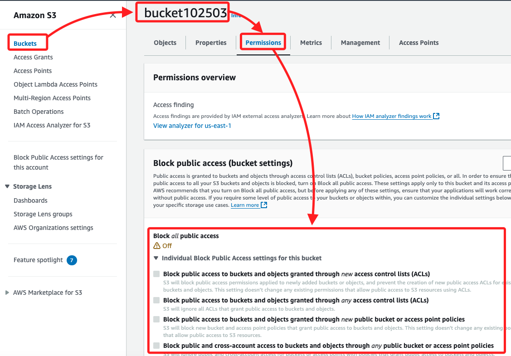

# 流水筆記


## 建立 S3 Bucket

_以下使用標準視窗建立 Bucket 實例_

<br>

1. 進入 S3 的 Bucket，點擊 `Create bucket` 建立 Bucket。


2. 命名如 `bucket102501`

3. 選擇 `ACLs enabled`

4. `Block Public Access settings` 預設是全部勾選的，也就是啟動了封鎖；特別注意，這時的勾選狀態顯示如下，之後會再來來觀察。


5. 手動將勾選取消，也就是不進行封鎖，所以在下方要點擊 `I acknowledge ...` 表示知悉風險。


6. 其他設定不變，點擊 `Create bucket` 完成建立 bucket。


## 準備工作

_AWS CLI_

1. 開啟之前的操作文本，在 `第二部分` 加入兩個變數 `Bucket_name`、`My_region`，其中  `Bucket_name` 填入 `mybuctket1025`，`My_region` 使用預設的 `us-east-1`。

```bash
# 第一部分：複製 AWS CLI 貼上，格式不重要，稍後會直接覆蓋
[default]
aws_access_key_id=
aws_secret_access_key=
aws_session_token=

# 第二部分：在操作步驟中逐一複製
Instance_ID=
Public_IPv4_address=
Security_groups=
Username=Administrator
Password=''
Shared_Name_of_Drive_C=C_Drive
# 加入
Bucket_name=
My_region=us-east-1

# 第三部分：建立環境變數
export AWS_ACCESS_KEY_ID=$aws_access_key_id
export AWS_SECRET_ACCESS_KEY=$aws_secret_access_key
export AWS_SESSION_TOKEN=$aws_session_token
```

2. 建立環境變數，假如其他部分已經設定過，可複製添加的兩行到終端機中建立，這裡假設名稱就是 `bucket102501`；假如初次建立，可省略 `EC2` 實例的部分。

```bash
Bucket_name=bucket102501
My_region=us-east-1
```


## 使用 AWS CLI 建立 Bucket 

1. 建立

```bash
aws s3api create-bucket --bucket $Bucket_name --region $My_region
```

4. 禁用 S3 Bucket 的公共存取限制
```bash
aws s3api put-public-access-block --bucket $Bucket_name --public-access-block-configuration BlockPublicAcls=false,IgnorePublicAcls=false,BlockPublicPolicy=false,RestrictPublicBuckets=false
```



5. 允許所有人訪問該 Bucket 中的所有對象；特別注意，這樣設定後，所有上傳的文件都是公開的。

```bash
policy=$(cat << EOF
{
    "Version": "2012-10-17",
    "Statement": [
        {
        "Effect": "Allow",
        "Principal": "*",
        "Action": "s3:GetObject",
        "Resource": "arn:aws:s3:::$Bucket_name/*"
        }
    ]
}
EOF
)

echo "$policy" | envsubst | aws s3api put-bucket-policy --bucket $Bucket_name --policy file://<(echo "$policy" | envsubst)
```


6. 查詢當前 Buckets。

```bash
aws s3api list-buckets --query "Buckets[].Name"
```

7. 查詢指令 bucket
```bash
aws s3api get-bucket-acl --bucket $Bucket_name
```

8. 查詢 Bucket 的區域；特別注意，如果 Bucket 是在 `us-east-1` 中建立的，當查詢它的地理位置時，返回值會是 null

```bash
aws s3api get-bucket-location --bucket $Bucket_name
```

9. 查詢 Bucket 的公共訪問設定

```bash
aws s3api get-public-access-block --bucket $Bucket_name
```

10. 查詢 Bucket 的政策

```bash
aws s3api get-bucket-policy --bucket $Bucket_name
```

11. 列出特定 Bucket 內的物件

```bash
aws s3 ls s3://$Bucket_name --recursive
```

##

_當前路徑中準備一張圖片 `monkey.jpeg`_


1. 設定環境參數，圖片路徑

```bask
Image_path=monkey.jpeg
```

2. 上傳圖片到 S3 Bucket
```bash
aws s3 cp $Image_path s3://$Bucket_name/
```

3. 獲取該物件的詳細資訊


```bash
aws s3api head-object --bucket $Bucket_name --key $Image_path
```

4. 禁用 Block Public ACL 設置

```bash
aws s3api put-public-access-block --bucket $Bucket_name --public-access-block-configuration BlockPublicAcls=false

```

5. 更新 Bucket Policy

```bash
aws s3api put-bucket-policy --bucket $Bucket_name --policy '{
  "Version": "2012-10-17",
  "Statement": [
    {
      "Effect": "Allow",
      "Principal": "*",
      "Action": "s3:GetObject",
      "Resource": "arn:aws:s3:::'$Bucket_name'/*"
    }
  ]
}'
```

6. 檢查 Policy

```bash
aws s3api get-bucket-policy --bucket $Bucket_name
```

7. 訪問物件

```bash
open -a "Google Chrome" https://$Bucket_name.s3.amazonaws.com/monkey.jpeg
```

