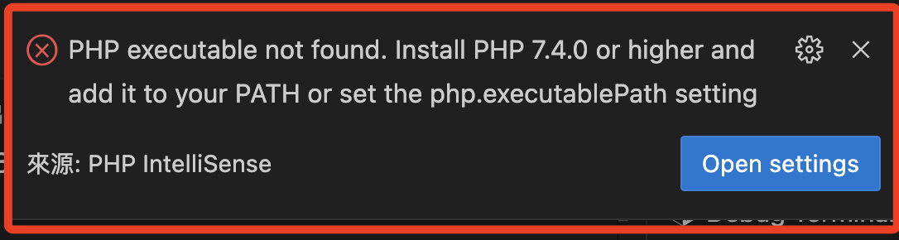

# 關於 PHP 錯誤

_暫時放在這_

## 說明

1. 開啟 VSCode 的時候若出現以下錯誤彈窗。




此錯誤訊息顯示在 VSCode 中啟用了 PHP IntelliSense 外掛，但系統找不到 PHP 執行檔。以下是排除問題的步驟：

### 1. 安裝 PHP
如果尚未安裝 PHP，請先安裝 PHP 7.4 或更高版本。可以參考以下步驟來安裝：

   - macOS：可以透過 [Homebrew](https://brew.sh/) 安裝，執行以下指令：
     ```bash
     brew install php
     ```
   - Windows：可以從 [PHP 官網](https://windows.php.net/download) 下載安裝程式，並將 PHP 的安裝路徑加入環境變數中。
   - Linux：可以使用以下指令安裝 PHP：
     ```bash
     sudo apt update
     sudo apt install php
     ```

### 2. 將 PHP 加入 PATH 環境變數
確保 PHP 執行檔的路徑在系統的 PATH 環境變數中：

   - macOS / Linux：
     1. 打開終端機，輸入以下指令來確認 PHP 是否已在 PATH 中：
        ```bash
        php -v
        ```
     2. 如果顯示版本資訊則代表已正確設定；如果沒有，則需要手動將 PHP 路徑加入 PATH。可以在 `~/.bash_profile` 或 `~/.zshrc` 中加入以下行（假設 PHP 安裝在 `/usr/local/bin/php`）：
        ```bash
        export PATH="/usr/local/bin/php:$PATH"
        ```
     3. 存檔後，執行 `source ~/.bash_profile` 或 `source ~/.zshrc` 以重新載入設定。

   - Windows：
     1. 右鍵點擊「此電腦」或「我的電腦」，選擇「屬性」。
     2. 前往「進階系統設定」→「環境變數」。
     3. 在「系統變數」的 `Path` 中新增 PHP 安裝路徑（例如 `C:\php`）。
     4. 存檔後重啟 VSCode。

### 3. 設定 `php.executablePath`（在 VSCode 中）
如果安裝好 PHP 後，還是出現錯誤，可以手動在 VSCode 設定中指定 PHP 執行檔路徑：

1. 開啟 VSCode，前往「設定」：
   - 點擊左下角的齒輪圖示，選擇「Settings」。
2. 搜尋 `php.executablePath`。
3. 在 `php.executablePath` 設定中，填入 PHP 執行檔的完整路徑。例如：
   - macOS / Linux：`/usr/local/bin/php`
   - Windows：`C:\php\php.exe`
4. 存檔後重新啟動 VSCode。

完成這些步驟後，應該可以解決此錯誤。如果還有問題，請確認 PHP 安裝路徑是否正確，並確保 VSCode 的設定已正確指向該路徑。