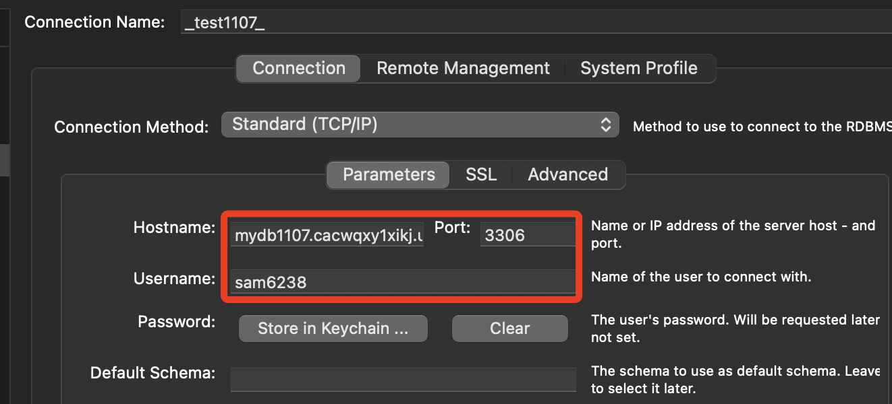

## Database

1. 連線資料庫

```sql
mysql -h mydb1107.cacwqxy1xikj.us-east-1.rds.amazonaws.com \
-P 3306 \
-u sam6238 \
-p
```

2. 最後一個參數 `-p` 表示需要並提示密碼，輸入密碼完成連線。 


3. 使用 Workbench 也是相同。



## 資料庫查詢

1. 查詢當前資料庫

    ```sql
    SELECT DATABASE();
    ```

2. 查看所有資料庫

    ```sql
    SHOW DATABASES;
    ```

3. 選擇資料庫

    ```sql
    USE <database-名稱>;
    ```

4. 查看所有表格

    ```sql
    SHOW TABLES;
    ```

5. 查看表格結構

    ```sql
    DESCRIBE <table-名稱>;
    ```

    _或者使用_

    ```sql
    SHOW COLUMNS FROM <table-名稱>;
    ```

6. 查看表格詳細結構，包含欄位類型、預設值等詳細資訊。

    ```sql
    SHOW CREATE TABLE <table-名稱>;
    ```

## 資料表查詢

1. 查詢所有欄位資料

    ```sql
    SELECT * FROM table_name;
    ```

- 查詢特定欄位
  ```sql
  SELECT column1, column2 FROM table_name;
  ```

- 使用條件篩選資料
  ```sql
  SELECT * FROM table_name WHERE condition;
  ```
  例如，查詢年齡大於 25 的用戶
  ```sql
  SELECT * FROM users WHERE age > 25;
  ```

- 排序查詢結果：
  ```sql
  SELECT * FROM table_name ORDER BY column_name ASC|DESC;
  ```
  例如，根據年齡從大到小排序
  ```sql
  SELECT * FROM users ORDER BY age DESC;
  ```

- 限制查詢筆數
  ```sql
  SELECT * FROM table_name LIMIT number;
  ```
  例如，查詢前 10 筆記錄：
  ```sql
  SELECT * FROM users LIMIT 10;
  ```

## 資料表維護與管理

- 新增資料表
  ```sql
  CREATE TABLE table_name (
      column1 datatype PRIMARY KEY,
      column2 datatype,
      column3 datatype
  );
  ```
  例如，建立一個使用者表格
  ```sql
  CREATE TABLE users (
      id INT PRIMARY KEY AUTO_INCREMENT,
      name VARCHAR(50),
      age INT,
      email VARCHAR(100)
  );
  ```

- 插入資料
  ```sql
  INSERT INTO table_name (column1, column2) VALUES (value1, value2);
  ```
  例如，插入一筆使用者資料：
  ```sql
  INSERT INTO users (name, age, email) VALUES ('Alice', 30, 'alice@example.com');
  ```

- 更新資料
  ```sql
  UPDATE table_name SET column1 = value1 WHERE condition;
  ```
  例如，更新使用者的年齡
  ```sql
  UPDATE users SET age = 31 WHERE name = 'Alice';
  ```

- 刪除資料
  ```sql
  DELETE FROM table_name WHERE condition;
  ```
  例如，刪除年齡大於 30 的使用者：
  ```sql
  DELETE FROM users WHERE age > 30;
  ```

## 進階查詢

_聚合查詢：計算資料總數、平均值、最大/最小值等_

1. 總數
    ```sql
    SELECT COUNT(*) FROM table_name;
    ```
2. 平均值
    ```sql
    SELECT AVG(column_name) FROM table_name;
    ```
3. 最大值
    ```sql
    SELECT MAX(column_name) FROM table_name;
    ```
4. 最小值
    ```sql
    SELECT MIN(column_name) FROM table_name;
    ```

- 分組查詢
  ```sql
  SELECT column_name, COUNT(*) FROM table_name GROUP BY column_name;
  ```
  例如，統計每個年齡的使用者數量：
  ```sql
  SELECT age, COUNT(*) FROM users GROUP BY age;
  ```

- 多表連結查詢（內部連結）
  ```sql
  SELECT a.column1, b.column2 FROM table1 AS a
  INNER JOIN table2 AS b ON a.common_column = b.common_column;
  ```
  例如，查詢訂單中的用戶資料：
  ```sql
  SELECT users.name, orders.order_date FROM users
  INNER JOIN orders ON users.id = orders.user_id;
  ```

