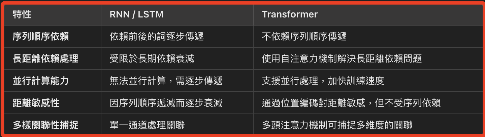

# Transformer

_常被應用在 NLP 中的深度學習架構，相較於 `RNN` 和 `LSTM` 架構，`Transformer` 除擁有 `並行計算` 能力，最重要的是在捕捉 `長距離關係` 的處理上_

 

## 白話介紹

1. 相較於傳統的 `RNN` 或 `LSTM`，`Transformer` 不依賴數據的 `時間序列順序`，而是利用 `位置編碼` 來提供序列資訊。

2. 透過 `自注意力機制`，Transformer 對每個數據點建立了多個注意力 `頭`，計算該數據點與其他數據點的相似性向量，從而構建能全面考量整體關聯的 NLP 模型，這讓模型在捕捉長距離依賴關係時不會受到位置或距離的限制，因此特別適合處理長文本的關聯性分析。

3. 特別注意，這種關聯建構方式並非模型的 `降維展開`，而是通過 `多頭注意力` 擴展模型的觀察視角；`多頭注意力機制` 使得每個 `頭` 能從不同的角度學習數據之間的關聯性，每個頭能捕捉不同層次的關聯模式，並在不同特徵空間中形成一組多維度的注意力分布。

4. 這些多頭注意力共同提升了模型的語義理解能力，使模型能從更豐富的語境中解讀輸入訊息。

5. 每個頭在本質上並不是建立「路徑」，而是以不同的特徵空間去解釋和量化數據點間的關聯性。每個頭可以被視為一個關聯模式的觀察維度，而非具體的關聯「路徑」。

6. 這個機制稱為 `自注意力機制（self-attention）`，而多個注意力頭的設計則稱為 `多頭注意力（multi-head attention）`。

 

## 核心技術

_自注意力機制（Self-Attention Mechanism）_

 

1. 自注意力機制允許模型在處理序列的過程中，針對序列中每個詞，也就是每一個 `Token`  計算該詞與序列中所有其他詞的關聯性或`注意力權重`。

 

2. 如此將在模型中導入多組不同的權重組合，使模型可以捕捉到序列中的多層次關聯性。

 

3. 計算實務上，自注意力機制會根據每個詞的位置編碼及特徵，計算其與序列中其他詞的 `相似度` 或 `影響力`，生成 `注意力矩陣`。

 

## 架構要素

1. Transformer 包含多層的編碼器和解碼器（Encoder-Decoder），其中 `編碼器` 負責處理輸入序列的特徵表示，`解碼器` 負責根據輸入特徵生成 `輸出序列`。

 

2. 由於 Transformer _不具備序列順序傳遞的特性_，位置編碼為每個詞增加了 `位置信息`，使模型能識別各詞的相對位置。

 

## 差異性

_RNN 和 LSTM 因距離而產生的長期依賴衰減問題_

 

1. Transformer 與 RNN/LSTM 的對比。

    

 

## 距離敏感性和位置編碼

1. `位置編碼` 賦予模型對序列中各詞的相對位置信息，使模型對詞之間的 `距離` 敏感，這種距離敏感性不是基於序列順序，而是由 `位置` 編碼加權的計算得出。

 

2. 在自注意力中，Transformer 的 `注意力矩陣` 基於每個詞的特徵和位置，計算每個詞對其他詞的影響力或關聯性。

 

___

_END_