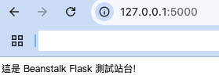
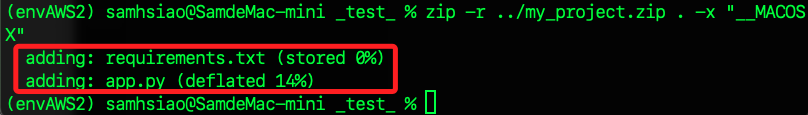

# Beanstalk

_以下使用 `90630` Learner Lab 進行建立站台，可參考 `07_Elastic Beanstalk`_

<br>

## 建立 Python 平台專案

_先建立簡易的範例專案_

<br>

1. 在 `~/.Downloads` 建立專案資料夾 `_test_`，內含兩個 Flask 站台所需文件；特別注意，在這不需要建立 `Procfile` 文件。

    ```bash
    mkdir -p ~/Downloads/_test_ && cd ~/Downloads/_test_
    touch app.py requirements.txt
    ```

<br>

2. 編輯簡易站台所需腳本，並啟動 VSCode。

    ```bash
    echo "from flask import Flask

    app = Flask(__name__)


    @app.route('/')
    def home():
        return '這是 Beanstalk Flask 測試站台!'


    if __name__ == '__main__':
        app.run()" > app.py


    echo "Flask==2.0.2" > requirements.txt

    code .
    ```

<br>

3. 在終端機啟動站台，並訪問 `127.0.0.1:5000`；停止運行按下組合鍵 `command+C`。

    ```bash
    python app.py
    ```

    

<br>

4. 在資料夾 `_test_` 內對於資料夾進行壓縮，並將壓縮檔 `my_project.zip` 存放在上層目錄中，這樣可讓站台訪問時維持在根路由；使用參數 `-x` 可指定要排除的項目，這裡示範排除 Mac 系統自動生成的 `__MACOSX` 資料夾。

    ```bash
    zip -r ../my_project.zip . -x "__MACOSX"
    ```

    

<br>

## 使用主控台建立應用

_接下來先使用主控台操作_

<br>

1. 

<br>

___

_END_

