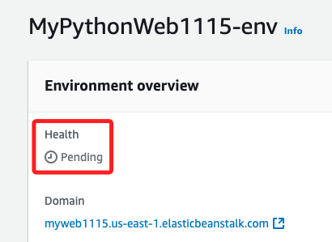
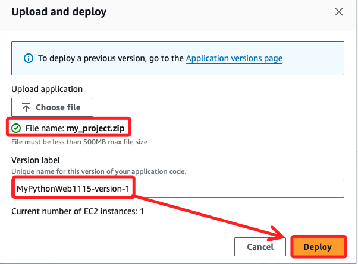

# Beanstalk

_以下使用 `90630` Learner Lab 進行建立站台，可參考 `07_Elastic Beanstalk`_

<br>

## 建立 Python 平台專案

_先建立簡易的範例專案_

<br>

1. 在 `~/.Downloads` 建立專案資料夾 `_test_`，內含兩個 Flask 站台所需文件；特別注意，在這不需要建立 `Procfile` 文件。

    ```bash
    mkdir -p ~/Downloads/_test_ && cd ~/Downloads/_test_
    touch application.py requirements.txt
    ```

<br>

2. 編輯簡易站台所需腳本，並啟動 VSCode。

    ```bash
    echo "from flask import Flask

    application = Flask(__name__)


    @application.route('/')
    def home():
        return '這是 Beanstalk Flask 測試站台!'


    if __name__ == '__main__':
        app.run()" > app.py


    echo "Flask==2.0.2" > requirements.txt

    code .
    ```

<br>

3. 在終端機啟動站台，並訪問 `127.0.0.1:5000`；停止運行按下組合鍵 `command+C`。

    ```bash
    python app.py
    ```

    

<br>

4. 在資料夾 `_test_` 內對於資料夾進行壓縮，並將壓縮檔 `my_project.zip` 存放在上層目錄中，這樣可讓站台訪問時維持在根路由；使用參數 `-x` 可指定要排除的項目，這裡示範排除 Mac 系統自動生成的 `__MACOSX` 資料夾。

    ```bash
    zip -r ../my_project.zip . -x "__MACOSX"
    ```

    

<br>

## 使用主控台建立應用

_接下來先使用主控台操作，未特別說明的部分使用預設值_

<br>

1. 搜尋並進入 `Elastic Beanstalk` 服務，點擊 `Create application` 建立應用。

    

<br>

2. 命名應用程式如 `MyPythonWeb1115`。

    

<br>

3. 可以自訂網域前綴名稱如 `myweb1115`，我個人是挺偏好使用自訂的；命名後點擊 `Check availability` 確認是否可用。

    

<br>

4. 平台選擇 `Python`，版本選擇 `3.9`。

    

<br>

5. 點擊右下角 `Next`；注意，這裡先不上傳檔案。

    

<br>

6. 接下來三個選項都使用 Lab 提供的設定，分別是角色選擇 `LabRole`、密鑰對選擇 `vockey`、EC2 實例 profile 選擇 `LabInstanceProfile`。

    

<br>

7. 點擊右下角 `Next`。

    

<br>

8. VCP 要從下拉選單選擇 Lab 提供的設定。

    

<br>

9. 讓外不能訪問，在 `Public IP address` 必須勾選 `Activated`。

    

<br>

10. 子網要任意選擇一個，這裡選擇 `us-east-1a`。

    

<br>

11. 點擊右下角 `Next`。

    

<br>

12. 安全群組可選擇 `default`。

    

<br>

13. 點擊右下角 `Next`。

    

<br>

14. 接下來這個頁面中比較重要的是環境變數，這裡可以先使用預設，直接點擊右下角 `Next`。

    

<br>

15. 進入下一個頁面後稍加瀏覽，然後點擊右下角 `Submit` 提交並完成建立應用。

    

<br>

## 回到主畫面

1. 等待建立的過程中，注意這個 `Health` 的狀態，顯示為 `Pending` 表示還在建立中。



2. 完成時顯示 `Ok`。


3. 這時若點擊下方的 `Domain` 會進入預設的站台中。


4. 檢查 Events 無異常事件。


## 部署站台

1. 點擊右上角 `Upload and deploy`。


2. 選擇前面步驟建立的壓縮檔進行上傳，會自動生成版本編號，然後點擊 `Deploy`。



___


_END_

