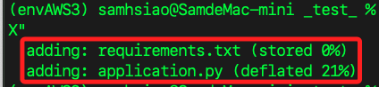
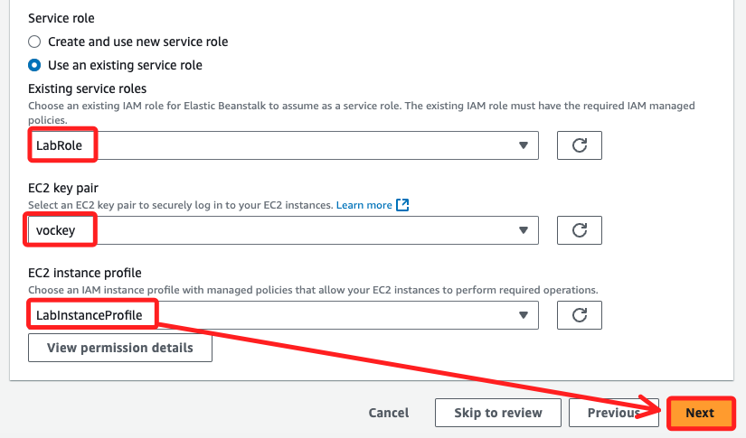
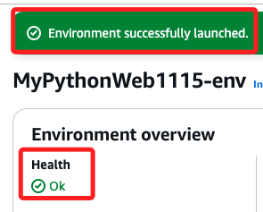

# Beanstalk

_以下使用 `90630` Learner Lab 進行建立站台，可參考 `07_Elastic Beanstalk`_

<br>

## 建立 Python 平台專案

_先建立簡易的範例專案_

<br>

1. 在 `~/.Downloads` 建立專案資料夾 `_test_`，內含兩個 Flask 站台所需文件；特別注意，在這不需要建立 `Procfile` 文件；接著啟動 VSCode。

    ```bash
    mkdir -p ~/Downloads/_test_ && cd ~/Downloads/_test_
    touch application.py requirements.txt
    code .
    ```

<br>

2. 編輯簡易站台所需腳本，這裡使用終端指令直接寫入；以下指令會在兩個腳本中寫入必要內容。

    ```bash
    echo "from flask import Flask

    application = Flask(__name__)


    @application.route('/')
    def home():
        return '這是 Beanstalk Flask 測試站台!'


    if __name__ == '__main__':
        application.run()" > application.py


    echo "Flask" > requirements.txt
    ```

<br>

3. 在終端機啟動站台。

    ```bash
    python application.py
    ```

<br>

4. 並訪問 `127.0.0.1:5000`；停止運行按下組合鍵 `command+C`。

    ```bash
    python application.py
    ```

    

<br>

5. 在資料夾 `_test_` 內對於資料夾進行壓縮，並將壓縮檔 `my_project.zip` 存放在上層目錄中，這樣可讓站台訪問時維持在根路由；使用參數 `-x` 可指定要排除的項目，這裡示範排除 Mac 系統自動生成的 `__MACOSX` 資料夾。

    ```bash
    zip -r ../my_project.zip . -x "__MACOSX"
    ```

    

<br>

## 使用主控台建立應用

_接下來先使用主控台操作，未特別說明的部分使用預設值_

<br>

1. 搜尋並進入 `Elastic Beanstalk` 服務，點擊 `Create application` 建立應用。

    

<br>

2. 命名應用程式如 `MyPythonWeb1115`。

    

<br>

3. 可以自訂網域前綴名稱如 `myweb1115`，我個人是挺偏好使用自訂的；命名後點擊 `Check availability` 確認是否可用。

    

<br>

4. 平台選擇 `Python`，版本選擇 `3.9`。

    

<br>

5. 點擊右下角 `Next`；注意，這裡先不上傳檔案。

    

<br>

6. 接下來三個選項都使用 Lab 提供的設定，分別是角色選擇 `LabRole`、密鑰對選擇 `vockey`、EC2 實例 profile 選擇 `LabInstanceProfile`。

    

<br>

7. 點擊右下角 `Next`。

    

<br>

8. VCP 要從下拉選單選擇 Lab 提供的設定。

    

<br>

9. 允許外部訪問，在 `Public IP address` 必須勾選 `Activated`。

    

<br>

10. 子網要任意選擇一個，這裡選擇 `us-east-1a`；若設定 `Load Balancer` 需設定兩個以上。

    

<br>

11. 點擊右下角 `Next`。

    

<br>

12. 安全群組可選擇 `default`。

    

<br>

13. 點擊右下角 `Next`。

    

<br>

14. 在接下來的頁面中滑動到 `Environment properties`，可看到已預設一組環境變數 `PYTHONPATH`，這是因為選擇的平台是 `Python` 系統；點擊右下角 `Next`。

    

<br>

15. 進入下一個頁面後稍加瀏覽，然後點擊右下角 `Submit` 提交並完成建立應用。

    

<br>

16. 自動返回環境清單，並且會顯示當前作業狀態。

    

<br>

## 回到主畫面

1. 等待建立的過程中，注意這個 `Health` 的狀態，一開始顯示為 `Pending` 表示還在建立中。

    

<br>

2. 完成時顯示 `Ok`。

    

<br>

3. 點擊下方的 `Domain`。

    

<br>

4. 會進入並開啟部署的站台。

    

<br>

5. 回到建立完成的實例中，在下方的頁籤 `Events` 可查看有無異常事件。

    

<br>

## 部署站台

1. 點擊右上角 `Upload and deploy`。

    

<br>

2. 選擇前面步驟建立的壓縮檔進行上傳，會依據應用名稱自動生成版本編號 `MyPythonWeb1115-version-1`，然後點擊 `Deploy`。

    

<br>

3. 會回到環境實例中，等待上傳完成；若狀態未自動更新，可點擊刷新功能的圖標。

    

<br>

4. 完成時點擊 `Domain` 查看這個 Flask 站台。

    

<br>

5. 可訪問這個自訂的網域名。

    

<br>

___


_END_

