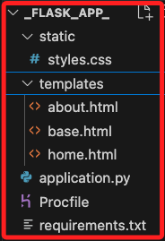

# Flask 站台

<br>

## 專案文件架構

1. 應用程式目錄結構。

    ```bash
    mkdir -p ~/Downloads/_flask_app_
    cd ~/Downloads/_flask_app_

    touch application.py Procfile requirements.txt

    mkdir static
    touch static/styles.css

    mkdir templates
    touch templates/base.html
    touch templates/home.html
    touch templates/about.html

    code .
    ```

<br>

2. 在 VSCode 中可查看結構。

    

<br>

## 編輯代碼

1. `application.py`，這是 Flask 主程式，其中設定了基本路由以及模板渲染等。

    ```python
    from flask import Flask, render_template

    # 使用 application 作為 Flask 應用實例
    application = Flask(__name__)


    @application.route("/")
    def home():
        return render_template("home.html")


    @application.route("/about")
    def about():
        return render_template("about.html")


    if __name__ == "__main__":
        application.run(debug=True)
    ```

<br>

2. `templates/base.html`，這是站台的基本模板，使用 Bootstrap 渲染，並以此作為其他頁面的基礎，每個頁面都會繼承這個模板，避免重複代碼。

    ```html
    <!DOCTYPE html>
    <html lang="en">
    <head>
        <meta charset="UTF-8">
        <meta name="viewport" content="width=device-width, initial-scale=1.0">
        <title>AWS 課程的 Flask 站台</title>
        <link href="https://stackpath.bootstrapcdn.com/bootstrap/4.5.2/css/bootstrap.min.css" rel="stylesheet">
        <link rel="stylesheet" href="{{ url_for('static', filename='styles.css') }}">
    </head>
    <body>
        <!-- Navbar -->
        <nav class="navbar navbar-expand-lg navbar-light bg-light">
            <a class="navbar-brand" href="/">FlaskApp</a>
            <button class="navbar-toggler" type="button" data-toggle="collapse" data-target="#navbarNav" aria-controls="navbarNav" aria-expanded="false" aria-label="Toggle navigation">
                <span class="navbar-toggler-icon"></span>
            </button>
            <div class="collapse navbar-collapse" id="navbarNav">
                <ul class="navbar-nav">
                    <li class="nav-item"><a class="nav-link" href="/">Home</a></li>
                    <li class="nav-item"><a class="nav-link" href="/about">About</a></li>
                </ul>
            </div>
        </nav>

        <!-- Main Content -->
        <div class="container mt-4">
            
        </div>

        <footer class="footer bg-light text-center mt-5 py-3">
            <p>&copy; 2024 實踐大學 AWS 課程. All Rights Reserved.</p>
        </footer>
    </body>
    </html>
    ```

<br>

3. `templates/home.html`，這是站台的首頁內容，如前項所述會繼承 `base.html`，並且使用 Bootstrap 的標題和按鈕樣式。

    ```html
    

    Home - Flask App

    
    <div class="jumbotron text-center">
        <h1 class="display-4">歡迎來到 AWS 課程的 Flask 站台。</h1>
        <p class="lead">這是一個簡單的範例，練習在 Beanstalk 上部署一個 Python Flask 應用，搭配 Bootstrap 進行網頁的優化。</p>
        <a class="btn btn-primary btn-lg" href="/about" role="button">更多資訊</a>
    </div>
    
    ```

<br>

4. `templates/about.html`，這是站台的分頁 `關於`，內容是簡單介紹應用的資訊。

    ```html
    

    About - Flask App

    
    <h2>關於我們</h2>
    <p>
        在這個部分主要是拓展 Flask App 的功能，可更進一步建立動態網頁，也可嘗試部署  LineBot。
    </p>
    
    ```

<br>

5. `static/styles.css`，這是自定義樣式表，可透過這個文件進一步自定義樣式。

    ```css
    body {
        font-family: Arial, sans-serif;
    }

    .footer {
        background-color: #f8f9fa;
        color: #6c757d;
    }
    ```

<br>

6. `Procfile`（可選，如果在 Beanstalk 使用 Gunicorn）

如果要在 Beanstalk 使用 Gunicorn，您可以添加一個 `Procfile` 文件，讓應用程式以 Gunicorn 啟動：

    ```bash
    web: gunicorn application:application
    ```

<br>

7. `requirements.txt` 部分，添加兩個庫。

    ```bash
    Flask
    gunicorn
    ```

<br>

## 部署

1. 先回到終端機中，在專案資料夾內壓縮站台內容。

    ```bash
    zip -r ../my_project.zip . -x "__MACOSX"
    ```

<br>

2. 進入 Beanstalk 主控台，點擊 `Upload and deploy`。

    

<br>

3. 選取壓縮文件，點擊 `Deploy`。

    

<br>

4. 這時開始部署工作，`Health` 不會改變，依舊是 `Ok`。

    

<br>

5. 接著 `Health` 會先變成 `Info`。

    

<br>

6. 上方顯示綠色的完成資訊時，先手動點擊刷新圖標，確認 `Health` 已經成為 `Ok`。

    

<br>

## 訪問網站

1. 點擊網域進行訪問。

    

<br>

2. 顯示如下畫面。

    

<br>

3. 切換頁籤。

    

<br>

___

_END_