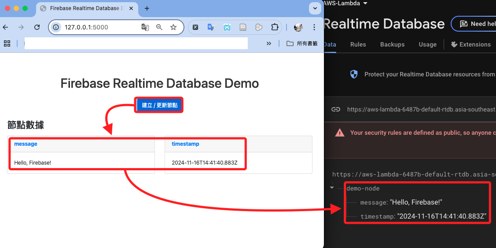

# 連動 Firebase

_結合 Python Flask、Javascript 及 Bootstrap，建立一個動態網頁顯示 Firebase 即時資料庫數據_

<br>

## 步驟

_開啟終端機執行_

<br>

1. 建立專案結構，專案資料夾命名為 `_linebot_`，同時啟動 VSCode；資料夾結構如下。

    ```bash
    mkdir -p ~/Downloads/_linebot_ && cd ~/Downloads/_linebot_
    mkdir static templates
    touch .env .gitignore application.py requirements.txt Procfile
    touch static/scripts.js static/styles.css
    touch templates/index.html
    code .
    ```

    

<br>

2. 同樣使用終端機指令，在 `.gitignore` 中寫入 `.env` 避免上傳敏感資訊。

    ```bash
    echo ".env" > .gitignore
    ```

<br>

3. 預設在 `.env` 中寫入 Firebase 憑證的 KEY 名稱。

    ```bash
    echo -e "FIREBASE_API_KEY=\nFIREBASE_AUTH_DOMAIN=\nFIREBASE_DATABASE_URL=\nFIREBASE_PROJECT_ID=\nFIREBASE_STORAGE_BUCKET=\nFIREBASE_MESSAGING_SENDER_ID=\nFIREBASE_APP_ID=" > .env
    ```

<br>

4. 啟動 VSCode。

    ```bash
    code .
    ```

<br>

5. 在 `requirements.txt` 中寫入。

    ```bash
    Flask
    gunicorn
    ```

<br>

6. 在 `Procfile` 中寫入。

    ```bash
    web: gunicorn application:application
    ```

<br>

## 編輯腳本

1. `index.html`。

    ```html
    <!DOCTYPE html>
    <html lang="en">
        <head>
            <meta charset="UTF-8">
            <meta name="viewport" content="width=device-width, initial-scale=1.0">
            <title>Firebase Realtime Database Demo</title>
            <link rel="stylesheet" href="{{ url_for('static', filename='styles.css') }}">
            <!-- 引入 Bootstrap -->
            <link rel="stylesheet" href="https://stackpath.bootstrapcdn.com/bootstrap/4.5.2/css/bootstrap.min.css">
            <!-- Firebase Modern SDK (Non-module) -->
            <script src="https://www.gstatic.com/firebasejs/9.6.10/firebase-app-compat.js"></script>
            <script src="https://www.gstatic.com/firebasejs/9.6.10/firebase-database-compat.js"></script>
        </head>
        <body>
            <div class="container mt-5">
                <h1 class="text-center mb-4">Firebase Realtime Database Demo</h1>
                <div class="text-center mb-4">
                    <button class="btn btn-primary" onclick="updateNode()">建立 / 更新節點</button>
                </div>
                <h3 class="mb-3">節點數據</h3>
                <div id="dynamic-content" class="row">
                    <!-- 節點數據將動態插入到這裡 -->
                </div>
            </div>

            <!-- 注入的 Firebase 配置 -->
            <script>
                const firebaseConfig = {
                    apiKey: "{{ apiKey }}",
                    authDomain: "{{ authDomain }}",
                    databaseURL: "{{ databaseURL }}",
                    projectId: "{{ projectId }}",
                    storageBucket: "{{ storageBucket }}",
                    messagingSenderId: "{{ messagingSenderId }}",
                    appId: "{{ appId }}"
                };
            </script>

            <!-- Custom Script -->
            <script>
                document.addEventListener("DOMContentLoaded", () => {
                    if (typeof firebaseConfig === "undefined") {
                        console.error("Firebase 配置未正確加載！");
                        return;
                    }

                    // 初始化 Firebase
                    const app = firebase.initializeApp(firebaseConfig);
                    const database = firebase.database();

                    // 指定節點
                    const nodeName = "demo-node";
                    const dbRef = database.ref(nodeName);

                    // 監聽節點數據變更
                    dbRef.on("value", (snapshot) => {
                        const data = snapshot.val();
                        const content = document.getElementById("dynamic-content");
                        content.innerHTML = ""; // 清空內容

                        if (data) {
                            Object.entries(data).forEach(([key, value]) => {
                                const col = document.createElement("div");
                                col.className = "col-md-6 mb-3";
                                col.innerHTML = `
                                    <div class="card">
                                        <div class="card-header font-weight-bold text-primary">${key}</div>
                                        <div class="card-body">
                                            <p class="card-text">${value}</p>
                                        </div>
                                    </div>
                                `;
                                content.appendChild(col);
                            });
                        } else {
                            content.innerHTML = `
                                <div class="col-12">
                                    <div class="alert alert-warning" role="alert">
                                        節點數據為空！
                                    </div>
                                </div>
                            `;
                        }
                    });

                    // 創建或更新節點數據
                    window.updateNode = async function () {
                        const newData = {
                            message: "Hello, Firebase!",
                            timestamp: new Date().toISOString(),
                        };
                        await dbRef.set(newData);
                        console.log("數據已更新:", newData);
                    };
                });
            </script>
        </body>
    </html>
    ```

<br>

2. `application.py`。

    ```python
    from flask import Flask, render_template
    import os

    # 判斷是否運行於 Elastic Beanstalk 或 AWS Lambda 環境
    if os.getenv("AWS_EXECUTION_ENV") is None:
        from dotenv import load_dotenv

        # 本地加載 .env 文件
        load_dotenv()

    application = Flask(__name__)


    @application.route("/")
    def home():
        # 從 .env 獲取 Firebase 配置
        firebase_config = {
            "apiKey": os.getenv("FIREBASE_API_KEY"),
            "authDomain": os.getenv("FIREBASE_AUTH_DOMAIN"),
            "databaseURL": os.getenv("FIREBASE_DATABASE_URL"),
            "projectId": os.getenv("FIREBASE_PROJECT_ID"),
            "storageBucket": os.getenv("FIREBASE_STORAGE_BUCKET"),
            "messagingSenderId": os.getenv("FIREBASE_MESSAGING_SENDER_ID"),
            "appId": os.getenv("FIREBASE_APP_ID"),
        }

        # 確認所有必要的參數是否正確
        for key, value in firebase_config.items():
            if not value:
                raise ValueError(f"Firebase 配置項 `{key}` 缺失，請檢查 .env 文件。")

        return render_template("index.html", **firebase_config)


    if __name__ == "__main__":
        application.run(debug=True)

    ```

<br>

3. `scripts.js`。

    ```js
    // 確保 `firebaseConfig` 已正確加載
    if (typeof firebaseConfig === "undefined") {
        console.error("Firebase 配置未正確加載！");
    } else {
        try {
            // 初始化 Firebase
            const app = firebase.initializeApp(firebaseConfig);
            const database = firebase.database();

            // 指定節點
            const nodeName = "demo-node";
            const dbRef = database.ref(nodeName);

            // 檢查節點是否存在並創建
            dbRef.once("value").then((snapshot) => {
                if (!snapshot.exists()) {
                    dbRef.set({
                        message: "Hello, Firebase!",
                        timestamp: new Date().toISOString(),
                    });
                    console.log(`節點 "${nodeName}" 已創建。`);
                }
            });

            // 監聽節點數據變更
            dbRef.on("value", (snapshot) => {
                const data = snapshot.val();
                document.getElementById("dynamic-content").innerText = JSON.stringify(data, null, 2);
            });

            // 節點更新功能
            window.updateNode = async function () {
                const newData = {
                    message: "Hello again, Firebase!",
                    timestamp: new Date().toISOString(),
                };
                await dbRef.set(newData);
                console.log("數據已更新：", newData);
            };
        } catch (error) {
            console.error("初始化 Firebase 時出錯：", error);
        }
    }
    ```

<br>

4. `styles.css`。

    ```css
    body {
        font-family: Arial, sans-serif;
        margin: 0;
        padding: 20px;
        background-color: #f4f4f9;
    }

    h1 {
        color: #333;
    }

    button {
        padding: 10px 20px;
        font-size: 16px;
        background-color: #007bff;
        color: white;
        border: none;
        border-radius: 5px;
        cursor: pointer;
    }

    button:hover {
        background-color: #0056b3;
    }

    pre {
        background-color: #e9ecef;
        padding: 10px;
        border-radius: 5px;
        white-space: pre-wrap;
        word-wrap: break-word;
    }
    ```

<br>

## 複製 Firebase 憑證

_進入 Firebase 專案主控台，這裡假設已經建立好專案以及 `Web apps`_

<br>

1. 在專案主控台的 `General` 頁籤中可複製 SDK 所需的設置，複製 `firebaseConfig` 變數的內容如下區塊。

    

<br>

2. 回到本地專案資料夾，將複製的內容貼在 `.env` 文件中，然後對照 Key 將 Value 剪下貼到對照的本地 Key 中；完成後將下方貼上的內容刪除。

    

<br>

## 運行

1. 在本地先測試。

    ```bash
    python application.py
    ```

<br>

2. 訪問。

    ```bash
    http://127.0.0.1:5000
    ```

<br>

3. 初次啟動，點擊 `建立/更新節點`。

    

<br>

4. 隨即建立節點數據。

    

<br>

5. 進入即時資料庫查看同步情況。

    

<br>

6. 每次點擊按鈕，都會讓本地站台與遠端資料庫同步變動。

    

<br>

7. 手動修改節點的值，本地站台也會同步變更。

    

<br>

## 壓縮腳本

_準備上傳站台到 Beanstalk_

<br>

1. 在本地專案資料夾開啟終端機，運行以下指令將專案內容壓縮至上一層資料夾，壓縮檔案命名為 `my_project.zip`。

    ```bash
    zip -r ../my_project.zip . -x "__MACOSX"
    ```

<br>

## 添加環境變數 

_進入 AWS 添加一個用於檢查是否在 `Beanstalk` 中運行的環境變數 `AWS_EXECUTION_ENV`_

<br>

1. 進入 `Environments` 物件中，點擊左側功能欄的 `Configuration`。

    

<br>

2. 滑動到最下方 `Updates, monitoring, and logging` 區塊，點擊 `Edit`。

    

<br>

3. 添加一個環境變數 `AWS_EXECUTION_ENV`，任意賦值即可，這裡填入的是 `True`；這個環境變數用於辨識當前所在環境是本地還是雲端，在本地是沒有這個環境變數的。

    

<br>

4. 接著逐一複製 `.env` 文件中的 `Key` 及 `Value`；特別注意貼上時，字串頭尾沒有多餘空白。

    

<br>

5. 另外保留系統自訂添加的變數 `PYTHONPATH`，然後點擊右下方 `Apply`。

    

<br>

6. 完成時會顯示彈窗。

    

<br>

## 上傳站台文件

1. 點擊 `Upload and deploy` 進行上傳，然後要手動點擊 `刷新` 圖標並等待完成。

    

<br>

2. 完成後訪問網域，會看到在本地相同的站台內容。

    

<br>

___

_END_