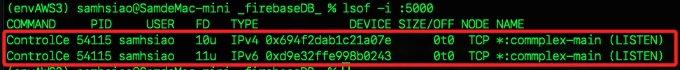

# 本地建立 LineBot

_接下來嘗試部署 Linebot 到 Beanstalk，可延續前一個步驟的專案，或是建立新的專案；特別注意的是 Linebot 需要設定 Webhook，所以必須將 Beanstalk 的 `Http` 重新定向到  `https`。_

<br>

## 檢查端口

_在進行接下來步驟前，先檢查端口佔用情形，確認 Ngrok 將使用的端口目前是閒置的_

<br>

1. 檢查 `5000` 目前狀態，顯示已被佔用。

    ```bash
    lsof -i :5000
    ```

    

<br>

2. 其中 `ControlCe` 就是 `Control Center`，也就是 macOS 系統的 `控制中心`，與 AirDrop、音量控制、Wi-Fi、藍牙等功能相關；另外，輸出結果中若有 `Google`，這可能是正在與本地設備或遠程設備進行網絡通信。

<br>

## 從頭開始

_假如重新建立專案，則從這裡開始，若沿用之前的專案，可以略過這個步驟_

<br>

1. 建立專案，可自訂名稱如 `_linebot_`，然後開啟 VSCode。

    ```python
    mkdir -p ~/Downloads/_linebot_ && cd ~/Downloads/_linebot_
    touch .env .gitignore application.py requirements.txt Procfile
    code .
    ```

<br>

2. 繼續使用終端機指令，在 `.gitignore` 文件中寫入 `.env`，用以避免上傳敏感資訊。

    ```bash
    echo ".env" > .gitignore
    ```

<br>

3. 使用指令在 `requirements.txt` 文件中寫入套件。

    ```bash
    echo "Flask==2.3.2\ngunicorn==20.1.0\nline-bot-sdk==3.14.2" > requirements.txt
    ```

<br>

4. 使用指令在 `Procfile` 文件中寫入運行指令。

    ```bash
    echo "web: gunicorn -w 3 -b :8000 application:application" > Procfile
    ```

<br>

5. 在 `.env` 文件中添加兩個 Linebot 憑證密鑰。

    ```bash
    echo "CHANNEL_ACCESS_TOKEN=\nCHANNEL_SECRET=" > .env
    ```

<br>

## 編輯腳本

_基礎範例，使用以下代碼覆蓋原本內容即可_

<br>

1. `application.py`。

    ```python
    import os
    import traceback
    from flask import (
        Flask,
        request,
        abort,
        jsonify
    )
    from linebot.v3 import WebhookHandler
    from linebot.v3.messaging import (
        Configuration,
        ApiClient,
        MessagingApi,
        ReplyMessageRequest,
        TextMessage,
    )
    from linebot.v3.webhooks import (
        MessageEvent,
        TextMessageContent
    )

    # 判斷是否在 Beanstalk 環境
    is_beanstalk = os.getenv("AWS_EXECUTION_ENV") is not None

    # 如果不是 Beanstalk 環境，嘗試載入 dotenv
    if not is_beanstalk:
        try:
            from dotenv import load_dotenv
            load_dotenv()
        except ImportError as e:
            print("dotenv 模組未安裝，本地環境可能無法正確載入 .env 文件。")
            raise ImportError(
                "請執行 `pip install python-dotenv` 安裝 dotenv 套件，"
                "以便在本地測試時載入環境變數。"
            ) from e

    # 獲取環境變數
    CHANNEL_ACCESS_TOKEN = os.getenv("CHANNEL_ACCESS_TOKEN")
    CHANNEL_SECRET = os.getenv("CHANNEL_SECRET")

    if not CHANNEL_ACCESS_TOKEN or not CHANNEL_SECRET:
        raise ValueError(
            "請確認環境變數 CHANNEL_ACCESS_TOKEN "
            "和 CHANNEL_SECRET 是否正確設置。"
        )

    # 初始化 Flask 應用
    application = Flask(__name__)

    configuration = Configuration(access_token=CHANNEL_ACCESS_TOKEN)
    handler = WebhookHandler(CHANNEL_SECRET)


    @application.route("/callback", methods=["POST"])
    def callback():
        signature = request.headers.get("X-Line-Signature")
        body = request.get_data(as_text=True)

        application.logger.info(f"Request Body: {body}")
        application.logger.info(f"X-Line-Signature: {signature}")

        try:
            handler.handle(body, signature)
        except Exception as e:
            print(f"發生錯誤：{e}")
            application.logger.error(
                f"Handler Error：{traceback.format_exc()}")
            abort(400)

        return "OK", 200


    @handler.add(MessageEvent, message=TextMessageContent)
    def handle_message(event):
        application.logger.info(f"Received Event：{event}")
        with ApiClient(configuration) as api_client:
            messaging_api = MessagingApi(api_client)
            reply_token = event.reply_token
            user_message = event.message.text
            response_message = TextMessage(text=f"你說了：{user_message}")
            messaging_api.reply_message_with_http_info(
                ReplyMessageRequest(
                    reply_token=reply_token,
                    messages=[response_message],
                )
            )


    # 添加一個 /home 路由
    @application.route("/home", methods=["GET"])
    def home():
        # 回傳一個簡單的 JSON 訊息
        return jsonify({
            "message": "站點正常運作中！",
            "status": "OK"
        }), 200


    # 添加一個 / 路由
    @application.route('/')
    def welcome():
        return "Hello, Elastic Beanstalk!"


    if __name__ == "__main__":
        # 判斷端口，Beanstalk 環境使用環境變數 `PORT`，本地環境使用 5050
        port = int(os.getenv("PORT", 5050)) if is_beanstalk else 5050
        application.run(debug=not is_beanstalk, port=port)

    ```

<br>

2. 查看 `requirements.txt` 內容，若見到如下內容代表已正確寫入。

    ```json
    Flask==2.3.2
    line-bot-sdk==3.14.2
    gunicorn==20.1.0
    ```

<br>

3. `.env` 文件中包含兩個 Linebot 密鑰的 Key。

    ```json
    CHANNEL_ACCESS_TOKEN=
    CHANNEL_SECRET=
    ```

<br>

4. `Procfile`，`-w 3` 指定 `Gunicorn` 使用 `3` 個 `worker` 進程來處理請求，可根據伺服器的 CPU 性能可調整，另外 `-b :8000` 指定 `Gunicorn` 綁定到伺服器的 `8000` 埠，Beanstalk 預設監聽此埠。

    ```bash
    web: gunicorn -w 3 -b :8000 application:application
    ```

<br>

## 複製密鑰

1. 前往 Line Developer 複製相關憑證，細節暫略。

<br>

2. 將這兩個憑證的值貼到 `.env`。

    

<br>

## 本地測試

1. 首先啟動代碼。

    ```bash
    python application.py
    ```

<br>

2. 在 `ngrok` 所在路徑運行以下指令啟動服務。

    ```bash
    ngrok http 5050
    ```

    

<br>

3. 複製 `Forwarding` 網址。

    

<br>

4. 寫入 `Webhook URL`。

    

<br>

5. 進行  `Webhook` 驗證。

    

<br>

6. 與 Linebot 對話測試。

    

<br>

___

_接下到下一個小節_