# 重新建立環境

_這節必須延續前一小節 `04` 來實作_

<br>

## 說明

1. 在之前的步驟中所建立的 `Beanstalk` 環境是 `Single Instance` 模式，而不是 `Load Balancing, Auto Scaling` 模式，在這種情況下，`Beanstalk` 不會自動啟用負載均衡器，也就無法在 `Configuration` 配置 `Load Balancer`。

    

<br>

2. 因為要使用 `ALB` 以支持 `HTTPS`，必須建立新的環境類型使用 `Load Balancing, Auto Scaling`。

<br>

## 建立 Beanstalk 環境

_使用 `Learner Lab` 建立支持負載均衡的環境，步驟大致與之前相同，以下僅簡單條列_

<br>

1. 進入服務 `Beanstalk`，左側切換到頁籤 `Environments`，接著點擊 `Create environment` 建立新的環境。

    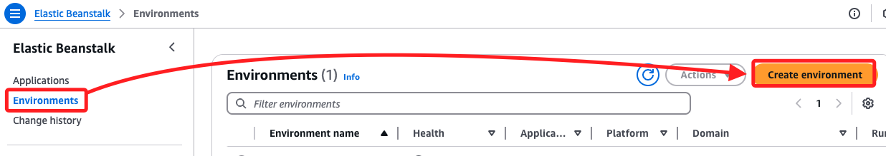

<br>

2. 選擇 `Web Server Environment`。

    

<br>

3. 任意命名如 `MyWSEnb1118`；主機名稱可命名 `mylinebot1118`。

    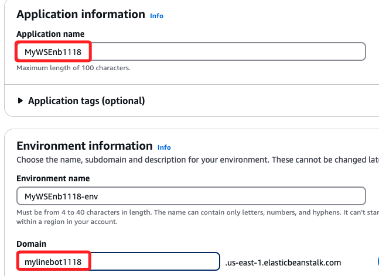

<br>

4. Platform 一樣使用 `Python 3.9`。

    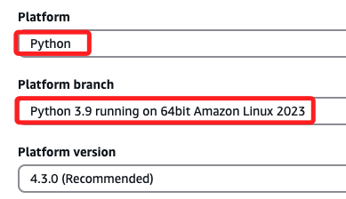

<br>

5. 在 `Presets ` 選擇 `High availability` 模式，這樣可以直接啟用 `Application Load Balancer`；若使用個人帳號，可選用 Single instance 來避免不必要的費用。

    

<br>

6. 在 `Configure service access` 與之前相同，選擇三個 Lab 準備好的實例；然後點擊 `Next`。

    

<br>

7. 在 `Set up networking, database, and tags`，先從下拉選單選取 Lab 預設好的 VPC，接著勾選並開啟 `Public IP address`。

    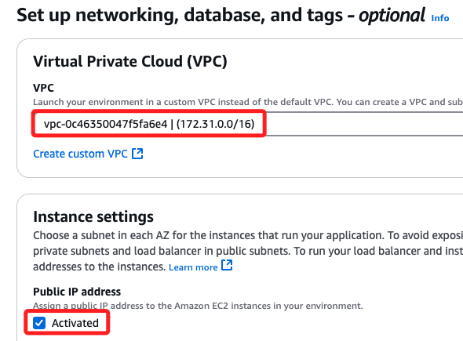

<br>

8. 因為使用 ALB，在 `Instance subnets` 需要綁定到至少兩個子網；點擊 `Next`。

    

<br>

9. 在 `Configure instance traffic and scaling` 頁面中，`EC2 security groups` 選擇 `default`。

    

<br>

10. `Capacity` 的 `Environment type` 已自動設置為 `load balanced`；預設最小最大實例數為 1、4，如果只需要 1 個實例，可以將最小和最大值都設置為 1。

    

<br>

11. `Load Balancer Type` 部分使用預設值，其中 `Application load balancer` 適合處理 `HTTP/HTTPS` 流量，支持基於路徑或主機名的流量路由，是 `Linebot Webhook HTTPS` 要求的最佳選擇；`Dedicated` 則為這個環境專門創建一個負載均衡器。

    

<br>

12. 特別注意，在 `Listeners` 及 `Processes` 部分預設都是 `80`，這僅支持 HTTP，但是添加監聽需綁定在有效的 SSL 憑證上，而 SSL 憑證域名必須與當前的域名相同；由上可知，這個步驟必須在 beanstalk 建立完成並取得域名後再回來處理；點擊 `Next`。

    

<br>

13. 接下來同樣會看到預設的 Python 路徑，點擊 `Next`。

    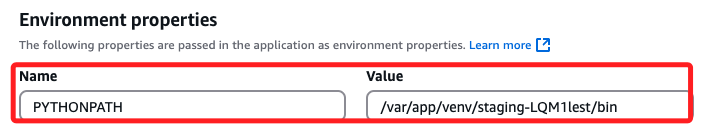

<br>

14. 略作瀏覽後點擊 `Submit` 提交。

    

<br>

15. 完成後紀錄域名備用。

    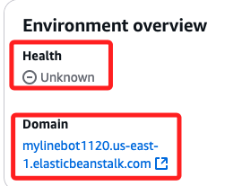

<br>

## 設定第三方域名

_使用 GoDaddy_

<br>

1. 進入服務 `Domains`。

    

<br>

2. 展開目標域名的功能選單，點擊 `Edit DNS`。

    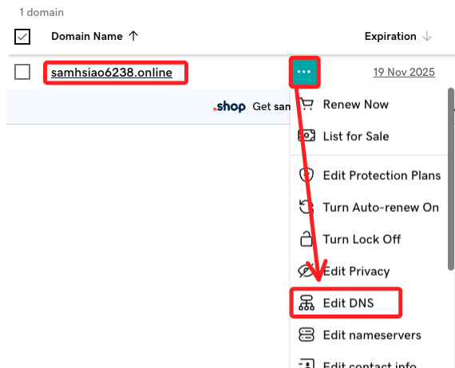

<br>

3. 已經有一個 `www CNAME` 紀錄。

    

<br>

4. 點擊 `Add New Record` 添加新的紀錄。

    

<br>

3. Type 選擇 `CNAME`，使用新的子域名如 `linebot`，Value 寫入 Beanstalk 的網域 `mylinebot1118.us-east-1.elasticbeanstalk.com`，TTL 可使用預設值，或設定為 `1 Hour`，這是解析器在緩存中保留一條記錄的時間長度；點擊 `Save` 儲存。

    

<br>

## 申請 SSL 憑證

_回到 AWS 主控台_

<br>

1. 搜尋並進入 `Certificate Manager`。

    

<br>

2. 在 `List certificates` 中點擊右側 `Request`。

    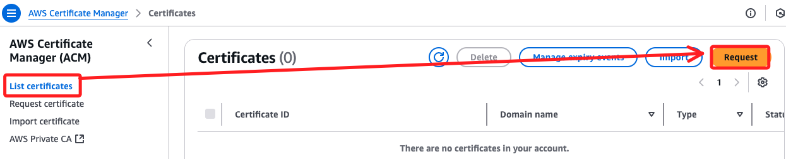

<br>

3. 選取 `Request a public certificate`，點擊 `Next`。

    

<br>

4. 貼上自己的第三方域名，這裡使用 GoDaddy 申請的 `linebot.SAMHSIAO6238.ONLINE`；如果需要覆蓋所有子域名，可輸入 `*.SAMHSIAO6238.ONLINE`。

    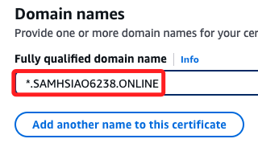

<br>

5. `Validation method` 使用預設的 `DNS validation`，AWS 會生成一條 `CNAME` 記錄，需要將這條記錄添加到 `GoDaddy` 的 `DNS` 配置中。

<br>

6. 點擊 `Request`。

    

<br>

7. 完成後，在 `Domains` 區塊會顯示 `CNAME name` 及 `CNAME value`，稍後步驟還會用到。

    

<br>

8. 目前的狀態 `Pending validation` 表示憑證的申請已經提交，但尚未完成驗證，需要完成以下操作，才能讓狀態變為 `Issued`。

    

<br>

## 設置 GoDaddy

1. 回到 GoDaddy，添加一條紀錄。

    

<br>

2. 同樣選擇 `CNAME`，接著貼上 `CNAME name` 及 `CNAME value`；完成後點擊 `Save`。

    

<br>

3. 返回 ACM 中等待驗證，通常需要幾分鐘甚至幾小時，取決於 DNS 的生效速度。

<br>

## 回到 Beanstalk 環境

1. 點擊 `Configuration`，在 `Instance traffic and scaling` 點擊 `Edit`。

    

<br>

2. 在 `Listeners` 點擊 `Add listener`，設置完成點擊 `Save`。

    

<br>

3. 最重要的，不要忘記點擊右下角的 `Apply`。

    

<br>

## 回到環境清單

1. 由於憑證未完成驗證，在這會顯示ㄧ連串錯誤。

    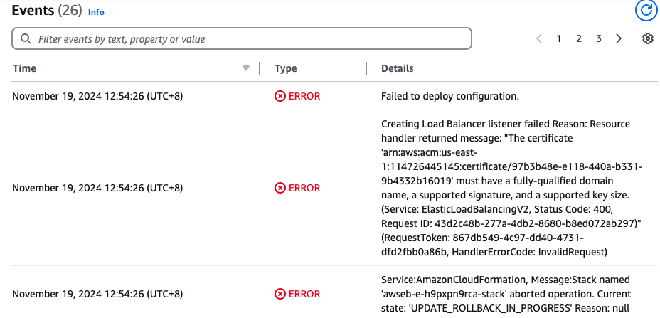

<br>

2. 使用以下指令，確認域名的 CNAME 是否指向正確的 Beanstalk 網域。

    ```bash
    dig linebot.samhsiao6238.online CNAME
    ```

<br>

3. 其中 `status: NOERROR` 表示查詢成功、沒有錯誤。

    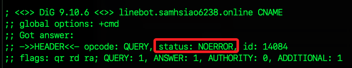

<br>

4. 另外，CNAME 記錄解析 `linebot.samhsiao6238.online` 被正確解析為 `mylinebot1118.us-east-1.elasticbeanstalk.com`；這表示：
用戶請求 `linebot.samhsiao6238.online` 時，DNS 會將流量重定向到 Beanstalk 的域名 `mylinebot1118.us-east-1.elasticbeanstalk.com`。

    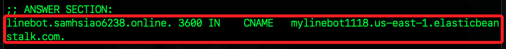

<br>

5. 當 SSL 憑證的狀態是 `Pending Validation`，域名仍然無法通過 HTTPS 訪問，但此時訪問 `http://linebot.samhsiao6238.online` 會定向到 Beanstalk 的網域上；以下這是 Beanstalk 預設的內容。

    ```html
    http://linebot.samhsiao6238.online
    ```

    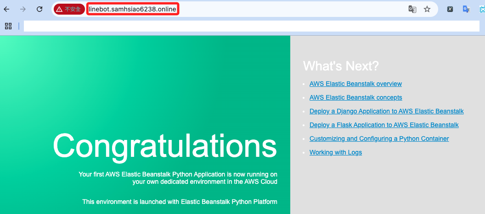

<br>

## 查看 Log

1. 切換到 `Logs` 頁籤，可查看近 `100` 條日誌，或點擊 `Full` 下載完整日誌。

    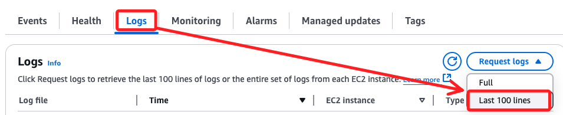

<br>

2. 特別注意，若要在 `Listerner` 添加 `443` 埠並啟用 `HTTPS`，必須確保已在 ACM 中建立或導入有效的 SSL 憑證，憑證必須覆蓋域名如 `linebot.samhsiao6238.online`。

<br>

___

_未完，延續下一個步驟_