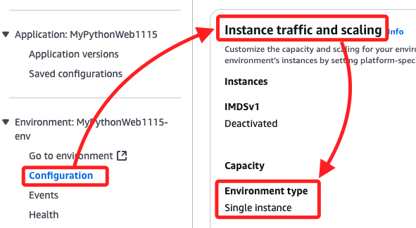
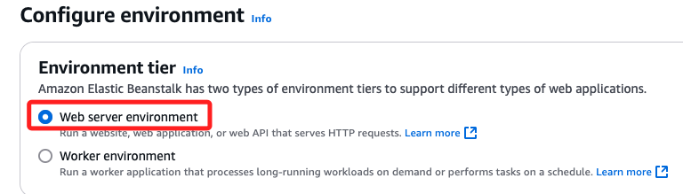
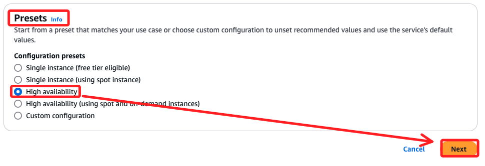
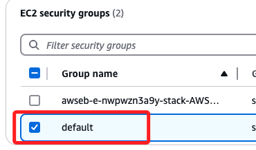
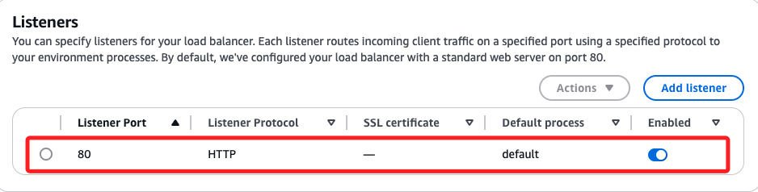
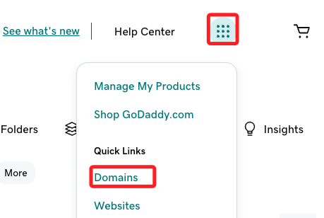
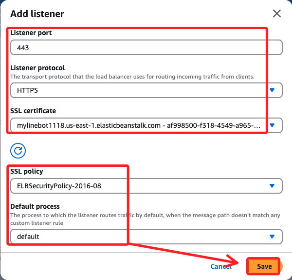

# 重新建立環境


## 說明

1. 在之前的步驟中所建立的 Beanstalk 環境是 `Single Instance` 模式，而不是 `Load Balancing, Auto Scaling` 模式，在這種情況下，`Beanstalk` 不會自動啟用負載均衡器，也就無法在 `Configuration` 配置 `Load Balancer`。



2. 因為要使用 `ALB` 以支持 `HTTPS`，必須建立新的環境類型使用 `Load Balancing, Auto Scaling`。

## 切換到支持負載均衡的環境

_大致與之前相同，僅簡單說明建立步驟_

1. 建立新的環境。


2. 選擇 `Web Server Environment`。



3. 任意命名如 `MyWSEnb1118`；主機名稱可命名 `mylinebot1118`。

4. Platform 一樣使用 `Python 3.9`。

5. 在 `Presets ` 選擇 `High availability` 模式，這樣可以直接啟用 `Application Load Balancer`。



6. 在 `Configure service access` 與之前相同。


7. 在 `Set up networking, database, and tags`，特別注意開啟 `Public IP address`。

8. 因為使用 ALB，在 `Instance subnets` 需要綁定到至少兩個子網。


9. 在 `Configure instance traffic and scaling` 頁面中，`EC2 security groups` 選擇 `default`。



10. `Capacity` 的 `Environment type` 已自動設置為 `load balanced`；預設最小最大實例數為 1、4，如果只需要 1 個實例，可以將最小和最大值都設置為 1。


11. `Load Balancer Type` 部分使用預設值，其中 `Application load balancer` 適合處理 `HTTP/HTTPS` 流量，支持基於路徑或主機名的流量路由，是 `Linebot Webhook HTTPS` 要求的最佳選擇；`Dedicated` 則為這個環境專門創建一個負載均衡器。


12. 特別注意，在 `Listeners` 及 `Processes` 部分預設都是 `80`，這僅支持 HTTP，但是添加監聽需綁定在有效的 SSL 憑證上，而 SSL 憑證域名必須與當前的域名相同；由上可知，這個步驟必須在 beanstalk 建立完成並取得域名後再回來處理。



13. 提交。


14. 完成後紀錄域名備用。


15. 另外，看一下 `Domain name`，這在設定監聽時會選擇。



## 申請 SSL 憑證

1. 搜尋並進入 `Certificate Manager`。


2. 點擊 `Request a certificate`。


3. 選取 `Request a public certificate`。


4. 貼上域名。


5. 其餘預設，點擊 `Request`。


## 回到 Beanstalk 環境

1. 點擊 `Configuration`，在 `Instance traffic and scaling` 點擊 `Edit`。


2. 在 `Listeners` 點擊 `Add listener`，設置完成點擊 `Save`。



3. 最重要的，不要忘記點擊右下角的 `Apply`。


## 如果不想切換環境（臨時解決方案）

如果您需要繼續使用 Single Instance 模式，但仍想支持 HTTPS，您可以手動建立一個 ALB，並將其連接到您的 EC2 實例：

1. 手動建立 ALB
   - 進入 EC2 控制台。
   - 點擊左側的 Load Balancers，選擇 Create Load Balancer。
   - 選擇 Application Load Balancer，並設置以下參數：
     - Scheme：Internet-facing。
     - Listeners：添加 HTTP (80) 和 HTTPS (443)。
     - VPC 和 Subnets：選擇與您的 EC2 實例相同的 VPC 和子網。

2. 添加目標組
   - 在 ALB 設置中，建立一個目標組（Target Group）。
   - 類型選擇 Instance，並將您的 EC2 實例添加到目標組中。

3. 配置 HTTPS
   - 在 ALB 的 Listener 設置中，為 HTTPS (443) 添加一條規則，將流量轉發到目標組。
   - 綁定您在 ACM 中申請的 SSL 憑證。

4. 更新 Line Webhook
   - 使用 ALB 的 HTTPS URL 作為 Webhook URL，例如：
     ```
     https://your-alb-dns-name.amazonaws.com/callback
     ```

---

## 為什麼需要切換到 ALB 模式？

1. Single Instance 無法支持負載均衡
   - 在 Single Instance 模式下，Elastic Beanstalk 不會啟用 Load Balancer，也無法直接處理 HTTPS 請求。

2. ALB 提供自動 HTTPS 處理
   - ALB 自帶 HTTPS Listener，並且可以輕鬆配置重定向規則。

---

### 建議的解決方案

- 長期方案： 建立一個支持 ALB 的新環境（Load Balancing, Auto Scaling 模式）。
- 臨時方案： 手動建立 ALB，並將其與現有的 EC2 實例綁定。

如果需要更進一步的指引或遇到問題，請提供更多細節，我可以幫助您完成操作！