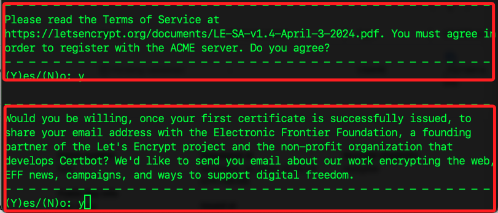
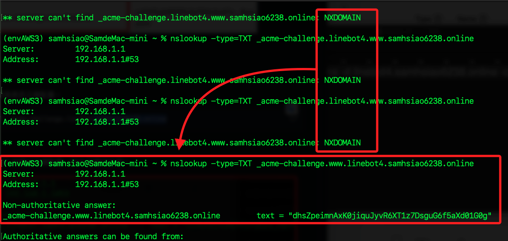
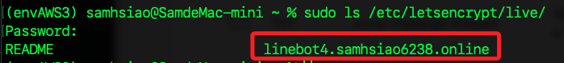
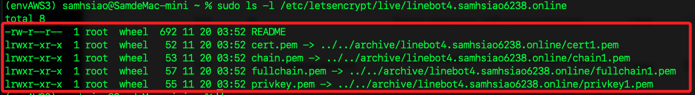
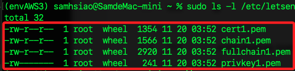
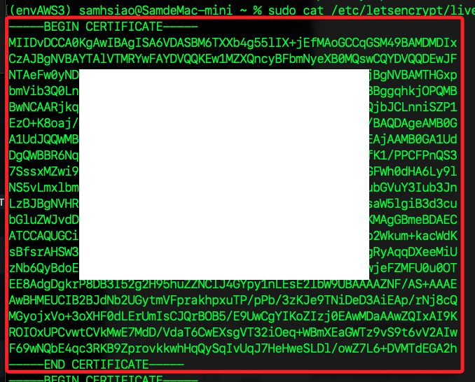
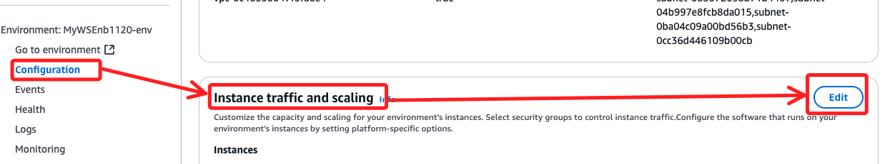
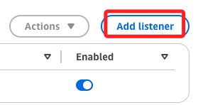
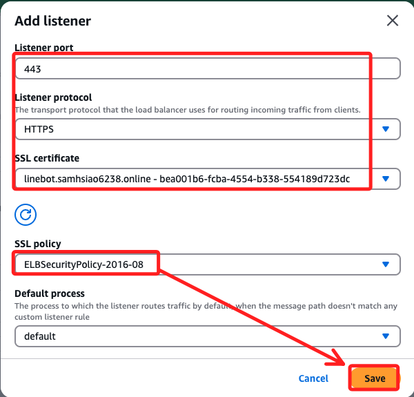
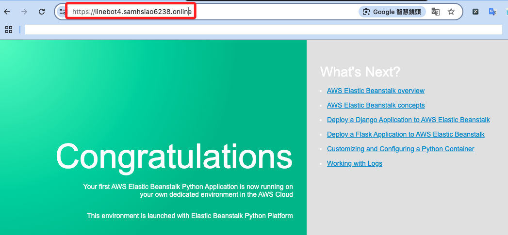

# 申請憑證

_申請 `Let's Encrypt` 憑證導入 ACM_

<br>

## 安裝 Certbot

_這是 `Let's Encrypt` 提供的 CLI 工具，以下是在 MacOS 中操作，若在 Windows 操作則安裝適配的系統工具，程序大同小異。_

<br>

1. 如果尚未安裝 Homebrew，執行安裝命令。

    ```bash
    /bin/bash -c "$(curl -fsSL https://raw.githubusercontent.com/Homebrew/install/HEAD/install.sh)"
    ```

<br>

2. 使用 Homebrew 安裝 Certbot。

    ```bash
    brew install certbot
    ```

<br>

3. 確認 Certbot 已安裝成功。

    ```bash
    certbot --version
    ```

    

<br>

## 生成憑證

1. 接著 Certbot 申請憑證，參數 `certonly` 表示只申請憑證，不會自動安裝到伺服器；`--manual` 是手動模式，Certbot 會要求用戶自行進行 DNS 設定來完成域名所有權的驗證；`--preferred-challenges=dns` 指定使用 DNS TXT 記錄驗證域名所有權；`-d` 指定要申請憑證的域名，這裡涵蓋主域名與子域名，憑證將同時覆蓋這兩個域名。

    ```bash
    sudo certbot certonly --manual --preferred-challenges=dns -d linebot.samhsiao6238.online -d www.linebot.samhsiao6238.online
    ```

    

<br>

2. 提示輸入一個有效的電子郵件信箱。

    

<br>

3. 點擊兩次 `Y`。

    

<br>

4. 按照提示進行 DNS 驗證，登入 DNS 管理平台，這裡使用 `GoDaddy`，添加 `TXT` 記錄，`Name` 為 `_acme-XXXXXXX.XXXXXXX.samhsiao6238.online.`，`Value` 為 `ziVuXXXXXXXXXXXXXXXXXxNwyKdIPsvIhfUQT43o`。

    

<br>

5. 完成時檢查 `Name`，假如尾綴的點 `.` 未被保存，點擊編輯再次輸入。

    

<br>

6. 儲存完成後先不要點擊 `ENTER`，開啟另一個終端機，先進行檢查是否已經玩可以解析網址。

    ```bash
    nslookup -type=TXT _acme-challenge.linebot.samhsiao6238.online
    ```

<br>

7. 確定顯示結果如下，表示 TXT 記錄已正確配置、DNS 記錄已生效，然後才點擊 `ENTER`。

    

<br>


8. 會連續提示兩次，特別注意這兩次是不同的紀錄，依照指示添加兩筆紀錄即可。

    

<br>

9. 再次進行檢查，第二次的網址是有 `www`。

    ```bash
    nslookup -type=TXT _acme-challenge.www.linebot.samhsiao6238.online
    ```

<br>

10. 無論多少次，一定要確認通過後才可以點擊 `ENTER`。

    

<br>

11. 正確完成時 `Name` 會自動轉換如下。

    

<br>

## 下載檢查

_一定要完成上述步驟才會下載憑證_

<br>

1. 按下 `ENTER` 之後會收到以下訊息，會顯示憑證路徑 `/etc/letsencrypt/live/linebot.samhsiao6238.online/fullchain.pem`，私鑰路徑 `/etc/letsencrypt/live/linebot.samhsiao6238.online/privkey.pem`。

    

<br>

2. 使用以下命令檢查生成的憑證，內有一個子網域同名的資料夾。

    ```bash
    sudo ls /etc/letsencrypt/live/
    ```

    

<br>

3. 依據結果進一步查看。

    ```bash
    sudo ls -l /etc/letsencrypt/live/linebot.samhsiao6238.online
    ```

    

<br>

4. 四個鏈接符號指向四個文件，包含主憑證 `cert.pem`、中間憑證 `chain.pem`、完整憑證鏈 `fullchain.pem`、私鑰 `privkey.pem`。

    

<br>

5. 實際位置在 `/etc/letsencrypt/archive/linebot4.samhsiao6238.online`。

    ```bash
    sudo ls -l /etc/letsencrypt/archive/linebot4.samhsiao6238.online 
    ```

    

<br>

## 導入憑證到 ACM

_使用主控台_

<br>

1. 點擊右上角的 `Import a certificate` 按鈕，進入後有三個欄位 `Certificate body`、`Certificate private key`、`Certificate chain`。

    

<br>

2. 查詢 `fullchain.pem`，並將第一個區塊貼在 `Certificate body`，著要要包含 `-----BEGIN CERTIFICATE-----` 及 `-----END CERTIFICATE-----`。

    ```bash
    sudo cat /etc/letsencrypt/live/linebot.samhsiao6238.online/fullchain.pem
    ```

    

<br>

3. 查詢 `privkey.pem` 並貼在 `Certificate private key`。

    ```bash
    sudo cat /etc/letsencrypt/live/linebot.samhsiao6238.online/privkey.pem
    ```

<br>

4. 查詢 `chain.pem` 並貼在 `Certificate chain`

    ```bash
    sudo cat /etc/letsencrypt/live/linebot.samhsiao6238.online/chain.pem
    ```

<br>

5. 點擊 `Import`。

<br>

6. 完成。

    

<br>

## 設置 HTTPS

1. 再次前往。

    

<br>

2. 點擊 `Add listener`。

    

<br>

3. 設置相同，不贅述。

    

<br>

4. 最重要的記得點擊右下角 `Apply`。

    

<br>

5. 完成後訪問 HTTPS，這是預設的站台。

    

<br>

## 補充說明

_使用 CLI 導入憑證到 ACM_

<br>

1. 如果憑證存放在 MacOS 系統中，可直接使用終端中的路徑傳遞給 AWS CLI，使用 `fileb://` 指定二進位文件路徑。

    ```bash
    aws acm import-certificate \
        --certificate fileb:///etc/letsencrypt/live/linebot.samhsiao6238.online/fullchain.pem \
        --private-key fileb:///etc/letsencrypt/live/linebot.samhsiao6238.online/privkey.pem \
        --region us-east-1
    ```

<br>

2. 返回 AWS Console，前往 ACM，確認導入的憑證顯示狀態為 `ISSUED`。

<br>

## 憑證效期

_特別注意 `Let's Encrypt` 憑證有效期為 `90` 天_

<br>

1. 設置自動更新。

    ```bash
    sudo certbot renew --dry-run
    ```

<br>

2. 添加以下命令到 `cron`，如此將每週執行並更新憑證。

    ```bash
    0 3 * * 1 sudo certbot renew --deploy-hook "aws acm import-certificate --certificate fileb:///etc/letsencrypt/live/<網域名稱>/fullchain.pem --private-key fileb:///etc/letsencrypt/live/<網域名稱>/privkey.pem --region us-east-1"
    ```

<br>

##

___

_END_