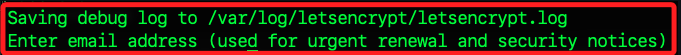

# 申請憑證

_申請 Let's Encrypt 憑證導入 ACM_

<br>

## 安裝 Certbot

1. 如果尚未安裝 Homebrew，執行安裝命令。

    ```bash
    /bin/bash -c "$(curl -fsSL https://raw.githubusercontent.com/Homebrew/install/HEAD/install.sh)"
    ```

<br>

2. 使用 Homebrew 安裝 Certbot。

    ```bash
    brew install certbot
    ```

<br>

3. 確認 Certbot 已安裝成功。

    ```bash
    certbot --version
    ```

<br>

## 生成憑證

1. 在 MacOS 上，需要使用 DNS 驗證，使用以下命令生成憑證。

    ```bash
    sudo certbot certonly --manual --preferred-challenges=dns -d linebot.samhsiao6238.online -d www.linebot.samhsiao6238.online
    ```

    

<br>

2. 參數 `--manual` 是手動驗證域名，`--preferred-challenges=dns` 選擇 DNS 驗證方式，`-d <自己的域名>` 替換為自己域名，若需保護多個域名，使用多個 `-d`。

<br>

3. 輸入一個有效的電子郵件信箱。

    

<br>

4. 先點擊兩次 `Y`。

<br>

5. 按照提示進行 DNS 驗證，登入 DNS 管理平台，這裡使用 `GoDaddy`，添加 `TXT` 記錄，`Name` 為 `_acme-XXXXXXX.XXXXXXX.samhsiao6238.online.`，`Value` 為 `ziVuXXXXXXXXXXXXXXXXXxNwyKdIPsvIhfUQT43o`。

    

<br>

6. 完成配置顯示如下。

    

<br>

7. 可以使用以下命令檢查是否正確配置。

    ```bash
    nslookup -type=TXT _acme-challenge.linebot.samhsiao6238.online
    ```

<br>

8. 顯示結果如下，表示 TXT 記錄已正確配置、DNS 記錄已生效。

    

<br>

9. 根據 Certbot 的提示需要為 `_acme-challenge.www.linebot.samhsiao6238.online` 新增另一個 DNS TXT 記錄；Name `_acme-challenge.www.linebot.samhsiao6238.online.`、Value `GlYPnrhuXxd-VW54f_EXFTF3nTt-Oshwx7SwDgU72IQ`，
保留上一個記錄勿刪除。

<br>

10. 按下 ENTER 之後會收到以下訊息，會顯示憑證路徑 `/etc/letsencrypt/live/linebot.samhsiao6238.online/fullchain.pem`，私鑰路徑 `/etc/letsencrypt/live/linebot.samhsiao6238.online/privkey.pem`。

    

<br>

11. 使用以下命令檢查生成的憑證。

    ```bash
    sudo ls /etc/letsencrypt/live/
    ```

<br>

12. 依據結果進一步查看。

    ```bash
    sudo ls -l /etc/letsencrypt/live/linebot.samhsiao6238.online
    ```

<br>

13. 文件包含主憑證`cert.pem`、中間憑證 `chain.pem`、完整憑證鏈 `fullchain.pem`、私鑰 `privkey.pem`。

    

<br>

## 導入憑證到 ACM

_使用主控台_

<br>

1. 點擊右上角的 `Import a certificate` 按鈕，進入後有三個欄位 `Certificate body`、`Certificate private key`、`Certificate chain`。

    

<br>

2. 查詢 `fullchain.pem`，並將第一個區塊貼在 `Certificate body`，著要要包含 `-----BEGIN CERTIFICATE-----` 及 `-----END CERTIFICATE-----`。

    ```bash
    sudo cat /etc/letsencrypt/live/linebot.samhsiao6238.online/fullchain.pem
    ```

<br>

3. 查詢 `privkey.pem` 並貼在 `Certificate private key`。

    ```bash
    sudo cat /etc/letsencrypt/live/linebot.samhsiao6238.online/privkey.pem
    ```

<br>

4. 查詢 `chain.pem` 並貼在 `Certificate chain`

    ```bash
    sudo cat /etc/letsencrypt/live/linebot.samhsiao6238.online/chain.pem
    ```

<br>

5. 點擊 `Import`。

<br>

6. 完成。

    

<br>

## 補充說明

_使用 CLI 導入憑證到 ACM_

<br>

1. 如果憑證存放在 MacOS 系統中，可直接使用終端中的路徑傳遞給 AWS CLI，使用 `fileb://` 指定二進位文件路徑。

    ```bash
    aws acm import-certificate \
        --certificate fileb:///etc/letsencrypt/live/linebot.samhsiao6238.online/fullchain.pem \
        --private-key fileb:///etc/letsencrypt/live/linebot.samhsiao6238.online/privkey.pem \
        --region us-east-1
    ```

<br>

2. 返回 AWS Console，前往 ACM，確認導入的憑證顯示狀態為 `ISSUED`。

<br>

## 憑證效期

_特別注意 `Let's Encrypt` 憑證有效期為 `90` 天_

<br>

1. 設置自動更新。

    ```bash
    sudo certbot renew --dry-run
    ```

<br>

2. 添加以下命令到 `cron`，如此將每週執行並更新憑證。

    ```bash
    0 3 * * 1 sudo certbot renew --deploy-hook "aws acm import-certificate --certificate fileb:///etc/letsencrypt/live/<網域名稱>/fullchain.pem --private-key fileb:///etc/letsencrypt/live/<網域名稱>/privkey.pem --region us-east-1"
    ```

<br>

##

___

_END_