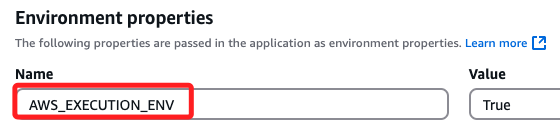
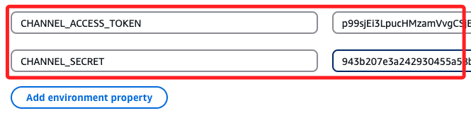
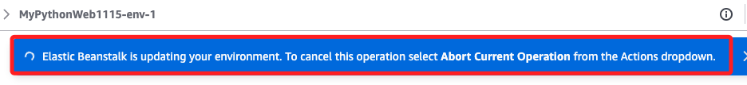
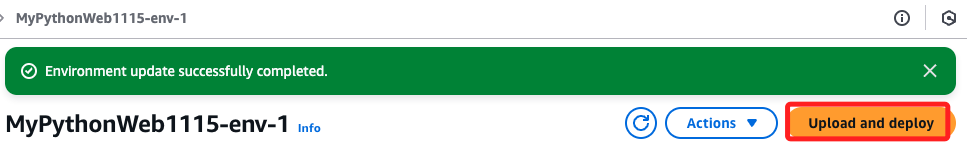

# 部署 Linebot 到雲端

_延續前一個小節_

## 説明

_在 AWS 部署 Linebot 有許多方式，除了 Beanstalk 以外，Lambda 也是可選方案之一，這裡以在 Beanstalk 中部署作為出發點來討論。_

1. Elastic Beanstal 利用 AWS Certificate Manager (ACM) 配置 HTTPS 綁定 SSL 憑證。

2. 使用 Route 53 將域名解析至 Elastic Beanstalk。

3. Beanstalk 可透過 ALB 來處理 HTTPS 請求，並將請求轉發至應用程式的 HTTP 埠。

## 

1. 確認無誤後，再次壓縮備用。

```bash
zip -r ../my_project.zip . -x "__MACOSX"
```

1. 進入 Beanstalk 編輯環境變數，可再次確認 `AWS_EXECUTION_ENV` 已經加入。



2. 添加兩個環境變數；務必在正常運作的環境中先添加環境變數。



3. 完成時記得點擊右下角 `Apply`。


4. 點擊 `Deploy` 等待完成。



5. 再次上傳 `Upload and deploy`




___

_待續_