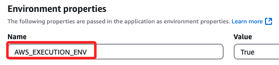
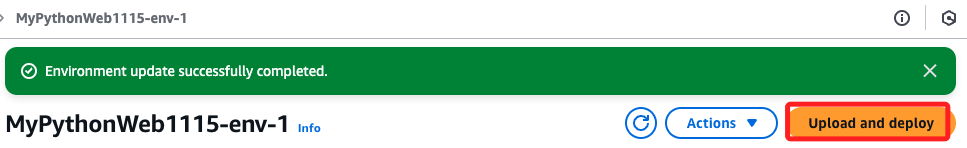
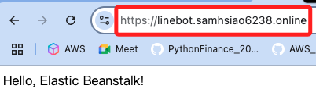
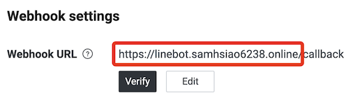
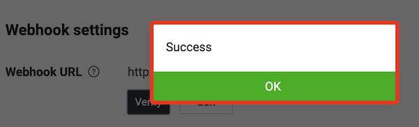

# 部署 Linebot 到雲端

_延續前一個小節_

<br>

## 説明

_在 AWS 部署 Linebot 有許多方式，除了 Beanstalk 以外，Lambda 也是可選方案之一，這裡以在 Beanstalk 中部署作為出發點來討論。_

<br>

1. 在 Beanstalk 部署 Flask 專案，並使用外部服務取得 SSL 憑證及 HTTPS 定向，然後在 ACM 導入 SSL 憑證來完成專案。

<br>

## 開始部署 

1. 壓縮本地專案。

    ```bash
    zip -r ../my_project.zip . -x "__MACOSX"
    ```

<br>

2. 進入 Beanstalk 編輯環境變數，添加 `AWS_EXECUTION_ENV` 作為判斷運行環境。

    

<br>

3. 添加兩個 Linebot 憑證環境變數；務必在正常運作的環境中添加。

    

<br>

4. 完成時記得點擊右下角 `Apply`。

    

<br>

5. 等待完成。

    

<br>

6. 環境建立完成後，上傳壓縮文件 `Upload and deploy`

    

<br>

7. 測試 HTTPS 訪問。

    

<br>

## 設置 Linebot webhook

1. 可使用自己註冊的網域。

    

<br>

2. 確認成功。

    

<br>

## 結論

1. 至此完成 Beanstalk 部署 Linebot 專案，使用外部域名服務 `GoDaddy` 是因為 Lab 中無 `Route 53` 權限，無法使用域名註冊與 DNS 設置功能；另外，在 SSL 憑證部分，因為 ACM 權限不足，所以使用 `Let's Encrypt`

<br>

2. 透過以上工具的結合，加上在  Line Developer 中建立 Linebot，並將透過定向設置了 Webhook，完成在 Beanstalk 中部署 Python Flask 的 Linebot 專案。

<br>

___

_END_