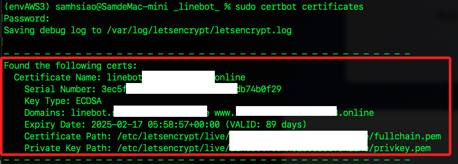
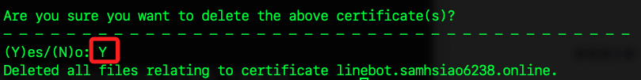
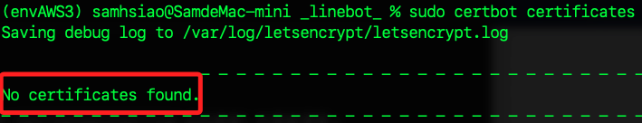
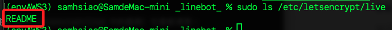

# 刪除憑證

_使用 `certbot` 建立的憑證_

<br>

## 查詢

1. 列出所有憑證，會顯示所有憑證的詳細資訊，包括 `域名`、`安裝位置` 以及 `憑證名稱`。

    ```bash
    sudo certbot certificates
    ```

    

<br>

## 刪除

1. 刪除指定 `Certificate Name` 的憑證。

    ```bash
    sudo certbot delete --cert-name <查詢到的-Certificate-Nam>
    ```

<br>

2. 輸入 `Y` 確認刪除。

    

<br>

3. 再次執行以下命令，確認該憑證已被刪除。

    ```bash
    sudo certbot certificates
    ```

    

<br>

4. 確認系統中相關的檔案已經被清理。

    

<br>

___

_END_