# 準備工作

_建立資料庫_

<br>

## 建立 AWS CLI 環境

1. 複製 Lab 的 AWS Details。

    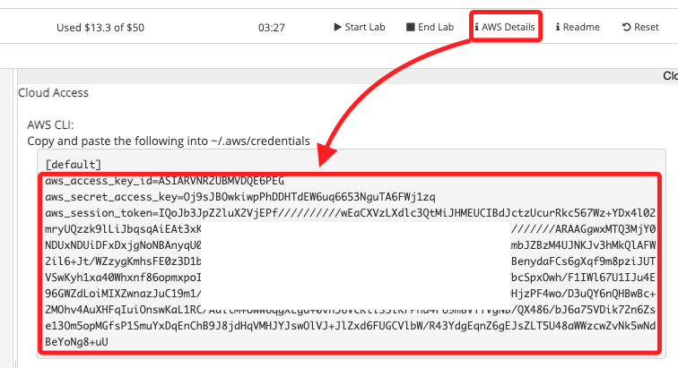

<br>

2. 開啟新的終端機視窗後直接貼上。

    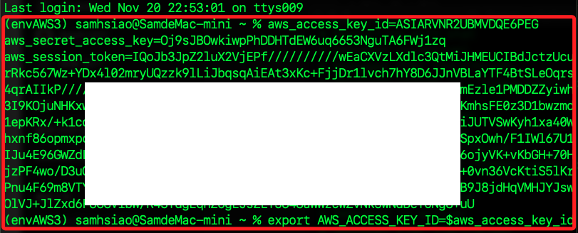

<br>

3. 接著運行以下指令，讀取值並寫入環境變數。

    ```bash
    export AWS_ACCESS_KEY_ID=$aws_access_key_id
    export AWS_SECRET_ACCESS_KEY=$aws_secret_access_key
    export AWS_SESSION_TOKEN=$aws_session_token
    ```

<br>

4. 透過 `echo` 指令讀取環境變數，例如 `AWS_ACCESS_KEY_ID`。

    ```bash
    echo $AWS_ACCESS_KEY_ID
    ```

    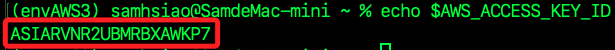

<br>

5. 輸出當前 CLI 使用者身份。

    ```bash
    aws sts get-caller-identity
    ```

    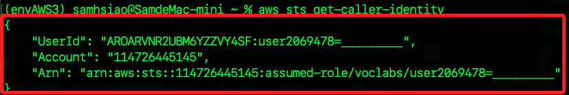

<br>

6. 確認使用者 ID 與 Lab 主控台顯示一致。

    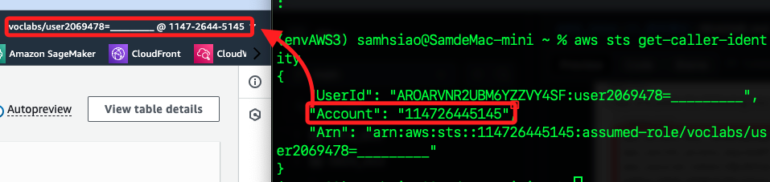

<br>

## 建立 SDK 環境

_以下將使用 `01_Beanstalk` 的 `04_本地 Linebot` 的腳本，所以先參考該筆記以重建相同環境，可從 `從頭開始` 部分起實作_

<br>

1. 在 `.env` 文件中，保留原本的內容，並貼上 `AWS Details` 中複製的憑證內容。

    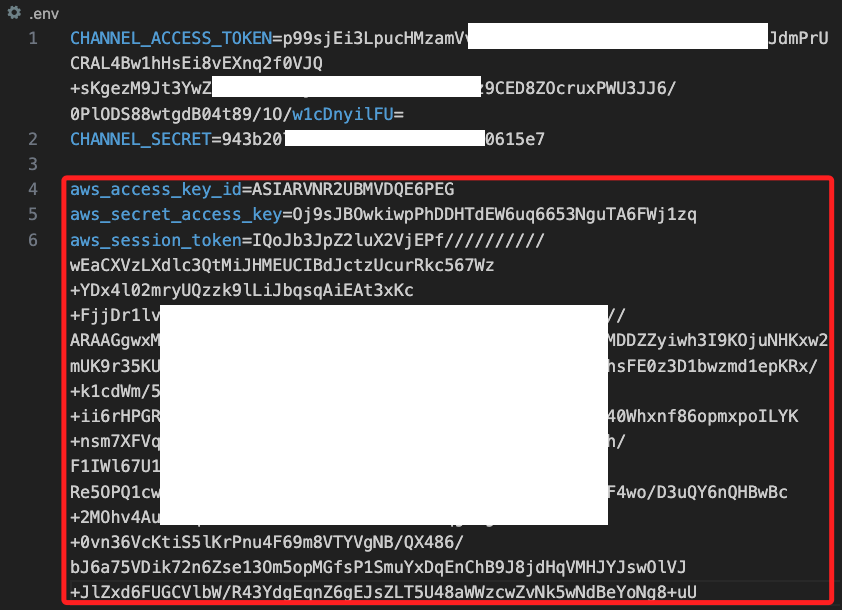

<br>

2. 接著貼上以下內容，這會讀取憑證的值並寫入環境變數。

    ```bash
    AWS_ACCESS_KEY_ID=${aws_access_key_id}
    AWS_SECRET_ACCESS_KEY=${aws_secret_access_key}
    AWS_SESSION_TOKEN=${aws_session_token}
    AWS_DEFAULT_REGION=us-east-1
    ```

<br>

## 安裝套件並編輯腳本

1. 回到終端機中，先安裝套件。

    ```bash
    pip install python-dotenv boto3
    ```

<br>

2. 建立新的腳本 `app.ipynb`。

    ```bash
    cd ~/Downloads/_linebot_ && touch app.ipynb && code .
    ```

<br>

3. 在 VSCode 中進行筆記本的編輯，添加 CELL 後貼上並運行以下代碼，這會建立並輸出環境變數。

    ```python
    import os
    import boto3
    from dotenv import load_dotenv

    # 載入 .env 文件中的環境變數
    load_dotenv()

    def check_credentials():
        # 初始化 boto3 session
        session = boto3.Session()
        print("Current Credentials:")
        print("Access Key:", session.get_credentials().access_key)
        print("Secret Key:", session.get_credentials().secret_key)
        print("Session Token:", session.get_credentials().token)
        print("Region:", session.region_name)

    if __name__ == "__main__":
        check_credentials()
    ```

    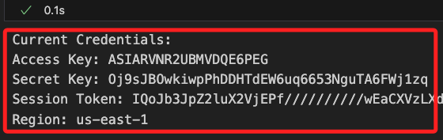

<br>

4. 在新的 CELL 中運行以下代碼，這會取得當前使用這身份；同樣的，務必確認該身份與 Lab 主控台中顯示相同。

    ```python
    # 自訂義函數
    def get_account_id():
        try:
            # 初始化 STS 客戶端
            sts_client = boto3.client('sts')
            
            # 獲取當前身份的資訊
            response = sts_client.get_caller_identity()
            
            # 輸出帳號 ID 和使用者 ARN
            print("Account ID:", response['Account'])
            print("User ARN:", response['Arn'])
        except Exception as e:
            print("無法獲取帳號資訊，錯誤原因：", e)

    if __name__ == "__main__":
        get_account_id()
    ```

    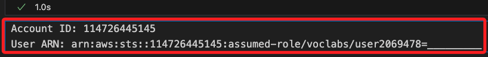

<br>

5. 運行簡單代碼查詢 DynamoDB，確認相關環境皆已正確運作；這時的結果會輸出 `資料表 LinebotMessages 不存在`。

    ```python
    import boto3
    from botocore.exceptions import ClientError

    def fetch_and_display_records():
        # 初始化 DynamoDB 資源
        dynamodb = boto3.resource('dynamodb', region_name='us-east-1')
        table_name = "LinebotMessages"

        try:
            # 獲取資料表
            table = dynamodb.Table(table_name)

            # 嘗試掃描資料表
            response = table.scan()
            items = response.get('Items', [])

            # 如果無資料，提示使用者
            if not items:
                print("當前無資料。")
            else:
                # 顯示所有記錄
                for item in items:
                    print(
                        f"UserId: {item['UserId']}, \n"
                        f"Timestamp: {item['Timestamp']}, \n"
                        f"Message: {item['Message']}\n"
                    )
        except ClientError as e:
            # 檢查是否是資料表不存在的錯誤
            error_code = e.response['Error']['Code']
            if error_code == 'ResourceNotFoundException':
                print(f"資料表 {table_name} 不存在。")
            else:
                print(f"讀取資料表時發生錯誤：{e}")
        except Exception as e:
            print(f"發生未知錯誤：{e}")

    if __name__ == "__main__":
        fetch_and_display_records()
    ```

    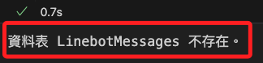

<br>

## 建立與刪除資料表

_使用 AWS CLI_

<br>

1. 建立資料表 `LinebotMessages`。

    ```bash
    aws dynamodb create-table \
        --table-name LinebotMessages \
        --attribute-definitions \
            AttributeName=UserId,AttributeType=S \
            AttributeName=Timestamp,AttributeType=S \
        --key-schema \
            AttributeName=UserId,KeyType=HASH \
            AttributeName=Timestamp,KeyType=RANGE \
        --provisioned-throughput ReadCapacityUnits=5,WriteCapacityUnits=5
    ```

    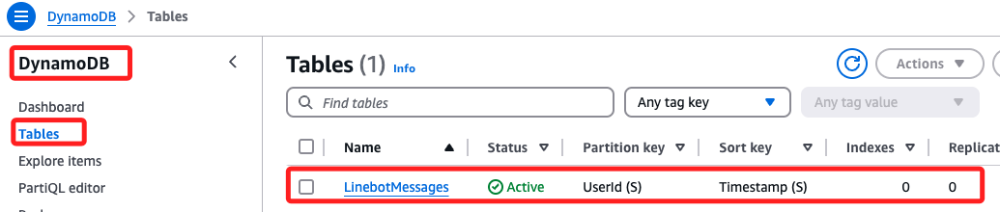

<br>

2. 查詢資料表中的記錄。

    ```bash
    aws dynamodb scan --table-name LinebotMessages
    ```

    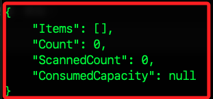

<br>

3. 刪除資料表。

    ```bash
    aws dynamodb delete-table --table-name LinebotMessages
    ```

    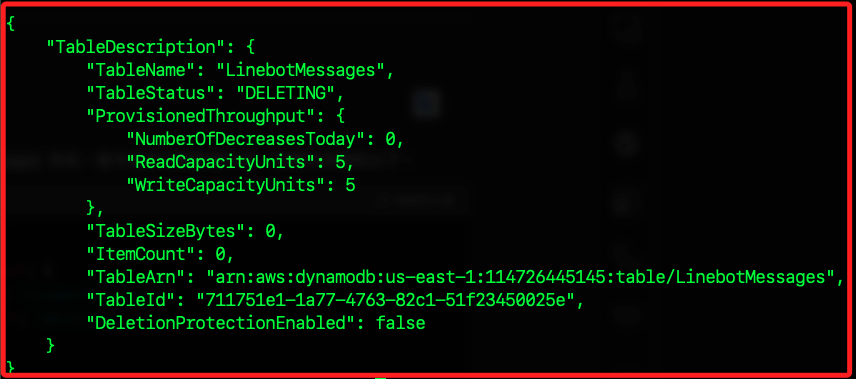

<br>

4. 檢查資料表是否仍存在。

    ```bash
    aws dynamodb list-tables
    ```

    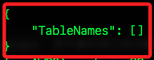

<br>

___

_END_