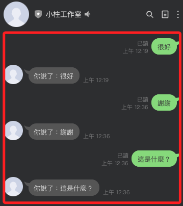
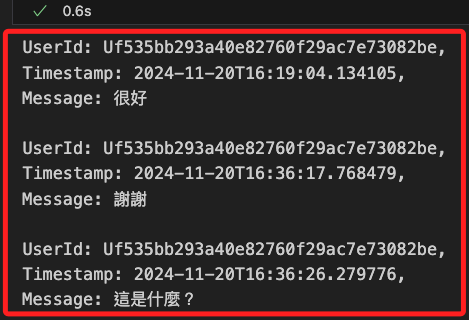
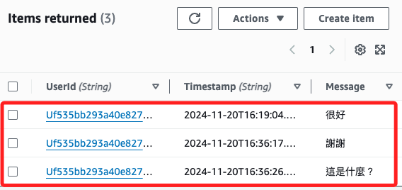

# 修改主腳本

_以下將針對 `04_本地 Linebot` 的腳本內容進行修改，請參考前面的說明操作建立。_

<br>

## 步驟說明

1. 初始化資源，依據以下的指引，在代碼 `handler = WebhookHandler...` 之後添加初始化邏輯。

    ```python
    # 初始化 Flask 應用
    application = Flask(__name__)

    configuration = Configuration(access_token=CHANNEL_ACCESS_TOKEN)
    handler = WebhookHandler(CHANNEL_SECRET)

    '''添加以下代碼'''

    # 初始化 DynamoDB 資源
    dynamodb = boto3.resource(
        'dynamodb', region_name='us-east-1'
    )
    table_name = "LinebotMessages"
    ```

<br>

2. 自訂儲存對話的函數。

    ```python
    # 自訂函數儲存對話
    def save_message_to_dynamodb(user_id, message):
        try:
            table.put_item(
                Item={
                    'UserId': user_id,
                    'Timestamp': datetime.utcnow().isoformat(),
                    'Message': message,
                }
            )
            print(f
            "訊息已保存到 DynamoDB：{user_id}, {message}")
        except Exception as e:
            print(
                f"保存到 DynamoDB 時發生錯誤：{e}"
            )
    ```

<br>

3. 自訂檢查資料表是否存在的函數。

    ```python
    # 確保資料表存在
    def ensure_table_exists():
        """
        檢查資料表是否存在，如果不存在則建立
        """
        try:
            table = dynamodb.Table(table_name)
            # 嘗試加載資料表資訊
            table.load()
            print(f"資料表 {table_name} 已存在。")
        except ClientError as e:
            if e.response['Error']['Code'] == 'ResourceNotFoundException':
                print(f"資料表 {table_name} 不存在，正在建立...")
                dynamodb.create_table(
                    TableName=table_name,
                    AttributeDefinitions=[
                        {"AttributeName": "UserId", "AttributeType": "S"},
                        {"AttributeName": "Timestamp", "AttributeType": "S"}
                    ],
                    KeySchema=[
                        {"AttributeName": "UserId", "KeyType": "HASH"},
                        {"AttributeName": "Timestamp", "KeyType": "RANGE"}
                    ],
                    ProvisionedThroughput={
                        "ReadCapacityUnits": 5,
                        "WriteCapacityUnits": 5
                    }
                )
                print(f"資料表 {table_name} 已成功建立，請稍等數分鐘讓其完全啟用。")
            else:
                raise

    ```

<br>

4. 調用自訂函數進行檢查並初始化資料表；補充說明，在 `ensure_table_exists()` 中會進行檢查，若資料表不存在則會調用 `create_table()` 進行資料表建立，當資料表存在時，透過 `Table()` 來建立該資料表的引用，並以此來操作資料表。

    ```python
    # 檢查並建立資料表
    ensure_table_exists()

    # 建立資料表物件
    table = dynamodb.Table(table_name)
    ```

<br>

5. 修改 `handle_message()` 函數；可直接覆蓋原本的內容。

    ```python
    @handler.add(MessageEvent, message=TextMessageContent)
    def handle_message(event):
        application.logger.info(f"Received Event：{event}")
        # 取得使用者 ID
        user_id = event.source.user_id
        # 取得使用者訊息
        user_message = event.message.text

        # 保存訊息到 DynamoDB
        save_message_to_dynamodb(user_id, user_message)

        with ApiClient(configuration) as api_client:
            messaging_api = MessagingApi(api_client)
            reply_token = event.reply_token
            response_message = TextMessage(
                text=f"你說了：{user_message}"
            )
            messaging_api.reply_message_with_http_info(
                ReplyMessageRequest(
                    reply_token=reply_token,
                    messages=[response_message],
                )
            )
    ```

<br>

6. 修改 `requirements.txt`，添加 `boto3`。

    ```json
    Flask==2.3.2
    gunicorn==20.1.0
    line-bot-sdk==3.14.2
    boto3==1.28.52
    ```

<br>

## 完整腳本

1. `application.py`，主腳本。

    ```python
    import os
    import traceback
    from flask import (
        Flask,
        request,
        abort,
        jsonify
    )
    from linebot.v3 import WebhookHandler
    from linebot.v3.messaging import (
        Configuration,
        ApiClient,
        MessagingApi,
        ReplyMessageRequest,
        TextMessage,
    )
    from linebot.v3.webhooks import (
        MessageEvent,
        TextMessageContent
    )
    import boto3
    from botocore.exceptions import ClientError
    from datetime import datetime

    # 判斷是否在 Beanstalk 環境
    is_beanstalk = os.getenv("AWS_EXECUTION_ENV") is not None

    # 如果不是 Beanstalk 環境，嘗試載入 dotenv
    if not is_beanstalk:
        try:
            from dotenv import load_dotenv
            load_dotenv()
        except ImportError as e:
            print("dotenv 模組未安裝，本地環境可能無法正確載入 .env 文件。")
            raise ImportError(
                "請執行 `pip install python-dotenv` 安裝 dotenv 套件，"
                "以便在本地測試時載入環境變數。"
            ) from e

    # 獲取環境變數
    CHANNEL_ACCESS_TOKEN = os.getenv("CHANNEL_ACCESS_TOKEN")
    CHANNEL_SECRET = os.getenv("CHANNEL_SECRET")

    if not CHANNEL_ACCESS_TOKEN or not CHANNEL_SECRET:
        raise ValueError(
            "請確認環境變數 CHANNEL_ACCESS_TOKEN "
            "和 CHANNEL_SECRET 是否正確設置。"
        )

    # 初始化 Flask 應用
    application = Flask(__name__)

    configuration = Configuration(access_token=CHANNEL_ACCESS_TOKEN)
    handler = WebhookHandler(CHANNEL_SECRET)

    # 初始化 DynamoDB 資源
    dynamodb = boto3.resource('dynamodb', region_name='us-east-1')
    table_name = "LinebotMessages"

    # 確保資料表存在
    def ensure_table_exists():
        """
        檢查資料表是否存在，如果不存在則建立
        """
        try:
            table = dynamodb.Table(table_name)
            table.load()  # 嘗試加載資料表資訊
            print(f"資料表 {table_name} 已存在。")
        except ClientError as e:
            if e.response['Error']['Code'] == 'ResourceNotFoundException':
                print(f"資料表 {table_name} 不存在，正在建立...")
                dynamodb.create_table(
                    TableName=table_name,
                    AttributeDefinitions=[
                        {"AttributeName": "UserId", "AttributeType": "S"},
                        {"AttributeName": "Timestamp", "AttributeType": "S"}
                    ],
                    KeySchema=[
                        {"AttributeName": "UserId", "KeyType": "HASH"},
                        {"AttributeName": "Timestamp", "KeyType": "RANGE"}
                    ],
                    ProvisionedThroughput={
                        "ReadCapacityUnits": 5,
                        "WriteCapacityUnits": 5
                    }
                )
                print(f"資料表 {table_name} 已成功建立，請稍等數分鐘讓其完全啟用。")
            else:
                raise

    ensure_table_exists()  # 檢查並建立資料表

    # 初始化資料表
    table = dynamodb.Table(table_name)

    # 自訂函數儲存對話
    def save_message_to_dynamodb(user_id, message):
        """
        保存訊息到 DynamoDB
        """
        try:
            table.put_item(
                Item={
                    'UserId': user_id,
                    'Timestamp': datetime.utcnow().isoformat(),
                    'Message': message,
                }
            )
            print(f"訊息已保存到 DynamoDB：{user_id}, {message}")
        except Exception as e:
            print(f"保存到 DynamoDB 時發生錯誤：{e}")


    @application.route("/callback", methods=["POST"])
    def callback():
        signature = request.headers.get("X-Line-Signature")
        body = request.get_data(as_text=True)

        application.logger.info(f"Request Body: {body}")
        application.logger.info(f"X-Line-Signature: {signature}")

        try:
            handler.handle(body, signature)
        except Exception as e:
            print(f"發生錯誤：{e}")
            application.logger.error(
                f"Handler Error：{traceback.format_exc()}")
            abort(400)

        return "OK", 200


    @handler.add(MessageEvent, message=TextMessageContent)
    def handle_message(event):
        application.logger.info(f"Received Event：{event}")
        # 取得使用者 ID
        user_id = event.source.user_id
        # 取得使用者訊息
        user_message = event.message.text

        # 保存訊息到 DynamoDB
        save_message_to_dynamodb(user_id, user_message)

        with ApiClient(configuration) as api_client:
            messaging_api = MessagingApi(api_client)
            reply_token = event.reply_token
            response_message = TextMessage(text=f"你說了：{user_message}")
            messaging_api.reply_message_with_http_info(
                ReplyMessageRequest(
                    reply_token=reply_token,
                    messages=[response_message],
                )
            )


    # /home 路由
    @application.route("/home", methods=["GET"])
    def home():
        # 回傳一個簡單的 JSON 訊息
        return jsonify({
            "message": "站點正常運作中！",
            "status": "OK"
        }), 200


    # / 路由
    @application.route('/')
    def welcome():
        return "Hello, Elastic Beanstalk!"


    if __name__ == "__main__":
        # 判斷端口，Beanstalk 環境使用環境變數 `PORT`，本地環境使用 5050
        port = int(os.getenv("PORT", 5050)) if is_beanstalk else 5050
        application.run(debug=not is_beanstalk, port=port)
    ```

<br>

2. 當前對話會直接回覆相同內容，無其他特殊邏輯。

    

<br>

3. 透過 SDK 查詢。

    

<br>

4. 在主控台中也可以查看。

    

<br>

___

_END_