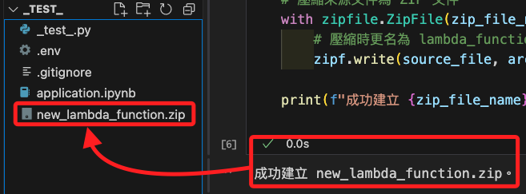

# 監聽 S3

_使用 Lambda 對指定 bucket 進行監聽，並將變動寫入另一個指定的 Bucket_

<br>

## 準備工作

_開啟終端機_

<br>

1. 建立專案資料夾；這裡建立在下載資料夾中，命名為 `_test_`。

    ```bash
    mkdir -p ~/Downloads/_test_
    cd ~/Downloads/_test_
    ```

<br>

2. 建立專案必要文件；先在 `.gitignore` 文件中寫入 `.env`，其餘文件暫且空白；接著開啟 VSCode。

    ```bash
    touch .env .gitignore application.ipynb
    echo ".env" > .gitignore
    code .
    ```

<br>

## 建立憑證

_這個練習在 Jupyter Notebook 中運行，所有授權工作僅針對筆記本的開發環境_

<br>

1. 編輯 `.env` 文件以建立 AWS SDK 環境，先前往 Lab 首頁複製並貼上 `AWS Details` 中提供的憑證。

    

<br>

2. 接著貼上以下內容，這會讀取憑證的值並寫入環境變數。

    ```bash
    AWS_ACCESS_KEY_ID=${aws_access_key_id}
    AWS_SECRET_ACCESS_KEY=${aws_secret_access_key}
    AWS_SESSION_TOKEN=${aws_session_token}
    AWS_DEFAULT_REGION=us-east-1
    ```

<br>

3. 在 `application.ipynb` 腳本中添加新的 Cell，運行以下代碼建立環境變數；以下每段代碼接使用新的 Cell 運行，不再贅述。

    ```python
    import os
    import boto3
    from dotenv import load_dotenv

    # 載入環境變數
    load_dotenv()

    def check_credentials():
        # 初始化 boto3 session
        session = boto3.Session()
        print("Current Credentials:")
        print("Access Key:", session.get_credentials().access_key)
        print("Secret Key:", session.get_credentials().secret_key)
        print("Session Token:", session.get_credentials().token)
        print("Region:", session.region_name)

    if __name__ == "__main__":
        check_credentials()
    ```

    

<br>

4. 運行以下代碼取得當前使用這身份；同樣的，務必確認該身份與 Lab 主控台中顯示相同。

    ```python
    # 自訂義函數
    def get_account_id():
        try:
            # 初始化 STS 客戶端
            sts_client = boto3.client('sts')
            
            # 取得當前身份的資訊
            response = sts_client.get_caller_identity()
            
            # 輸出帳號 ID 和使用者 ARN
            print("Account ID:", response['Account'])
            print("User ARN:", response['Arn'])
        except Exception as e:
            print("無法取得帳號資訊，錯誤原因：", e)

    if __name__ == "__main__":
        get_account_id()
    ```

    

<br>

## 建立 Function

_使用 SDK 逐步進行_

<br>

1. 在 `Lambda` 中建立一個 `Function`，並使用 Lab 提供的角色 `LabRole`。

    ```python
    # 用於壓縮和操作 ZIP 文件
    import zipfile

    # 初始化 IAM 和 Lambda 客戶端
    iam_client = boto3.client('iam')
    lambda_client = boto3.client('lambda')

    # 取得 LabRole 的 ARN
    role_name = "LabRole"
    response = iam_client.get_role(RoleName=role_name)
    # 解析
    role_arn = response['Role']['Arn']
    # 輸出查看
    print(f"LabRole ARN: {role_arn}")

    # 建立有效的 ZIP 文件，包含一個占位符 Lambda 函數
    with open("lambda_function.py", "w") as f:
        f.write("# Placeholder Lambda function\n")
        f.write("def lambda_handler(event, context):\n")
        f.write("    return {'status': 'success'}\n")

    with zipfile.ZipFile("valid_lambda.zip", "w") as zipf:
        zipf.write("lambda_function.py")

    # 讀取 ZIP 文件內容
    with open("valid_lambda.zip", "rb") as f:
        zip_file_content = f.read()

    # 清理原始 Python 文件
    os.remove("lambda_function.py")

    # Lambda Function 基本配置
    function_name = 'myfunction112102'
    runtime = 'python3.9'
    handler = 'lambda_function.lambda_handler'

    # 建立 Lambda Function
    response = lambda_client.create_function(
        FunctionName=function_name,
        Runtime=runtime,
        Role=role_arn,
        Handler=handler,
        Code={
            'ZipFile': zip_file_content
        },
        Description='Lambda function created with valid placeholder content',
        Timeout=15,
        MemorySize=128,
        Publish=True
    )

    # 清理 ZIP 文件
    os.remove("valid_lambda.zip")

    print("Lambda function created successfully:", response)
    ```

    

<br>

2. 可進入服務 `Lambda` 查看，其他 Function 是 Lab 預設的。

    

<br>

## 編輯並上傳 Python 代碼

1. 先開啟任意文件如 `test.py` 進行腳本編輯，其中指定兩個 Bucket 作為後續邏輯所需的來源與目的 Bucket，分別命名為 `mysource1121` 及 `mytarget1121`。

    ```python
    import datetime
    import dateutil.tz
    import boto3

    bucket_name = 'mytarget1121'
    s3 = boto3.resource('s3')

    def lambda_handler(event, context):
        request = event['Records'][0]['s3']['object']['key']
        copy_source = {
            'Bucket': 'mysource1121',
            'Key': request
        }
        tz = dateutil.tz.gettz('Asia/Taipei')
        timestr = datetime.datetime.now(tz).strftime("%Y%m%d%H%M%S")
        file_name = timestr + '.txt'
        s3.meta.client.copy(copy_source, bucket_name, file_name)

    if __name__ == "__main__":
        lambda_handler()
    ```

<br>

2. 接著回到筆記本中，將以上代碼複製到變數 `lambda_code` 的區塊中，並生成壓縮檔 `new_lambda_function.zip`，這將作為指定的 `Lambda Function` 邏輯。

    ```python
    import zipfile
    import os

    # Lambda Function 業務邏輯
    lambda_code = """
    import datetime
    import dateutil.tz
    import boto3

    bucket_name = 'mytarget1121'
    s3 = boto3.resource('s3')

    def lambda_handler(event, context):
        request = event['Records'][0]['s3']['object']['key']
        copy_source = {
            'Bucket': 'mysource1121',
            'Key': request
        }
        tz = dateutil.tz.gettz('Asia/Taipei')
        timestr = datetime.datetime.now(tz).strftime("%Y%m%d%H%M%S")
        file_name = timestr + '.txt'
        s3.meta.client.copy(copy_source, bucket_name, file_name)
    """

    # 寫入 Lambda 業務邏輯到 Python 文件
    with open("lambda_function.py", "w") as f:
        f.write(lambda_code)

    # 壓縮為 ZIP 文件
    zip_file_name = "new_lambda_function.zip"
    with zipfile.ZipFile(zip_file_name, "w") as zipf:
        zipf.write("lambda_function.py")

    # 清理原始 Python 文件
    os.remove("lambda_function.py")
    print(f"{zip_file_name} created successfully.")
    ```

    

<br>

3. 更新 Lambda Function。

    ```python
    # 初始化 Lambda 客戶端
    lambda_client = boto3.client('lambda')

    # 指定 Function 名稱
    function_name = 'myfunction112102'

    # 讀取壓縮檔案
    with open(zip_file_name, "rb") as f:
        zip_file_content = f.read()

    # 更新 Lambda Function 代碼
    response = lambda_client.update_function_code(
        FunctionName=function_name,
        ZipFile=zip_file_content
    )

    print("Lambda function updated successfully:", response)
    ```

    

<br>

4. 可進入主控台查看。

    

<br>

## 建立 Bucket

_監聽的來源與寫入的目標_

<br>

1. 建立這兩個 Bucket。

    ```python
    # 初始化 S3 客戶端
    s3 = boto3.client('s3', region_name='us-east-1')

    # Bucket 名稱
    source_bucket_name = 'mysource1121'
    target_bucket_name = 'mytarget1121'

    # 建立來源 Bucket
    # us-east-1 不需要指定 LocationConstraint
    s3.create_bucket(Bucket=source_bucket_name)
    print(f"Bucket {source_bucket_name} created.")

    # 建立目標 Bucket
    s3.create_bucket(Bucket=target_bucket_name)
    print(f"Bucket {target_bucket_name} created.")
    ```

<br>

2. 確保 S3 取得調用 Lambda 的權限。

    ```python
    # 初始化 Lambda 客戶端
    lambda_client = boto3.client('lambda', region_name='us-east-1')

    # Lambda Function 名稱與來源 Bucket
    function_name = 'myfunction112102'
    source_bucket_name = 'mysource1121'

    # 取得 Lambda ARN
    lambda_response = lambda_client.get_function(FunctionName=function_name)
    lambda_arn = lambda_response['Configuration']['FunctionArn']

    # 添加授權，允許 S3 調用 Lambda
    response = lambda_client.add_permission(
        FunctionName=function_name,
        StatementId='S3InvokePermission',
        Action='lambda:InvokeFunction',
        Principal='s3.amazonaws.com',
        SourceArn=f'arn:aws:s3:::{source_bucket_name}'
    )

    print(f"Permission added for S3 to invoke Lambda function: {response}")
    ```

<br>

7. 配置 S3 Bucket 事件通知。

    ```python
    # 初始化 S3 客戶端
    s3_client = boto3.client('s3', region_name='us-east-1')

    # 配置 S3 Bucket 事件通知
    response = s3_client.put_bucket_notification_configuration(
        Bucket=source_bucket_name,
        NotificationConfiguration={
            'LambdaFunctionConfigurations': [
                {
                    'LambdaFunctionArn': lambda_arn,
                    # 監聽寫入事件
                    'Events': ['s3:ObjectCreated:*']
                }
            ]
        }
    )

    print(
        f"S3 event notification configured for bucket {source_bucket_name} "
        f"to trigger Lambda {function_name}."
    )
    ```

<br>

## 進行測試

1. 在 `mysource1121` 中寫入一個測試的 `.txt` 文件。

    ```python
    s3 = boto3.client('s3')

    source_bucket_name = 'mysource1121'
    file_name = 'testfile.txt'

    # 上傳測試文件到來源 Bucket
    s3.put_object(
        Bucket=source_bucket_name,
        Key=file_name,
        Body="This is a test file for S3 bucket monitoring."
    )
    print(f"File {file_name} uploaded to {source_bucket_name}.")
    ```

<br>

2. 查詢 `mytarget1121` 的內容，是否將文件寫入。 

    ```python
    response = s3_client.list_objects_v2(Bucket='mytarget1121')
    if 'Contents' in response:
        print("Files in mytarget1121:")
        for obj in response['Contents']:
            print(f"- {obj['Key']}")
    else:
        print("No files found in mytarget1121.")
    ```

<br>

## 刪除資源

1. 完成以上測試後，進行環境清理，恢復原狀。

    ```python
    # 初始化 S3 和 Lambda 客戶端
    s3_client = boto3.client('s3', region_name='us-east-1')
    lambda_client = boto3.client('lambda', region_name='us-east-1')

    # 定義資源名稱
    source_bucket_name = 'mysource1121'
    target_bucket_name = 'mytarget1121'
    function_name = 'myfunction112102'

    # 1. 清空 S3 Bucket 的內容
    def clear_bucket(bucket_name):
        try:
            # 列舉所有對象
            objects = s3_client.list_objects_v2(Bucket=bucket_name)
            if 'Contents' in objects:
                for obj in objects['Contents']:
                    print(
                        f"Deleting object: {obj['Key']} "
                        f"from bucket: {bucket_name}")
                    s3_client.delete_object(Bucket=bucket_name, Key=obj['Key']
                    )
            
            # 刪除多部分上傳的暫存文件（如果存在）
            multipart_uploads = s3_client.list_multipart_uploads(Bucket=bucket_name)
            if 'Uploads' in multipart_uploads:
                for upload in multipart_uploads['Uploads']:
                    print(
                        f"Aborting multipart upload: {upload['UploadId']} "
                        f"in bucket: {bucket_name}"
                    )
                    s3_client.abort_multipart_upload(
                        Bucket=bucket_name,
                        Key=upload['Key'],
                        UploadId=upload['UploadId']
                    )

            print(f"All objects cleared from bucket: {bucket_name}")
        except Exception as e:
            print(f"Error clearing bucket {bucket_name}: {e}")

    # 2. 刪除 S3 Bucket
    def delete_bucket(bucket_name):
        try:
            # 清空 Bucket
            clear_bucket(bucket_name)
            # 刪除 Bucket
            s3_client.delete_bucket(Bucket=bucket_name)
            print(f"Bucket {bucket_name} deleted successfully.")
        except Exception as e:
            print(f"Error deleting bucket {bucket_name}: {e}")

    # 3. 刪除 Lambda Function
    def delete_lambda_function(function_name):
        try:
            lambda_client.delete_function(FunctionName=function_name)
            print(f"Lambda function {function_name} deleted successfully.")
        except Exception as e:
            print(f"Error deleting Lambda function {function_name}: {e}")

    # 刪除過程
    if __name__ == "__main__":
        print("Starting resource cleanup...")
        
        # 刪除 Lambda Function
        delete_lambda_function(function_name)
        
        # 刪除 S3 Buckets
        delete_bucket(source_bucket_name)
        delete_bucket(target_bucket_name)
        
        print("Resource cleanup completed.")
    ```

<br>

2. 若是要刪除指定的 Function。

    ```python
    # 初始化 Lambda 客戶端
    lambda_client = boto3.client('lambda', region_name='us-east-1')

    # 定義要刪除的 Lambda Function 名稱
    function_name = 'myFunction1121'

    # 刪除 Lambda Function
    def delete_lambda_function(function_name):
        try:
            # 調用 Lambda Delete Function API
            lambda_client.delete_function(FunctionName=function_name)
            print(
                f"Lambda function '{function_name}' "
                "deleted successfully."
            )
        except Exception as e:
            print(
                f"Error deleting Lambda function "
                f"'{function_name}': {e}"
            )

    # 主程序
    if __name__ == "__main__":
        print(
            f"Attempting to delete Lambda function: {function_name}"
        )
        delete_lambda_function(function_name)
    ```

    

<br>

___

_END_