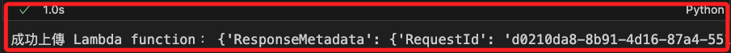
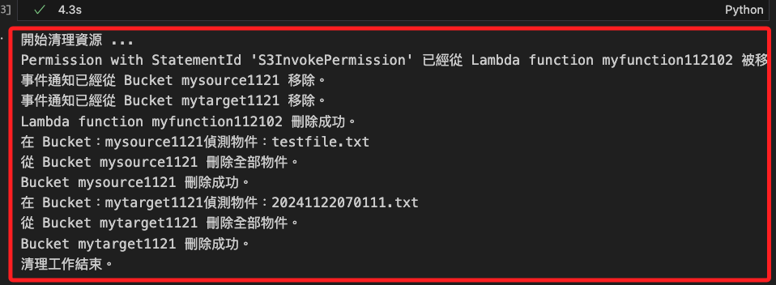

# 監聽 S3

_使用 SDK 操作，透過 Lambda 對指定 Bucket 進行監聽，並將變動寫入另一個指定的 Bucket。_

<br>

## 準備工作

_開啟終端機_

<br>

1. 建立專案資料夾；這裡建立在下載資料夾中，命名為 `_test_`。

    ```bash
    mkdir -p ~/Downloads/_test_
    cd ~/Downloads/_test_
    ```

<br>

2. 建立專案必要文件；先在 `.gitignore` 文件中寫入 `.env`，其餘文件暫且空白；接著開啟 VSCode。

    ```bash
    touch .env .gitignore application.ipynb
    echo ".env" > .gitignore
    code .
    ```

<br>

## 建立憑證

_這個練習在 Jupyter Notebook 中運行，所有授權工作僅針對筆記本的開發環境_

<br>

1. 編輯 `.env` 文件以建立 AWS SDK 環境，先前往 Lab 首頁複製並貼上 `AWS Details` 中提供的憑證。

    

<br>

2. 接著貼上以下內容，這會讀取憑證的值並寫入環境變數。

    ```bash
    AWS_ACCESS_KEY_ID=${aws_access_key_id}
    AWS_SECRET_ACCESS_KEY=${aws_secret_access_key}
    AWS_SESSION_TOKEN=${aws_session_token}
    AWS_DEFAULT_REGION=us-east-1
    ```

<br>

3. 在 `application.ipynb` 腳本中添加新的 Cell，運行以下代碼建立環境變數；以下每段代碼接使用新的 Cell 運行，不再贅述。

    ```python
    import os
    import boto3
    from dotenv import load_dotenv

    # 載入環境變數
    load_dotenv()

    def check_credentials():
        # 初始化 boto3 session
        session = boto3.Session()
        print("Current Credentials:")
        print("Access Key:", session.get_credentials().access_key)
        print("Secret Key:", session.get_credentials().secret_key)
        print("Session Token:", session.get_credentials().token)
        print("Region:", session.region_name)

    if __name__ == "__main__":
        check_credentials()
    ```

    

<br>

4. 運行以下代碼取得當前使用這身份；同樣的，務必確認該身份與 Lab 主控台中顯示相同。

    ```python
    # 自訂義函數
    def get_account_id():
        try:
            # 初始化 STS 客戶端
            sts_client = boto3.client('sts')
            
            # 取得當前身份的資訊
            response = sts_client.get_caller_identity()
            
            # 輸出帳號 ID 和使用者 ARN
            print("Account ID:", response['Account'])
            print("User ARN:", response['Arn'])
        except Exception as e:
            print("無法取得帳號資訊，錯誤原因：", e)

    if __name__ == "__main__":
        get_account_id()
    ```

    

<br>

## 建立 Function

_使用 SDK 逐步進行_

<br>

1. 在 `Lambda` 中建立一個 `Function`，並使用 Lab 提供的角色 `LabRole`。

    ```python
    # 用於壓縮和操作 ZIP 文件
    import zipfile

    # 初始化 IAM 和 Lambda 客戶端
    iam_client = boto3.client('iam')
    lambda_client = boto3.client('lambda')

    # 取得 LabRole 的 ARN
    role_name = "LabRole"
    response = iam_client.get_role(RoleName=role_name)
    # 解析
    role_arn = response['Role']['Arn']
    # 輸出查看
    print(f"LabRole ARN: {role_arn}")

    # 建立有效的 ZIP 文件，包含一個占位符 Lambda 函數
    with open("lambda_function.py", "w") as f:
        f.write("# Placeholder Lambda function\n")
        f.write("def lambda_handler(event, context):\n")
        f.write("    return {'status': 'success'}\n")

    with zipfile.ZipFile("valid_lambda.zip", "w") as zipf:
        zipf.write("lambda_function.py")

    # 讀取 ZIP 文件內容
    with open("valid_lambda.zip", "rb") as f:
        zip_file_content = f.read()

    # 清理原始 Python 文件
    os.remove("lambda_function.py")

    # Lambda Function 基本配置
    function_name = 'myfunction112102'
    runtime = 'python3.9'
    handler = 'lambda_function.lambda_handler'

    # 建立 Lambda Function
    response = lambda_client.create_function(
        FunctionName=function_name,
        Runtime=runtime,
        Role=role_arn,
        Handler=handler,
        Code={
            'ZipFile': zip_file_content
        },
        Description='Lambda function created with valid placeholder content',
        Timeout=15,
        MemorySize=128,
        Publish=True
    )

    # 清理 ZIP 文件
    os.remove("valid_lambda.zip")

    print("成功建立 Lambda function：", response)
    ```

    

<br>

2. 可進入服務 `Lambda` 查看，其他 Function 是 Lab 預設的。

    

<br>

## 編輯並上傳 Python 代碼

1. 先透過終端機建立一個臨時腳本文件如 `_test_.py`。

    ```bash
    touch _test_.py
    ```

<br>

2. 在 VSCode 中編輯腳本 `_test.py_` 貼上以下內容；主要是指定兩個 Bucket 作為後續邏輯所需的來源與目的 Bucket，分別命名為 `mysource1121` 及 `mytarget1121`。

    ```python
    import datetime
    import dateutil.tz
    import boto3

    bucket_name = 'mytarget1121'
    s3 = boto3.resource('s3')


    def lambda_handler(event, context):
        request = event['Records'][0]['s3']['object']['key']
        copy_source = {
            'Bucket': 'mysource1121',
            'Key': request
        }
        tz = dateutil.tz.gettz('Asia/Taipei')
        timestr = datetime.datetime.now(tz).strftime("%Y%m%d%H%M%S")
        file_name = timestr + '.txt'
        s3.meta.client.copy(copy_source, bucket_name, file_name)


    if __name__ == "__main__":
        lambda_handler()

    ```

<br>

2. 接著回到筆記本中，將以上代碼複製到變數 `lambda_code` 的區塊中，並生成壓縮檔 `new_lambda_function.zip`，這將作為指定的 `Lambda Function` 邏輯。

    ```python
    # 來源 Python 文件名
    source_file = "_test_.py"
    # 壓縮後的 ZIP 文件名
    zip_file_name = "new_lambda_function.zip"

    # 檢查來源文件是否存在
    if not os.path.exists(source_file):
        raise FileNotFoundError(
            f"{source_file} 不存在，"
            "請確認檔案存在當前目錄中。"
        )

    # 壓縮來源文件為 ZIP 文件
    with zipfile.ZipFile(zip_file_name, "w") as zipf:
        # 壓縮時更名為 lambda_function.py
        zipf.write(
            source_file, 
            arcname="lambda_function.py"
        )

    print(f"成功建立 {zip_file_name}。")
    ```

    

<br>

3. 更新 `Lambda Function`。

    ```python
    # 讀取壓縮檔案
    with open(zip_file_name, "rb") as f:
        zip_file_content = f.read()

    # 更新 Lambda Function 代碼
    response = lambda_client.update_function_code(
        FunctionName=function_name,
        ZipFile=zip_file_content
    )

    print("成功上傳 Lambda function：", response)
    ```

    

<br>

4. 可進入主控台查看，在 `Code` 頁籤中確認代碼已經更新。

    

<br>

## 建立 Bucket

_監聽的來源與寫入的目標_

<br>

1. 建立兩個 Bucket，分別是要監聽的對象 `mysource1121`，以及要寫入資料的對象 `mytarget1121`。

    ```python
    # 初始化 S3 客戶端
    s3 = boto3.client('s3')

    # Bucket 名稱
    source_bucket_name = 'mysource1121'
    target_bucket_name = 'mytarget1121'

    # 建立來源 Bucket
    s3.create_bucket(Bucket=source_bucket_name)
    print(f"Bucket {source_bucket_name} 建立完成。")

    # 建立目標 Bucket
    s3.create_bucket(Bucket=target_bucket_name)
    print(f"Bucket {target_bucket_name} 建立完成。")
    ```

    

<br>

2. 同樣可在主控台中進行查看。

    

<br>

3. 檢查 Lambda 函數是否已具備 S3 調用權限，並自定義的一個唯一標識 ID `S3InvokePermission`。

    ```python
    import json

    # 權限的唯一識別 ID
    statement_id = 'S3InvokePermission'

    try:
        # 檢查 Lambda 函數是否存在
        try:
            lambda_response = lambda_client.get_function(FunctionName=function_name)
            lambda_arn = lambda_response['Configuration']['FunctionArn']
            print(f"Lambda 函數 {function_name} 存在，ARN：{lambda_arn}")
        except lambda_client.exceptions.ResourceNotFoundException:
            print(f"錯誤：Lambda 函數 {function_name} 不存在，請確認函數名稱是否正確。")
            raise

        # 獲取 Lambda 資源型策略
        try:
            policy_response = lambda_client.get_policy(FunctionName=function_name)
            policy = policy_response['Policy']

            print(f"Lambda 函數 {function_name} 的當前資源型策略：")
            print(policy)

            # 解析策略並檢查是否已存在指定權限
            policy_doc = json.loads(policy)
            statements = policy_doc.get('Statement', [])

            permission_exists = any(
                stmt.get('Sid') == statement_id and
                stmt.get('Principal', {}).get('Service') == 's3.amazonaws.com' and
                stmt.get('Action') == 'lambda:InvokeFunction' and
                stmt.get('Condition', {}).get('ArnLike', {}).get('AWS:SourceArn') == f'arn:aws:s3:::{source_bucket_name}'
                for stmt in statements
            )

            if permission_exists:
                print(
                    f"權限已存在：S3 Bucket '{source_bucket_name}' "
                    f"已被授權調用 Lambda 函數 {function_name}，"
                    f"權限 ID 為 '{statement_id}'。"
                )
            else:
                print(
                    f"權限不存在：S3 Bucket '{source_bucket_name}' "
                    f"尚未被授權調用 Lambda 函數 {function_name}。"
                    "建議添加此權限。"
                )

        except lambda_client.exceptions.ResourceNotFoundException:
            print(
                f"錯誤：Lambda 函數 {function_name} 未設置資源型策略，"
                "可能尚未授權。"
            )

    except Exception as e:
        print(f"發生錯誤：{e}")
    ```

    

<br>

4. 進行授權；這裡還是會再次檢查，主要是避免代碼區塊重複運行時會報錯。

    ```python
    try:
        # 檢查 Lambda 函數是否存在
        lambda_response = lambda_client.get_function(FunctionName=function_name)
        lambda_arn = lambda_response['Configuration']['FunctionArn']
        print(f"Lambda 函數 {function_name} 存在，ARN：{lambda_arn}")

        # 嘗試取得資源型策略
        try:
            policy_response = lambda_client.get_policy(FunctionName=function_name)
            policy = json.loads(policy_response['Policy'])
            statements = policy.get('Statement', [])

            # 檢查是否已存在指定的 StatementId
            for stmt in statements:
                if stmt.get('Sid') == statement_id:
                    print(f"權限已存在：StatementId '{statement_id}' 已存在於 Lambda 策略中。")
                    print("現有權限內容：", json.dumps(stmt, indent=4, ensure_ascii=False))
                    break
            else:
                # 若未找到該 StatementId，則添加新授權
                response = lambda_client.add_permission(
                    FunctionName=function_name,
                    StatementId=statement_id,
                    Action='lambda:InvokeFunction',
                    Principal='s3.amazonaws.com',
                    SourceArn=f'arn:aws:s3:::{source_bucket_name}'
                )
                print(f"成功添加新的授權：{response}")

        except lambda_client.exceptions.ResourceNotFoundException:
            print(f"Lambda 函數 {function_name} 尚無資源型策略，直接添加授權。")

            # 如果策略不存在，直接添加授權
            response = lambda_client.add_permission(
                FunctionName=function_name,
                StatementId=statement_id,
                Action='lambda:InvokeFunction',
                Principal='s3.amazonaws.com',
                SourceArn=f'arn:aws:s3:::{source_bucket_name}'
            )
            print(f"成功添加新的授權：{response}")

    except boto3.exceptions.Boto3Error as e:
        print(f"發生錯誤：{e}")

    ```

    

<br>

5. 可再次運行相同代碼區塊，顯示已經授權。

    

<br>

6. 或再次運行前一段代碼，確認相關設定。

    ```python
    import json

    # 權限的唯一識別 ID
    statement_id = 'S3InvokePermission'

    try:
        # 檢查 Lambda 函數是否存在
        try:
            lambda_response = lambda_client.get_function(FunctionName=function_name)
            lambda_arn = lambda_response['Configuration']['FunctionArn']
            print(f"Lambda 函數 {function_name} 存在，ARN：{lambda_arn}")
        except lambda_client.exceptions.ResourceNotFoundException:
            print(f"錯誤：Lambda 函數 {function_name} 不存在，請確認函數名稱是否正確。")
            raise

        # 獲取 Lambda 資源型策略
        try:
            policy_response = lambda_client.get_policy(FunctionName=function_name)
            policy = policy_response['Policy']

            print(f"Lambda 函數 {function_name} 的當前資源型策略：")
            print(policy)

            # 解析策略並檢查是否已存在指定權限
            policy_doc = json.loads(policy)
            statements = policy_doc.get('Statement', [])

            permission_exists = any(
                stmt.get('Sid') == statement_id and
                stmt.get('Principal', {}).get('Service') == 's3.amazonaws.com' and
                stmt.get('Action') == 'lambda:InvokeFunction' and
                stmt.get('Condition', {}).get('ArnLike', {}).get('AWS:SourceArn') == f'arn:aws:s3:::{source_bucket_name}'
                for stmt in statements
            )

            if permission_exists:
                print(
                    f"權限已存在：S3 Bucket '{source_bucket_name}' "
                    f"已被授權調用 Lambda 函數 {function_name}，"
                    f"權限 ID 為 '{statement_id}'。"
                )
            else:
                print(
                    f"權限不存在：S3 Bucket '{source_bucket_name}' "
                    f"尚未被授權調用 Lambda 函數 {function_name}。"
                    "建議添加此權限。"
                )

        except lambda_client.exceptions.ResourceNotFoundException:
            print(
                f"錯誤：Lambda 函數 {function_name} 未設置資源型策略，"
                "可能尚未授權。"
            )

    except Exception as e:
        print(f"發生錯誤：{e}")
    ```

    

<br>

## 建立觸發事件

1. 配置指定 Bucket 事件通知。

    ```python
    # 初始化 S3 客戶端
    s3_client = boto3.client('s3')

    # 配置 S3 Bucket 事件通知
    response = s3_client.put_bucket_notification_configuration(
        Bucket=source_bucket_name,
        NotificationConfiguration={
            'LambdaFunctionConfigurations': [
                {
                    'LambdaFunctionArn': lambda_arn,
                    # 監聽寫入事件
                    'Events': ['s3:ObjectCreated:*']
                }
            ]
        }
    )

    print(
        f"S3 Bucket {source_bucket_name} 已配置事件通知，"
        f"觸發 Lambda 函數 {function_name}。"
    )
    ```

    

<br>

2. 可在主控台中進行圖形化介面的查看。

    

<br>

## 測試監聽功能

1. 在 `mysource1121` 中寫入一個測試的 `.txt` 文件。

    ```python
    s3 = boto3.client('s3')

    # 測試文件
    file_name = 'testfile.txt'

    # 上傳測試文件到來源 Bucket
    s3.put_object(
        Bucket=source_bucket_name,
        Key=file_name,
        Body="This is a test file for S3 bucket monitoring."
    )
    print(f"檔案 {file_name} 已經上傳到 {source_bucket_name}。")
    ```

    

<br>

2. 可在主控台中查看。

    

<br>

3. 查詢 `mytarget1121` 的內容，是否將文件寫入。 

    ```python
    response = s3_client.list_objects_v2(Bucket=target_bucket_name)
    if 'Contents' in response:
        print(f"Bucket {target_bucket_name} 中的檔案：")
        for obj in response['Contents']:
            print(f"- {obj['Key']}")
    else:
        print(f"Bucket {target_bucket_name} 中沒有檔案。")
    ```

    

<br>

## 刪除資源

_特別注意，假如要接續下一個章節，這裡先不要刪除；或是刪除後重建，然後接續下一個單元_

<br>

1. 完成以上測試後，進行環境清理，恢復原狀。

    ```python
    # 1. 清空 S3 Bucket 的內容
    def clear_bucket(bucket_name):
        try:
            # 列舉所有對象
            objects = s3_client.list_objects_v2(Bucket=bucket_name)
            if 'Contents' in objects:
                for obj in objects['Contents']:
                    print(
                        f"在 Bucket：{bucket_name}"
                        f"偵測物件：{obj['Key']} "
                    )
                    s3_client.delete_object(
                        Bucket=bucket_name, Key=obj['Key']
                    )
            
            # 刪除多部分上傳的暫存文件（如果存在）
            multipart_uploads = s3_client.list_multipart_uploads(Bucket=bucket_name)
            if 'Uploads' in multipart_uploads:
                for upload in multipart_uploads['Uploads']:
                    print(
                        f"正在 Bucket：{bucket_name} "
                        f"中止分段上傳：{upload['UploadId']}"
                    )
                    s3_client.abort_multipart_upload(
                        Bucket=bucket_name,
                        Key=upload['Key'],
                        UploadId=upload['UploadId']
                    )

            print(f"從 Bucket {bucket_name} 刪除全部物件。")
        except Exception as e:
            print(f"清理 Bucket {bucket_name} 出現錯誤：{e}")

    # 2. 刪除 S3 Bucket
    def delete_bucket(bucket_name):
        try:
            # 清空 Bucket
            clear_bucket(bucket_name)
            # 刪除 Bucket
            s3_client.delete_bucket(Bucket=bucket_name)
            print(f"Bucket {bucket_name} 刪除成功。")
        except Exception as e:
            print(f"Error deleting bucket {bucket_name}: {e}")

    # 3. 刪除 Lambda Function
    def delete_lambda_function(function_name):
        try:
            lambda_client.delete_function(FunctionName=function_name)
            print(f"Lambda function {function_name} 刪除成功。")
        except Exception as e:
            print(f"刪除 Lambda function {function_name} 發生錯誤：{e}")


    def remove_lambda_permission(function_name, statement_id):
        try:
            lambda_client.remove_permission(
                FunctionName=function_name,
                StatementId=statement_id
            )
            print(
                f"Permission with StatementId '{statement_id}' "
                f"已經從 Lambda function {function_name} 被移除。"
            )
        except lambda_client.exceptions.ResourceNotFoundException:
            print(
                f"Permission with StatementId '{statement_id}' "
                f"不存在於 Lambda function {function_name}."
            )
        except Exception as e:
            print(
                f"從 Lambda function {function_name} "
                f"移除 permission 發生錯誤：{e}"
            )


    def remove_s3_event_notification(bucket_name):
        try:
            # 刪除事件通知配置
            s3_client.put_bucket_notification_configuration(
                Bucket=bucket_name,
                NotificationConfiguration={}
            )
            print(f"事件通知已經從 Bucket {bucket_name} 移除。")
        except Exception as e:
            print(f"從 Bucket {bucket_name} 移除事件通知時發生錯誤：{e}")


    # 刪除過程
    if __name__ == "__main__":
        print("開始清理資源 ...")
        
        # 刪除 Lambda 授權
        remove_lambda_permission(function_name, statement_id)
        
        # 移除 S3 事件通知
        remove_s3_event_notification(source_bucket_name)
        remove_s3_event_notification(target_bucket_name)
        
        # 刪除 Lambda Function
        delete_lambda_function(function_name)
        
        # 刪除 S3 Buckets
        delete_bucket(source_bucket_name)
        delete_bucket(target_bucket_name)

        print("清理工作結束。")
    ```

    

<br>

2. 檢查相關資源狀態，包含 Lambda、Policy 及 Bucket。

    ```python
    # 檢查 Lambda 函數是否存在
    def check_lambda_function(function_name):
        try:
            lambda_response = lambda_client.get_function(FunctionName=function_name)
            lambda_arn = lambda_response['Configuration']['FunctionArn']
            print(f"Lambda 函數 '{function_name}' 存在，ARN：{lambda_arn}")
            return True
        except lambda_client.exceptions.ResourceNotFoundException:
            print(f"Lambda 函數 '{function_name}' 不存在。")
            return False
        except Exception as e:
            print(f"檢查 Lambda 函數 '{function_name}' 時發生錯誤：{e}")
            return False


    # 檢查 Lambda 資源型策略是否存在
    def check_lambda_policy(function_name):
        try:
            policy_response = lambda_client.get_policy(FunctionName=function_name)
            print(f"Lambda 函數 '{function_name}' 的資源型策略存在：")
            print(policy_response['Policy'])
        except lambda_client.exceptions.ResourceNotFoundException:
            print(f"Lambda 函數 '{function_name}' 沒有資源型策略。")
        except Exception as e:
            print(f"檢查 Lambda 資源型策略時發生錯誤：{e}")

    def check_s3_bucket(bucket_name):
        """檢查 S3 Bucket 是否存在"""
        try:
            s3_client.head_bucket(Bucket=bucket_name)
            print(f"S3 Bucket '{bucket_name}' 存在。")
            return True
        except s3_client.exceptions.NoSuchBucket:
            print(f"S3 Bucket '{bucket_name}' 不存在。")
            return False
        except Exception as e:
            print(f"檢查 S3 Bucket '{bucket_name}' 時發生錯誤：{e}")
            return False

    # 主程序
    if __name__ == "__main__":
        print("檢查相關資源狀態：")

        # 檢查 Lambda 函數是否存在
        lambda_exists = check_lambda_function(function_name)

        # Lambda 函數檢查結果
        if not lambda_exists:
            print(f"檢查結果：Lambda 函數 '{function_name}' 已被刪除或不存在。\n")

        # 檢查 S3 Bucket 是否存在
        bucket_exists = check_s3_bucket(source_bucket_name)

        # S3 Bucket 檢查結果
        if not bucket_exists:
            print(f"檢查結果：S3 Bucket '{source_bucket_name}' 已被刪除或不存在。\n")

        # 總結檢查結果
        if not lambda_exists and not bucket_exists:
            print("所有相關資源均已清理。")
        else:
            print("部分資源仍然存在，請檢查相關輸出進行後續操作。")
    ```

    

<br>

___

_END_