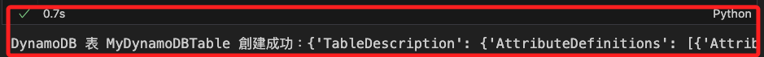
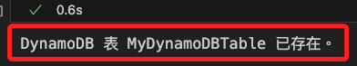
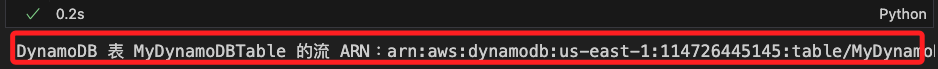
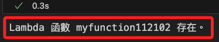
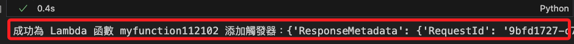
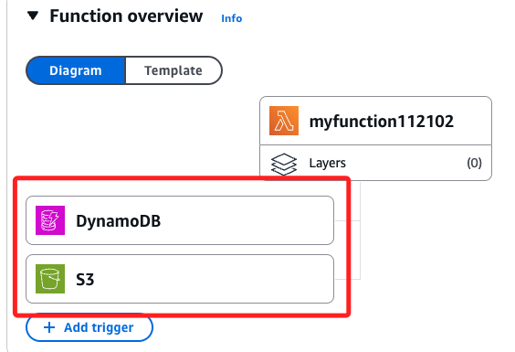

# 監聽 DynamoDB

_寫入資料，觸發函數生成顯示資料的靜態網頁_

<br>

## 說明

_接下來建立一個新的觸發事件，監聽指定的 DynamoDB_

<br>

1. 第一步先建立一個 DynamoDB 並啟用 `流` 功能；`DynamoDB Streams` 是一項 **持續記錄表中數據更改** 的功能，啟用時會記錄下表中發生的 `INSERT`、`MODIFY` 和 `REMOVE` 操作，並將這些更改記錄保存到一個專用的數據流中，這些記錄可被其他服務例用，從而實現事件驅動的架構。

<br>

2. 在 function 中加入觸發，當 DynamoDB 被寫入資料表數據時，將數據讀出，並寫成超文本格式。

<br>

3. 將文本寫入指定的目標 bucket，同時設定文本的 ACL，點擊即可開啟網頁瀏覽。

<br>

## 建立 DynamoDB 表

1. 建立一個 DynamoDB 表，設置主鍵並啟用流功能，這將用於觸發 Lambda 函數。

    ```python
    # 初始化 DynamoDB 客戶端
    dynamodb = boto3.client('dynamodb')

    # 定義表名稱
    table_name = 'MyDynamoDBTable'

    # 建立 DynamoDB 表
    try:
        response = dynamodb.create_table(
            TableName=table_name,
            KeySchema=[
                # 主鍵
                {'AttributeName': 'id', 'KeyType': 'HASH'}
            ],
            AttributeDefinitions=[
                # 字串類型
                {'AttributeName': 'id', 'AttributeType': 'S'}
            ],
            ProvisionedThroughput={
                'ReadCapacityUnits': 5,
                'WriteCapacityUnits': 5
            },
            StreamSpecification={
                'StreamEnabled': True,
                'StreamViewType': 'NEW_AND_OLD_IMAGES'
            }
        )
        print(f"DynamoDB 表 {table_name} 建立成功：{response}")
    except dynamodb.exceptions.ResourceInUseException:
        print(f"DynamoDB 表 {table_name} 已存在。")
    ```

    

<br>

2. 可在主控台進行查看。

    

<br>

3. 假如資料表已經存在會顯示如下訊息。

    

<br>

## 建立觸發

1. 獲取流 ARN。

    ```python
    # 獲取表描述，提取流 ARN
    table_desc = dynamodb.describe_table(TableName=table_name)
    stream_arn = table_desc['Table']['LatestStreamArn']
    print(f"DynamoDB 表 {table_name} 的流 ARN：{stream_arn}")
    ```

    

<br>

2. 檢查 Lambda 函數是否存在。

    ```python
    try:
        response = lambda_client.get_function(FunctionName=function_name)
        print(f"Lambda 函數 {function_name} 存在。")
    except lambda_client.exceptions.ResourceNotFoundException:
        print(f"Lambda 函數 {function_name} 不存在，請檢查名稱拼寫或區域設定。")
    ```

    

<br>

3. 添加觸發器，將 DynamoDB 流 ARN 綁定到現有的 Lambda 函數。

    ```python
    # 添加觸發器
    try:
        response = lambda_client.create_event_source_mapping(
            # DynamoDB 流 ARN
            EventSourceArn=stream_arn,
            # 現有 Lambda 函數名稱
            FunctionName=function_name,
            # 從最新的數據開始觸發
            StartingPosition='LATEST'
        )
        print(f"成功為 Lambda 函數 {function_name} 添加觸發器：{response}")
    except Exception as e:
        print(f"添加觸發器時發生錯誤：{e}")
    ```

    

<br>

4. 可在主控台中查看。

    

<br>

## 編輯新的腳本

1. 使用既有的 `_test_.py`，貼上以下內容。

    ```python
    import boto3
    import datetime
    import dateutil.tz
    from botocore.exceptions import ClientError

    # 初始化 S3 和 DynamoDB
    s3 = boto3.client("s3")
    dynamodb = boto3.resource("dynamodb")

    # 配置目標 S3 Bucket 和 DynamoDB 表
    target_bucket = "mytarget1121"
    table_name = "MyDynamoDBTable"


    def lambda_handler(event, context):
        try:
            # 獲取 DynamoDB 表對象
            table = dynamodb.Table(table_name)

            # 掃描 DynamoDB 表數據
            response = table.scan()
            items = response["Items"]
            if not items:
                print(f"DynamoDB 表 {table_name} 中無數據")
                return

            # 生成 HTML 文件
            html_content = generate_html(items)
            tz = dateutil.tz.gettz("Asia/Taipei")
            timestr = datetime.datetime.now(tz).strftime("%Y%m%d%H%M%S")
            file_name = f"{timestr}.html"

            # 上傳 HTML 文件到 S3
            upload_to_s3(file_name, html_content)
        except Exception as e:
            print(f"處理事件時發生錯誤：{e}")


    def generate_html(items):
        """生成 HTML 文件，包含 Bootstrap 格式表格"""
        html_content = """
        <!DOCTYPE html>
        <html>
        <head>
            <link href="https://cdn.jsdelivr.net/npm/bootstrap@5.1.3/dist/css/bootstrap.min.css" rel="stylesheet">
            <title>DynamoDB Data</title>
        </head>
        <body>
            <div class="container mt-5">
                <h1 class="text-center">DynamoDB Table Data</h1>
                <table class="table table-striped">
                    <thead>
                        <tr>"""
        if items:
            # 表頭
            for key in items[0].keys():
                html_content += f"<th>{key}</th>"
            html_content += "</tr></thead><tbody>"
            for item in items:  # 表內容
                html_content += "<tr>"
                for value in item.values():
                    html_content += f"<td>{value}</td>"
                html_content += "</tr>"
        html_content += "</tbody></table></div></body></html>"
        return html_content


    def upload_to_s3(file_name, content):
        """上傳文件到 S3，不使用 ACL，通過存儲桶策略管理訪問權限"""
        try:
            s3.put_object(
                Bucket=target_bucket,
                Key=file_name,
                Body=content,
                # 確保是 HTML 文件
                ContentType="text/html",
            )
            print(f"文件 {file_name} 已成功上傳至 S3")
            print(f"訪問 URL：https://{target_bucket}.s3.amazonaws.com/{file_name}")
        except ClientError as e:
            print(f"上傳文件至 S3 時發生錯誤：{e}")
    ```

<br>

2. 再次壓縮。

    ```python
    # 來源 Python 文件名
    source_file = "_test_.py"
    # 壓縮後的 ZIP 文件名
    zip_file_name = "new_lambda_function.zip"

    # 檢查來源文件是否存在
    if not os.path.exists(source_file):
        raise FileNotFoundError(
            f"{source_file} 不存在，"
            "請確認檔案存在當前目錄中。"
        )

    # 壓縮來源文件為 ZIP 文件
    with zipfile.ZipFile(zip_file_name, "w") as zipf:
        # 壓縮時更名為 lambda_function.py
        zipf.write(
            source_file, 
            arcname="lambda_function.py"
        )

    print(f"成功建立 {zip_file_name}。")
    ```

<br>

3. 更新 Lambda 函數代碼。

    ```python
    # 讀取壓縮檔案
    with open(zip_file_name, "rb") as f:
        zip_file_content = f.read()

    # 更新 Lambda Function 代碼
    response = lambda_client.update_function_code(
        FunctionName=function_name,
        ZipFile=zip_file_content
    )

    print("成功上傳 Lambda function：", response)
    ```

<br>

4. 