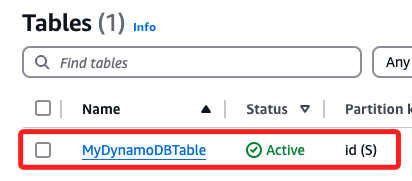

# 監聽 DynamoDB

_寫入資料，觸發函數生成顯示資料的靜態網頁_

## 說明

_接下來建立一個新的觸發事件，監聽指定的 DynamoDB_

1. 第一步先建立一個 DynamoDB。

2. 在 function 中加入觸發，當 DynamoDB 被寫入資料表數據時，將數據讀出，並寫成超文本格式。

3. 將文本寫入指定的目標 bucket，同時設定文本的 ACL，點擊即可開啟網頁瀏覽。

## 建立 DynamoDB 表

1. 建立一個 DynamoDB 表，設置主鍵並啟用流功能，這將用於觸發 Lambda 函數。

```python
# 初始化 DynamoDB 客戶端
dynamodb = boto3.client('dynamodb')

# 定義表名稱
table_name = 'MyDynamoDBTable'

# 建立 DynamoDB 表
try:
    response = dynamodb.create_table(
        TableName=table_name,
        KeySchema=[
            # 主鍵
            {'AttributeName': 'id', 'KeyType': 'HASH'}
        ],
        AttributeDefinitions=[
            # 字串類型
            {'AttributeName': 'id', 'AttributeType': 'S'}
        ],
        ProvisionedThroughput={
            'ReadCapacityUnits': 5,
            'WriteCapacityUnits': 5
        },
        StreamSpecification={
            'StreamEnabled': True,
            'StreamViewType': 'NEW_AND_OLD_IMAGES'
        }
    )
    print(f"DynamoDB 表 {table_name} 建立成功：{response}")
except dynamodb.exceptions.ResourceInUseException:
    print(f"DynamoDB 表 {table_name} 已存在。")
```


2. 可在主控台進行查看。




## 建立 Lambda 函數

1. 從 DynamoDB 獲取變更數據，轉化為 HTML 格式並上傳至 S3 ，同時設置 ACL 為 `public-read`。

```python
import boto3
import json
from botocore.exceptions import ClientError

# 初始化 S3 資源
s3 = boto3.client('s3')
target_bucket = 'mytarget1121'  # 替換為目標 Bucket 名稱

def lambda_handler(event, context):
    # 循環處理 DynamoDB 流中的每條記錄
    for record in event['Records']:
        if record['eventName'] == 'INSERT':
            # 獲取新插入的數據
            new_image = record['dynamodb']['NewImage']
            id_value = new_image['id']['S']
            data = {k: v[list(v.keys())[0]] for k, v in new_image.items()}

            # 將數據轉化為 HTML 格式（Bootstrap 美化）
            html_content = f"""
            <!DOCTYPE html>
            <html>
            <head>
                <link href="https://cdn.jsdelivr.net/npm/bootstrap@5.1.3/dist/css/bootstrap.min.css" rel="stylesheet">
                <title>DynamoDB Data</title>
            </head>
            <body>
                <div class="container mt-5">
                    <h1 class="text-center">DynamoDB Record</h1>
                    <table class="table table-striped">
                        <thead>
                            <tr>
                                <th>Key</th>
                                <th>Value</th>
                            </tr>
                        </thead>
                        <tbody>
            """
            for key, value in data.items():
                html_content += f"<tr><td>{key}</td><td>{value}</td></tr>"
            html_content += """
                        </tbody>
                    </table>
                </div>
            </body>
            </html>
            """

            # 上傳至 S3
            file_name = f"{id_value}.html"
            try:
                s3.put_object(
                    Bucket=target_bucket,
                    Key=file_name,
                    Body=html_content,
                    ContentType='text/html',
                    ACL='public-read'
                )
                print(f"文件 {file_name} 已成功上傳至 S3 並設置為公開訪問。")
            except ClientError as e:
                print(f"上傳文件至 S3 時發生錯誤：{e}")
```

---

### 步驟 3：配置 Lambda 觸發事件

將 DynamoDB 流事件設置為 Lambda 函數的觸發事件。

#### 程式碼：配置 Lambda 觸發
```python
import boto3

# 初始化 AWS 客戶端
lambda_client = boto3.client('lambda', region_name='us-east-1')
dynamodb = boto3.client('dynamodb', region_name='us-east-1')

# Lambda 函數名稱
function_name = 'myDynamoDBTriggerFunction'

# 獲取 DynamoDB 流 ARN
table_name = 'MyDynamoDBTable'
table_desc = dynamodb.describe_table(TableName=table_name)
stream_arn = table_desc['Table']['LatestStreamArn']

# 添加觸發器
response = lambda_client.create_event_source_mapping(
    EventSourceArn=stream_arn,
    FunctionName=function_name,
    StartingPosition='LATEST'
)

print(f"成功配置 Lambda 函數觸發事件：{response}")
```

---

### 步驟 4：測試流程

1. 插入數據至 DynamoDB：
   ```python
   import boto3

   dynamodb = boto3.resource('dynamodb', region_name='us-east-1')
   table = dynamodb.Table('MyDynamoDBTable')

   # 插入測試數據
   response = table.put_item(
       Item={
           'id': '123',
           'name': 'John Doe',
           'email': 'john.doe@example.com',
           'message': 'Hello, DynamoDB!'
       }
   )
   print("測試數據已插入：", response)
   ```

2. 檢查 S3 Bucket：
   - 登錄 AWS S3 控制台，檢查 `mytarget1121` Bucket 是否生成了一個 HTML 文件（例如 `123.html`）。
   - 點擊該文件的公開 URL，應顯示美化的 HTML 表格。

---

### 總結

上述流程完整實現了以下功能：
1. 建立 DynamoDB 表並啟用流。
2. 建立 Lambda 函數，將 DynamoDB 的數據轉化為 HTML，並上傳到 S3。
3. 設置 Lambda 函數為 DynamoDB 流的觸發器。
4. 測試插入數據並驗證結果。

如果有其他需求，或需要進一步調整，請隨時告知！