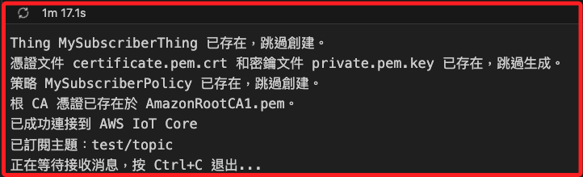

# IoT Core

_以下將以純代碼方式使用 MQTT 協議連接到 IoT Core，並測試發送和接收消息。_

<br>

## 準備工作

1. 安裝必要套件；在筆記本中運行時，使用魔法指令 `%` 或 `!`。

    ```bash
    %pip install AWSIoTPythonSDK
    ```

<br>

2. 建立兩個不同的專案資料夾。

    ```bash
    mkdir -p ~/Downloads/_exPub_ ~/Downloads/_exSub_
    ```

<br>

## 簡易測試

1. 建立 IoT Core。

    ```python
    import json
    import requests
    from AWSIoTPythonSDK.MQTTLib import AWSIoTMQTTClient

    # 初始化 boto3 客戶端
    iot_client = boto3.client('iot')


    # 建立 Thing
    def create_iot_thing(thing_name):
        response = iot_client.create_thing(thingName=thing_name)
        print(f"成功建立 Thing: {response['thingName']}")
        return response['thingName']


    # 建立證書和密鑰
    def create_keys_and_certificate():
        response = iot_client.create_keys_and_certificate(setAsActive=True)
        certificate_arn = response['certificateArn']
        print(f"成功建立 Certificate: {certificate_arn}")
        return response


    # 建立 IoT Core 策略
    def create_policy(policy_name):
        policy_document = {
            "Version": "2012-10-17",
            "Statement": [
                {
                    "Effect": "Allow",
                    "Action": "iot:*",
                    "Resource": "*"
                }
            ]
        }
        response = iot_client.create_policy(
            policyName=policy_name,
            policyDocument=json.dumps(policy_document)
        )
        print(f"成功建立 Policy: {response['policyName']}")
        return response['policyName']


    # 將 policy 附加到 certificate
    def attach_policy_and_certificate(policy_name, certificate_arn):
        iot_client.attach_policy(policyName=policy_name, target=certificate_arn)
        print(f"成功將 Policy 附加到 Certificate: {certificate_arn}")


    # 將 thing 與 certificate 連接
    def attach_thing_to_certificate(thing_name, certificate_arn):
        iot_client.attach_thing_principal(thingName=thing_name, principal=certificate_arn)
        print(f"成功將 Thing 附加到 Certificate: {thing_name}")


    # 檢查並下載 Amazon 根 CA 憑證
    def download_root_ca(ca_path="AmazonRootCA1.pem"):
        url = "https://www.amazontrust.com/repository/AmazonRootCA1.pem"
        if not os.path.exists(ca_path):
            print(f"正在下載根 CA 憑證到 {ca_path}...")
            response = requests.get(url)
            with open(ca_path, "wb") as file:
                file.write(response.content)
            print("根 CA 憑證下載完成。")
        else:
            print(f"根 CA 憑證已存在於 {ca_path}。")


    # 配置 MQTT 客戶端
    def configure_mqtt_client(client_id, cert_path, key_path, root_ca_path, iot_endpoint):
        mqtt_client = AWSIoTMQTTClient(client_id)
        mqtt_client.configureEndpoint(iot_endpoint, 8883)
        mqtt_client.configureCredentials(root_ca_path, key_path, cert_path)
        # 保留所有離線消息
        mqtt_client.configureOfflinePublishQueueing(-1)
        # 每秒處理兩條消息
        mqtt_client.configureDrainingFrequency(2)
        # 10 秒連接超時
        mqtt_client.configureConnectDisconnectTimeout(10)
        # 5 秒操作超時
        mqtt_client.configureMQTTOperationTimeout(5)
        return mqtt_client

    def get_iot_endpoint():
        """獲取 AWS IoT Core 的端點地址"""
        response = iot_client.describe_endpoint(endpointType='iot:Data-ATS')
        return response['endpointAddress']

    def main():
        # 定義 IoT Core 的名稱
        thing_name = "MyIoTDevice"
        policy_name = "MyIoTPolicy"

        # 建立 IoT Thing
        create_iot_thing(thing_name)

        # 建立證書和密鑰
        cert_data = create_keys_and_certificate()

        # 儲存證書和密鑰
        with open("certificate.pem.crt", "w") as cert_file:
            cert_file.write(cert_data['certificatePem'])
        with open("private.pem.key", "w") as key_file:
            key_file.write(cert_data['keyPair']['PrivateKey'])
        with open("public.pem.key", "w") as pub_file:
            pub_file.write(cert_data['keyPair']['PublicKey'])
        print("已儲存證書和密鑰到本地檔案。")

        # 建立 IoT Policy
        create_policy(policy_name)

        # 將策略附加到證書
        attach_policy_and_certificate(
            policy_name, cert_data['certificateArn']
        )

        # 將 Thing 附加到證書
        attach_thing_to_certificate(
            thing_name, cert_data['certificateArn']
        )

        # 動態獲取 IoT Core 端點
        iot_endpoint = get_iot_endpoint()
        print(
            f"獲取到的 IoT Core 端點：{iot_endpoint}"
        )

        # 配置 MQTT 所需參數
        client_id = "MyIoTTestDevice"
        cert_path = "certificate.pem.crt"
        key_path = "private.pem.key"
        root_ca_path = "AmazonRootCA1.pem"

        # 自動下載根 CA 憑證
        download_root_ca(root_ca_path)

        # 配置 MQTT 客戶端
        mqtt_client = configure_mqtt_client(
            client_id, 
            cert_path, 
            key_path, 
            root_ca_path, 
            iot_endpoint
        )

        # 連接到 IoT Core
        mqtt_client.connect()
        print("已成功連接到 AWS IoT Core")

        # 訂閱主題
        topic = "test/topic"
        mqtt_client.subscribe(
            topic, 1, 
            lambda c, u, 
            m: print(f"接收到消息: {m.payload.decode()}")
        )
        print(f"已訂閱主題：{topic}")

        # 發布測試消息
        mqtt_client.publish(topic, "Hello IoT Core!", 1)
        print("已發布消息：Hello IoT Core!")

    if __name__ == "__main__":
        main()
    ```

<br>

2. 刪除以上程序建立的資源。

    ```python
    from botocore.exceptions import ClientError

    iot_client = boto3.client('iot')

    def list_certificates():
        """列出所有 IoT Core 證書"""
        try:
            response = iot_client.list_certificates()
            for cert in response.get('certificates', []):
                print(f"Certificate ARN: {cert['certificateArn']}")
                print(f"Certificate ID: {cert['certificateId']}")
            return response.get('certificates', [])
        except ClientError as e:
            print(f"無法獲取證書列表: {e.response['Error']['Message']}")
            return []

    def detach_policy_from_certificate(certificate_arn):
        """解除策略與證書的關聯"""
        try:
            policies = iot_client.list_attached_policies(target=certificate_arn)
            for policy in policies.get('policies', []):
                iot_client.detach_policy(policyName=policy['policyName'], target=certificate_arn)
                print(f"已從證書 {certificate_arn} 分離策略 {policy['policyName']}")
        except ClientError as e:
            print(f"無法分離策略: {e.response['Error']['Message']}")

    def detach_thing_from_certificate(thing_name, certificate_arn):
        """解除 Thing 與證書的關聯"""
        try:
            iot_client.detach_thing_principal(thingName=thing_name, principal=certificate_arn)
            print(f"已從 Thing {thing_name} 分離證書 {certificate_arn}")
        except ClientError as e:
            print(f"無法分離 Thing: {e.response['Error']['Message']}")

    def delete_certificate(certificate_id):
        """停用並刪除證書"""
        try:
            iot_client.update_certificate(certificateId=certificate_id, newStatus='INACTIVE')
            print(f"已停用證書: {certificate_id}")
            iot_client.delete_certificate(certificateId=certificate_id)
            print(f"已刪除證書: {certificate_id}")
        except ClientError as e:
            print(f"無法刪除證書: {e.response['Error']['Message']}")

    def delete_thing(thing_name):
        """刪除 IoT Thing"""
        try:
            principals = iot_client.list_thing_principals(thingName=thing_name)
            for principal in principals.get('principals', []):
                iot_client.detach_thing_principal(thingName=thing_name, principal=principal)
                print(f"已從 Thing {thing_name} 分離 Principal {principal}")
            iot_client.delete_thing(thingName=thing_name)
            print(f"已刪除 Thing: {thing_name}")
        except ClientError as e:
            print(f"無法刪除 Thing: {e.response['Error']['Message']}")

    def delete_policy(policy_name):
        """刪除 IoT Core 策略"""
        try:
            attached_principals = iot_client.list_policy_principals(policyName=policy_name)
            for principal in attached_principals.get("principals", []):
                iot_client.detach_policy(policyName=policy_name, target=principal)
                print(f"已從 Principal {principal} 分離策略 {policy_name}")
            iot_client.delete_policy(policyName=policy_name)
            print(f"成功刪除策略: {policy_name}")
        except ClientError as e:
            if e.response["Error"]["Code"] == "ResourceNotFoundException":
                print(f"策略 {policy_name} 不存在。")
            else:
                print(f"無法刪除策略: {e.response['Error']['Message']}")

    def main():
        # 列出所有證書，選擇要刪除的資源
        certificates = list_certificates()
        if not certificates:
            print("無可用證書，結束刪除流程。")
            return

        # 動態選取第一個證書進行操作（可根據實際需求篩選）
        target_certificate = certificates[0]
        certificate_arn = target_certificate['certificateArn']
        certificate_id = target_certificate['certificateId']

        # 動態設置 Thing 和 Policy
        thing_name = "MyIoTDevice"  # 修改為具體 Thing
        policy_name = "MyIoTPolicy"  # 修改為具體 Policy

        try:
            # 分離策略與證書
            detach_policy_from_certificate(certificate_arn)

            # 分離 Thing 與證書
            detach_thing_from_certificate(thing_name, certificate_arn)

            # 刪除證書
            delete_certificate(certificate_id)

            # 刪除 Thing
            delete_thing(thing_name)

            # 刪除策略
            delete_policy(policy_name)

        except ClientError as ce:
            print(f"AWS 錯誤: {ce.response['Error']['Message']}")

    if __name__ == "__main__":
        main()
    ```

<br>

## 訂閱

1. 建立獨立的專案環境 _exSub_。

<br>

2. 載入環境變數。

    ```python
    import os
    import boto3
    from dotenv import load_dotenv

    # 載入環境變數
    load_dotenv()


    def check_credentials():
        # 初始化 boto3 session
        session = boto3.Session()
        print("Current Credentials:")
        print("Access Key:", session.get_credentials().access_key)
        print("Secret Key:", session.get_credentials().secret_key)
        print("Session Token:", session.get_credentials().token)
        print("Region:", session.region_name)


    if __name__ == "__main__":
        check_credentials()
    ```

<br>

3. 確認使用者身份。

    ```python
    # 自訂義函數
    def get_account_id():
        try:
            # 初始化 STS 客戶端
            sts_client = boto3.client("sts")

            # 取得當前身份的資訊
            response = sts_client.get_caller_identity()

            # 輸出帳號 ID 和使用者 ARN
            print("Account ID:", response["Account"])
            print("User ARN:", response["Arn"])
        except Exception as e:
            print("無法取得帳號資訊，錯誤原因：", e)


    if __name__ == "__main__":
        get_account_id()
    ```

<br>

4. 進行訂閱。

    ```python
    import os
    import json
    import requests
    import time
    from AWSIoTPythonSDK.MQTTLib import AWSIoTMQTTClient
    import boto3
    from botocore.exceptions import ClientError

    # 初始化 boto3 客戶端
    iot_client = boto3.client('iot')

    # 檢查並下載 Amazon 根 CA 憑證
    def download_root_ca(ca_path="AmazonRootCA1.pem"):
        url = "https://www.amazontrust.com/repository/AmazonRootCA1.pem"
        if not os.path.exists(ca_path):
            print(f"正在下載根 CA 憑證到 {ca_path}...")
            response = requests.get(url)
            with open(ca_path, "wb") as file:
                file.write(response.content)
            print("根 CA 憑證下載完成。")
        else:
            print(f"根 CA 憑證已存在於 {ca_path}。")

    # 檢查並創建證書和密鑰
    def check_and_create_keys_and_certificate(cert_path="certificate.pem.crt", key_path="private.pem.key"):
        if os.path.exists(cert_path) and os.path.exists(key_path):
            print(f"憑證文件 {cert_path} 和密鑰文件 {key_path} 已存在，跳過生成。")
            return None, None

        response = iot_client.create_keys_and_certificate(setAsActive=True)
        with open(cert_path, "w") as cert_file:
            cert_file.write(response['certificatePem'])
        with open(key_path, "w") as key_file:
            key_file.write(response['keyPair']['PrivateKey'])
        print("成功生成並保存憑證和密鑰文件。")
        return response['certificateId'], response['certificateArn']

    # 創建 IoT Thing（如不存在）
    def create_iot_thing(thing_name):
        try:
            iot_client.describe_thing(thingName=thing_name)
            print(f"Thing {thing_name} 已存在，跳過創建。")
        except iot_client.exceptions.ResourceNotFoundException:
            response = iot_client.create_thing(thingName=thing_name)
            print(f"成功創建 Thing：{response['thingName']}")

    # 創建 IoT 策略（如不存在）
    def create_policy(policy_name):
        try:
            iot_client.get_policy(policyName=policy_name)
            print(f"策略 {policy_name} 已存在，跳過創建。")
        except iot_client.exceptions.ResourceNotFoundException:
            policy_document = {
                "Version": "2012-10-17",
                "Statement": [
                    {
                        "Effect": "Allow",
                        "Action": ["iot:Connect", "iot:Subscribe", "iot:Receive"],
                        "Resource": "*"
                    }
                ]
            }
            iot_client.create_policy(
                policyName=policy_name,
                policyDocument=json.dumps(policy_document)
            )
            print(f"成功創建策略：{policy_name}")

    # 將策略附加到憑證
    def attach_policy_and_certificate(policy_name, certificate_arn):
        attached_policies = iot_client.list_attached_policies(target=certificate_arn)
        for policy in attached_policies.get('policies', []):
            if policy['policyName'] == policy_name:
                print(f"策略 {policy_name} 已附加到憑證 {certificate_arn}，跳過附加。")
                return
        iot_client.attach_policy(policyName=policy_name, target=certificate_arn)
        print(f"成功將策略 {policy_name} 附加到憑證 {certificate_arn}。")

    # 將 Thing 與憑證連接
    def attach_thing_to_certificate(thing_name, certificate_arn):
        attached_principals = iot_client.list_thing_principals(thingName=thing_name)
        if certificate_arn in attached_principals.get('principals', []):
            print(f"憑證 {certificate_arn} 已附加到 Thing {thing_name}，跳過附加。")
            return
        iot_client.attach_thing_principal(thingName=thing_name, principal=certificate_arn)
        print(f"成功將憑證 {certificate_arn} 附加到 Thing {thing_name}。")

    # 獲取 IoT Core 端點
    def get_iot_endpoint():
        response = iot_client.describe_endpoint(endpointType='iot:Data-ATS')
        return response['endpointAddress']

    # 配置 MQTT 客戶端
    def configure_mqtt_client(client_id, cert_path, key_path, root_ca_path, iot_endpoint):
        mqtt_client = AWSIoTMQTTClient(client_id)
        mqtt_client.configureEndpoint(iot_endpoint, 8883)
        mqtt_client.configureCredentials(root_ca_path, key_path, cert_path)
        mqtt_client.configureOfflinePublishQueueing(-1)
        mqtt_client.configureDrainingFrequency(2)
        mqtt_client.configureConnectDisconnectTimeout(10)
        mqtt_client.configureMQTTOperationTimeout(5)
        mqtt_client.configureAutoReconnectBackoffTime(1, 32, 20)  # 自動重連
        return mqtt_client

    # 消息回調函數
    def on_message(client, userdata, message):
        print(f"接收到消息：{message.payload.decode()}")

    # 主程序
    def main():
        thing_name = "MySubscriberThing"
        policy_name = "MySubscriberPolicy"
        client_id = "SubscriberDevice"
        cert_path = "certificate.pem.crt"
        key_path = "private.pem.key"
        root_ca_path = "AmazonRootCA1.pem"
        topic = "test/topic"

        create_iot_thing(thing_name)
        cert_id, cert_arn = check_and_create_keys_and_certificate(cert_path, key_path)
        create_policy(policy_name)
        if cert_arn:
            attach_policy_and_certificate(policy_name, cert_arn)
            attach_thing_to_certificate(thing_name, cert_arn)

        iot_endpoint = get_iot_endpoint()
        download_root_ca(root_ca_path)
        mqtt_client = configure_mqtt_client(client_id, cert_path, key_path, root_ca_path, iot_endpoint)
        if mqtt_client:
            mqtt_client.connect()
            print("已成功連接到 AWS IoT Core")
            mqtt_client.subscribe(topic, 1, on_message)
            print(f"已訂閱主題：{topic}")
            try:
                print("正在等待接收消息，按 Ctrl+C 退出...")
                while True:
                    time.sleep(1)
            except KeyboardInterrupt:
                print("訂閱已停止")
                mqtt_client.disconnect()

    if __name__ == "__main__":
        main()

    ```

    

<br>

## 發布

1. 建立專案資料夾。

<br>

2. 建立環境變數。

<br>

3. 確認使用者身份。

4. 發布。

    ```python
    import os
    import json
    import requests
    import time
    import random
    from AWSIoTPythonSDK.MQTTLib import AWSIoTMQTTClient
    import boto3
    from botocore.exceptions import ClientError

    iot_client = boto3.client('iot')

    def download_root_ca(ca_path="AmazonRootCA1.pem"):
        url = "https://www.amazontrust.com/repository/AmazonRootCA1.pem"
        if not os.path.exists(ca_path):
            print(f"正在下載根 CA 憑證到 {ca_path}...")
            response = requests.get(url)
            with open(ca_path, "wb") as file:
                file.write(response.content)
            print("根 CA 憑證下載完成。")
        else:
            print(f"根 CA 憑證已存在於 {ca_path}。")

    def create_iot_thing(thing_name):
        try:
            iot_client.describe_thing(thingName=thing_name)
            print(f"Thing {thing_name} 已存在，跳過創建。")
        except iot_client.exceptions.ResourceNotFoundException:
            response = iot_client.create_thing(thingName=thing_name)
            print(f"成功創建 Thing：{response['thingName']}")

    def create_keys_and_certificate():
        response = iot_client.create_keys_and_certificate(setAsActive=True)
        with open("certificate.pem.crt", "w") as cert_file:
            cert_file.write(response['certificatePem'])
        with open("private.pem.key", "w") as key_file:
            key_file.write(response['keyPair']['PrivateKey'])
        print("成功生成並保存憑證和密鑰文件。")
        return response['certificateId'], response['certificateArn']

    def create_policy(policy_name):
        try:
            iot_client.get_policy(policyName=policy_name)
            print(f"策略 {policy_name} 已存在，跳過創建。")
        except iot_client.exceptions.ResourceNotFoundException:
            policy_document = {
                "Version": "2012-10-17",
                "Statement": [
                    {
                        "Effect": "Allow",
                        "Action": ["iot:Connect", "iot:Publish"],
                        "Resource": "*"
                    }
                ]
            }
            iot_client.create_policy(
                policyName=policy_name,
                policyDocument=json.dumps(policy_document)
            )
            print(f"成功創建策略：{policy_name}")

    def attach_policy_and_certificate(policy_name, certificate_arn):
        attached_policies = iot_client.list_attached_policies(target=certificate_arn)
        for policy in attached_policies.get('policies', []):
            if policy['policyName'] == policy_name:
                print(f"策略 {policy_name} 已附加到憑證 {certificate_arn}，跳過附加。")
                return
        iot_client.attach_policy(policyName=policy_name, target=certificate_arn)
        print(f"成功將策略 {policy_name} 附加到憑證 {certificate_arn}")

    def attach_thing_to_certificate(thing_name, certificate_arn):
        attached_principals = iot_client.list_thing_principals(thingName=thing_name)
        if certificate_arn in attached_principals.get('principals', []):
            print(f"憑證 {certificate_arn} 已附加到 Thing {thing_name}，跳過附加。")
            return
        iot_client.attach_thing_principal(thingName=thing_name, principal=certificate_arn)
        print(f"成功將憑證 {certificate_arn} 附加到 Thing {thing_name}")

    def get_iot_endpoint():
        response = iot_client.describe_endpoint(endpointType="iot:Data-ATS")
        return response['endpointAddress']

    def configure_mqtt_client(client_id, cert_path, key_path, root_ca_path, iot_endpoint):
        if not (os.path.exists(cert_path) and os.path.exists(key_path) and os.path.exists(root_ca_path)):
            print("憑證文件缺失，請檢查 certificate.pem.crt, private.pem.key, AmazonRootCA1.pem")
            return None
        mqtt_client = AWSIoTMQTTClient(client_id)
        mqtt_client.configureEndpoint(iot_endpoint, 8883)
        mqtt_client.configureCredentials(root_ca_path, key_path, cert_path)
        mqtt_client.configureOfflinePublishQueueing(-1)
        mqtt_client.configureDrainingFrequency(2)
        mqtt_client.configureConnectDisconnectTimeout(20)  # 延長超時
        mqtt_client.configureMQTTOperationTimeout(10)  # 延長操作超時
        return mqtt_client

    def connect_with_retry(mqtt_client, retries=10, delay=10):
        for attempt in range(1, retries + 1):
            try:
                mqtt_client.connect()
                print("已成功連接到 AWS IoT Core")
                return True
            except Exception as e:
                print(f"連接失敗: {e}. 第 {attempt} 次重試...")
                time.sleep(delay)
        print("無法連接到 AWS IoT Core，請檢查網絡配置或憑證。")
        return False

    def main():
        thing_name = "MyPublisherThing"
        policy_name = "MyPublisherPolicy"
        client_id = f"MyPublisher-{random.randint(1000, 9999)}"  # 確保 Client ID 唯一
        cert_path = "certificate.pem.crt"
        key_path = "private.pem.key"
        root_ca_path = "AmazonRootCA1.pem"
        topic = "test/topic"

        create_iot_thing(thing_name)
        certificate_id, certificate_arn = create_keys_and_certificate()
        create_policy(policy_name)
        attach_policy_and_certificate(policy_name, certificate_arn)
        attach_thing_to_certificate(thing_name, certificate_arn)

        iot_endpoint = get_iot_endpoint()
        if not iot_endpoint:
            return
        print(f"IoT Core 端點地址：{iot_endpoint}")

        download_root_ca(root_ca_path)
        mqtt_client = configure_mqtt_client(client_id, cert_path, key_path, root_ca_path, iot_endpoint)
        if not mqtt_client:
            return

        if not connect_with_retry(mqtt_client):
            return

        while True:
            print(f"請輸入訊息。")
            payload = input("請輸入發佈消息內容 (輸入 'exit' 退出)：")
            if payload.lower() == "exit":
                break
            mqtt_client.publish(topic, payload, 1)
            print(f"已發佈消息：{payload}")

    if __name__ == "__main__":
        main()
    ```

<br>

## 刪除資源

1. 刪除訂閱的 Policy。

    ```python
    import boto3
    from botocore.exceptions import ClientError

    # 初始化 boto3 客戶端
    iot_client = boto3.client('iot')

    def delete_policy(policy_name):
        """刪除 IoT Core 策略"""
        try:
            # 列出所有附加到此策略的 Principals 並解除關聯
            attached_principals = iot_client.list_policy_principals(policyName=policy_name)
            for principal in attached_principals.get("principals", []):
                iot_client.detach_policy(policyName=policy_name, target=principal)
                print(f"已從 Principal {principal} 分離策略 {policy_name}")

            # 刪除策略
            iot_client.delete_policy(policyName=policy_name)
            print(f"成功刪除策略: {policy_name}")
        except ClientError as e:
            error_code = e.response["Error"]["Code"]
            if error_code == "ResourceNotFoundException":
                print(f"策略 {policy_name} 不存在，無需刪除。")
            elif error_code == "DeleteConflictException":
                print(
                    f"策略 {policy_name} 正在使用中，請先解除相關資源的關聯。"
                )
            else:
                print(f"無法刪除策略: {e.response['Error']['Message']}")

    def main():
        # 要刪除的策略名稱
        policy_name = "MySubscriberPolicy"

        try:
            delete_policy(policy_name)
        except ClientError as ce:
            print(f"AWS 錯誤: {ce.response['Error']['Message']}")

    if __name__ == "__main__":
        main()
    ```

<br>

2. 發布的資源刪除可參考之前簡易專案步驟。

<br>

___

_END_

