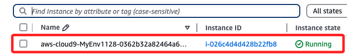
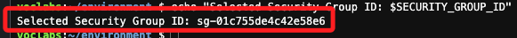

# Cloud 9

_使用 `90628` 的 `Learner Lab`_

<br>

## 步驟

1. 搜尋並進入服務 `Cloud 9`。

    

<br>

2. 點擊 `Create Environment`。

    

<br>

3. 任意命名如 `_MyEnv1128_`。

    

<br>

4. `Network settings` 切換到 `SSH`。

    

<br>

5. 其餘皆使用預設，點擊右下角 `Create`。

    

<br>

6. 等待完成變為綠色時，點擊 `Open`。

    

<br>

## 觀察

_進入 EC2_

<br>

1. 設定完成時只有一個與環境 `test1128` 同名的 EC2，前綴是 `aws-cloud9`，尾綴是隨機的唯一識別碼。

    

<br>

## 查詢

_進入 Cloud 9，使用 AWS CLI 進行查詢_

<br>

1. 查詢所有的實例，並僅顯示 ID。

    ```bash
    aws ec2 describe-instances --query 'Reservations[*].Instances[*].InstanceId'
    ```

    

<br>

2. 可使用進階的篩選來顯示查詢結果，例如顯示 ID 及 名稱。

    ```bash
    aws ec2 describe-instances --query "Reservations[*].Instances[*].[InstanceId, Tags[?Key=='Name'].Value | [0]]" --output text
    ```

    

<br>

3. 查詢可用的 AMI；因為結果很多個，這會導致 Cloud 9 的終端機崩潰，所以添加限制，`cat` 用於處理輸出，並讓結果不會進入交互式界面，避免停留在 `END` 標記並自動回到命令行。

    ```bash
    aws ec2 describe-images --owners amazon --query "Images[:2]" --output json | cat
    ```

    

<br>

4. 篩選最新的 Amazon Linux AMI 並輸出查看，結果會被存入變數 `LATEST_AMI_ID` 中，這可用於後續的指令。

    ```bash
    LATEST_AMI_ID=$(aws ec2 describe-images \
        --owners amazon \
        --filters "Name=name,Values=amzn2-ami-kernel-*-hvm-*-x86_64-gp2" \
                "Name=state,Values=available" \
        --query "Images | sort_by(@, &CreationDate)[-1].ImageId" \
        --output text) \

    echo $LATEST_AMI_ID
    ```

    

<br>

5. 查詢 `security-group-ids` 並選擇第一個。

    ```bash
    SUBNET_IDS=$(aws ec2 describe-subnets \
        --query "Subnets[:2].SubnetId" \
        --output text)

    SUBNET_ID_1=$(echo $SUBNET_IDS | awk '{print $1}')
    SUBNET_ID_2=$(echo $SUBNET_IDS | awk '{print $2}')

    echo "Selected Subnet ID 1: $SUBNET_ID_1"
    echo "Selected Subnet ID 2: $SUBNET_ID_2"
    ```

    

<br>

6. 查詢 `subnet-ids` 並選擇前兩個。

    ```bash
    SUBNET_IDS=$(aws ec2 describe-subnets \
        --query "Subnets[0:2].SubnetId" \
        --output text)

    if [ -z "$SUBNET_IDS" ]; then
        echo "No Subnets found or query failed."
        exit 1
    fi

    SUBNET_ID_1=$(echo $SUBNET_IDS | awk '{print $1}')
    SUBNET_ID_2=$(echo $SUBNET_IDS | awk '{print $2}')

    echo "Selected Subnet ID 1: $SUBNET_ID_1"
    echo "Selected Subnet ID 2: $SUBNET_ID_2"
    ```

<br>

## 指令

_以下使用 AWS CLI 建立、停止和終止 EC2_

<br>

1. 建立新的 Key Pair，任意命名如 `MyKeyPair`。

    ```bash
    aws ec2 create-key-pair \
        --key-name MyKeyPair \
        --query "KeyMaterial" \
        --output text > MyKeyPair.pem
    ```

<br>

2. 查詢當前 Key Pair。

    ```bash
    aws ec2 describe-key-pairs --output table
    ```

    

<br>

3. 建立 EC2 實例，其中 `image-id` 為 AMI ID

    ```bash
    INSTANCE_ID=$(aws ec2 run-instances \
        --image-id $LATEST_AMI_ID \
        --count 1 \
        --instance-type t2.micro \
        --key-name MyKeyPair \
        --security-group-ids $SECURITY_GROUP_ID \
        --subnet-id $SUBNET_ID_1 \
        --tag-specifications 'ResourceType=instance,Tags=[{Key=Name,Value=MyInstance}]' \
        --query "Instances[0].InstanceId" \
        --output text)

    if [ $? -eq 0 ]; then
        echo "EC2 instance created successfully. Instance ID: $INSTANCE_ID"
    else
        echo "Error: EC2 instance creation failed."
        exit 1
    fi
    ```

<br>

4. 停止 EC2 實例

    ```bash
    aws ec2 stop-instances \
        --instance-ids $INSTANCE_ID
    ```

<br>

5. 終止 EC2 實例

    ```bash
    aws ec2 terminate-instances \
        --instance-ids $INSTANCE_ID
    ```

<br>

___

_END_