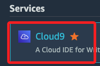
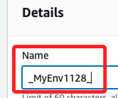
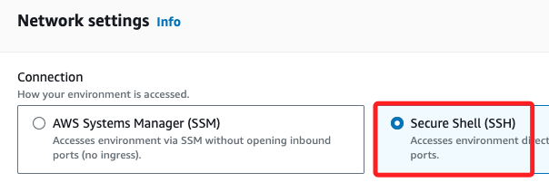
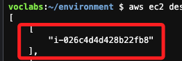
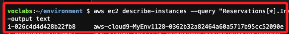
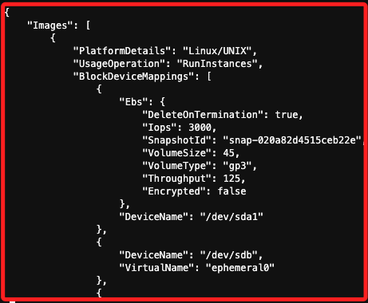
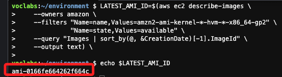

# Cloud 9

_使用 `90628` 的 `Learner Lab`_

<br>

## 步驟

1. 搜尋並進入服務 `Cloud 9`。

    

<br>

2. 點擊 `Create Environment`。

    

<br>

3. 任意命名如 `_MyEnv1128_`。

    

<br>

4. `Network settings` 切換到 `SSH`。

    

<br>

5. 其餘皆使用預設，點擊右下角 `Create`。

    

<br>

6. 等待完成變為綠色時，點擊 `Open`。

    

<br>

## 觀察

_進入 EC2_

<br>

1. 設定完成時只有一個與環境 `test1128` 同名的 EC2，前綴是 `aws-cloud9`，尾綴是隨機的唯一識別碼。

    

<br>

## 查詢

_進入 Cloud 9，使用 AWS CLI 進行查詢_

<br>

1. 查詢所有的實例，並僅顯示 ID。

    ```bash
    aws ec2 describe-instances --query 'Reservations[*].Instances[*].InstanceId'
    ```

    

<br>

2. 可使用進階的篩選來顯示查詢結果，例如顯示 ID 及 名稱。

    ```bash
    aws ec2 describe-instances --query "Reservations[*].Instances[*].[InstanceId, Tags[?Key=='Name'].Value | [0]]" --output text
    ```

    

<br>

3. 查詢可用的 AMI；因為結果很多個，這會導致 Cloud 9 的終端機崩潰，所以添加限制，`cat` 用於處理輸出，並讓結果不會進入交互式界面，避免停留在 `END` 標記並自動回到命令行。

    ```bash
    aws ec2 describe-images --owners amazon --query "Images[:2]" --output json | cat
    ```

    

<br>

4. 篩選最新的 Amazon Linux AMI 並輸出查看，結果會被存入變數 `LATEST_AMI_ID` 中，這可用於後續的指令。

    ```bash
    LATEST_AMI_ID=$(aws ec2 describe-images \
        --owners amazon \
        --filters "Name=name,Values=amzn2-ami-kernel-*-hvm-*-x86_64-gp2" \
                "Name=state,Values=available" \
        --query "Images | sort_by(@, &CreationDate)[-1].ImageId" \
        --output text) \

    echo $LATEST_AMI_ID
    ```

    

<br>

5. 查詢 `security-group-ids` 並選擇第一個。

    ```bash
    SECURITY_GROUP_ID=$(aws ec2 describe-security-groups \
        --query "SecurityGroups[0].GroupId" \
        --output text)

    echo "Selected Security Group ID: $SECURITY_GROUP_ID"
    ```

    

<br>

6. 查詢 `subnet-ids` 並選擇前兩個。

    ```bash
    SUBNET_IDS=$(aws ec2 describe-subnets \
        --query "Subnets[0:2].SubnetId" \
        --output text)

    if [ -z "$SUBNET_IDS" ]; then
        echo "No Subnets found or query failed."
        exit 1
    fi

    SUBNET_ID_1=$(echo $SUBNET_IDS | awk '{print $1}')
    SUBNET_ID_2=$(echo $SUBNET_IDS | awk '{print $2}')

    echo "Selected Subnet ID 1: $SUBNET_ID_1"
    echo "Selected Subnet ID 2: $SUBNET_ID_2"
    ```

    

<br>

## 指令

_以下使用 AWS CLI 建立、停止和終止 EC2_

<br>

1. 建立新的 Key Pair，任意命名如 `MyKeyPair`。

    ```bash
    aws ec2 create-key-pair \
        --key-name MyKeyPair \
        --query "KeyMaterial" \
        --output text > MyKeyPair.pem
    ```

<br>

2. 查詢當前 Key Pair。

    ```bash
    aws ec2 describe-key-pairs --output table
    ```

    

<br>

3. 建立 EC2 實例，其中 `image-id` 為 AMI ID

    ```bash
    INSTANCE_ID=$(aws ec2 run-instances \
        --image-id $LATEST_AMI_ID \
        --count 1 \
        --instance-type t2.micro \
        --key-name MyKeyPair \
        --security-group-ids $SECURITY_GROUP_ID \
        --subnet-id $SUBNET_ID_1 \
        --tag-specifications 'ResourceType=instance,Tags=[{Key=Name,Value=MyInstance}]' \
        --query "Instances[0].InstanceId" \
        --output text)

    if [ $? -eq 0 ]; then
        echo "EC2 instance created successfully. Instance ID: $INSTANCE_ID"
    else
        echo "Error: EC2 instance creation failed."
        exit 1
    fi
    ```

    

<br>

4. 查詢當前指定狀態如 `Running` 的實例。  

    ```bash
    aws ec2 describe-instances \
        --query "Reservations[*].Instances[?State.Name=='running'].[InstanceId, Tags[?Key=='Name'].Value | [0]]" \
        --output text
    ```

    

<br>

5. 停止 EC2 實例。

    ```bash
    aws ec2 stop-instances \
        --instance-ids $INSTANCE_ID
    ```

    

<br>

6. 終止 EC2 實例。

    ```bash
    aws ec2 terminate-instances \
        --instance-ids $INSTANCE_ID
    ```

    

<br>

7. 回到主控台，會看到僅剩下 `Cloud 9` 的實例。

    

<br>

## 刪除所有資源

_在本地的終端機中運行_

<br>

1. 複製 AWS Details，開啟本地新的終端機，並將憑證直接複製貼上。

    

<br>

2. 接著貼上以下指令，用於將憑證轉換為環境變數。

    ```bash
    export AWS_ACCESS_KEY_ID=$aws_access_key_id
    export AWS_SECRET_ACCESS_KEY=$aws_secret_access_key
    export AWS_SESSION_TOKEN=$aws_session_token
    ```

<br>

3. 確認使用者資訊，務必確實核對輸出是否與主控台顯示的相同。

    ```bash
    aws sts get-caller-identity
    ```

<br>

4. 先列出所有 Cloud9 環境，以確認需要刪除的資源。

    ```bash
    aws cloud9 list-environments --output table
    ```

<br>

5. 刪除 Cloud9 環境，這會自動終止與該環境相關聯的 EC2 實例。

    ```bash
    for ENV_ID in $(aws cloud9 list-environments --query "environmentIds[]" --output text); do
        echo "Deleting Cloud9 environment: $ENV_ID"
        aws cloud9 delete-environment --environment-id $ENV_ID
    done
    ```

<br>

6. 假如要手動刪除所有與 Cloud9 相關的 EC2 實例，可透過 Cloud9 實例 `aws-cloud9` 前綴進行篩選。

    ```bash
    for INSTANCE_ID in $(aws ec2 describe-instances \
        --filters "Name=tag:aws:cloud9" "Name=instance-state-name,Values=running,stopped" \
        --query "Reservations[*].Instances[*].InstanceId" --output text); do
        echo "Terminating EC2 instance: $INSTANCE_ID"
        aws ec2 terminate-instances --instance-ids $INSTANCE_ID
    done
    ```

<br>

7. 刪除全部的 Key Pair，並保留預設的 `vockey`。

    ```bash
    for KEY_NAME in $(aws ec2 describe-key-pairs --query "KeyPairs[*].KeyName" --output text); do
        if [ "$KEY_NAME" != "vockey" ]; then
            echo "Deleting Key Pair: $KEY_NAME"
            aws ec2 delete-key-pair --key-name $KEY_NAME
        else
            echo "Skipping Key Pair: $KEY_NAME"
        fi
    done
    ```

<br>

___


_END_