# Task02：建立額外的子網

_當前已有 `公共子網`、`私有子網` 各一個_

 

## 建立第二個公共子網

1. 點擊左側欄中的 `Subnets`。

    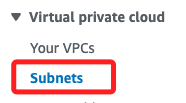

 

2. 點擊 `Cretae subnet` 建立第二個公共子網。

    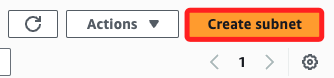

 

3. VPC ID 選擇前面步驟建立的 `lab-vpc`。

    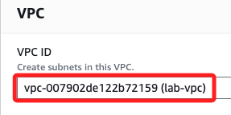

 

4. 命名 `lab-subnet-public2`，AZ 設定為 `us-east-1b`；`IPv4 subnet CIDR block` 需要手動輸入為 `10.0.2.0/24`。

    

 

5. 完成後點擊右下角 `Create subnet`。

    

 

## 建立第二個私有子網

1. 同樣點擊 `Create subnet`，這是要建立第二個私有子網。

    

 

2. 在 VPC ID 選擇 `lab-vpc`。

    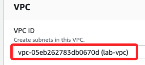

 

3. 命名為 `lab-subnet-private2`、可用區 `us-east-1b`、

    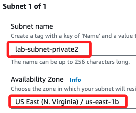

 

4. 在 `IPv4 subnet CIDR block` 下方手動輸入設定為 `10.0.3.0/24`；接著點擊右下方 `Create subnet`。

    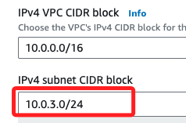

 

5. 完成後會顯示在最下方。 

    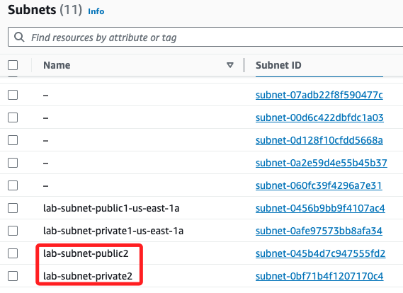

 

## 更新路由表

1. 點擊左側的 `Route tables`，然後點擊 `刷新`，就會看到新增的路由表；切記，一定要點擊 `刷新`。

    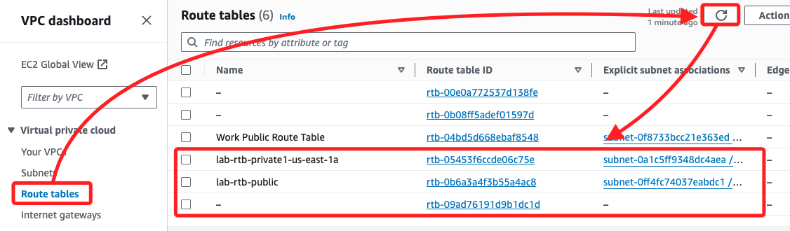

 

2. 勾選 `lab-rtb-private1-us-east-1a` 路由表，展開 `Actions`，點擊其中的 `Edit subnet associations`。

    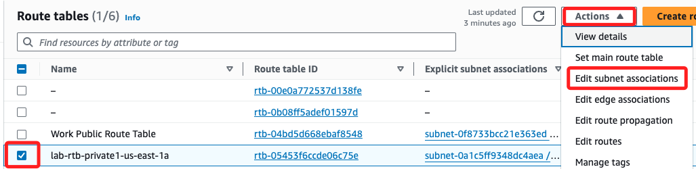

 

3. 或在下方切換頁籤到 `Subnet associations` 然後分別點擊 `Edit subnet associations`。

    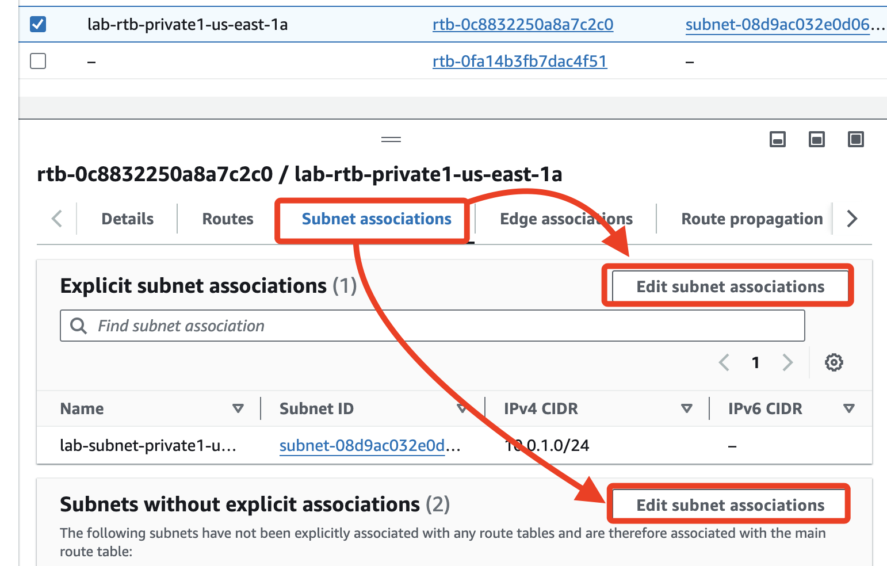

 

4. 無論使用哪一種方式進入設定頁面，接著要勾選新建的私有子網 (`lab-subnet-private2`) ，這時下方會顯示兩個 subnets 被選取；點擊右下角 `Save associations` 便可建立與此路由表的關聯。

    

 

5. 完成後會顯示 `2 subnets`。

    

 

## 再次更新路由表

_比照之前步驟_

 

1. 接著對 `lab-rtb-public` 路由表編輯子網關聯。

    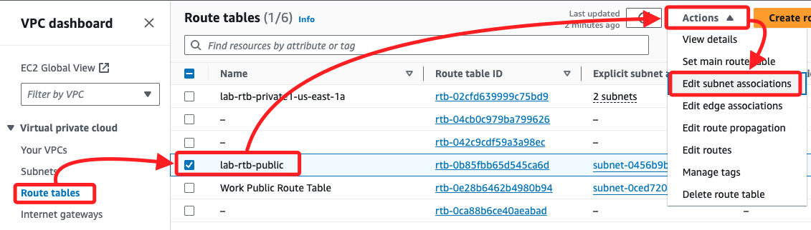

 

2. 勾選新建的公共子網 (`lab-subnet-public2`) 與此路由表關聯，然後點擊右下角 `Save assocciations`。

    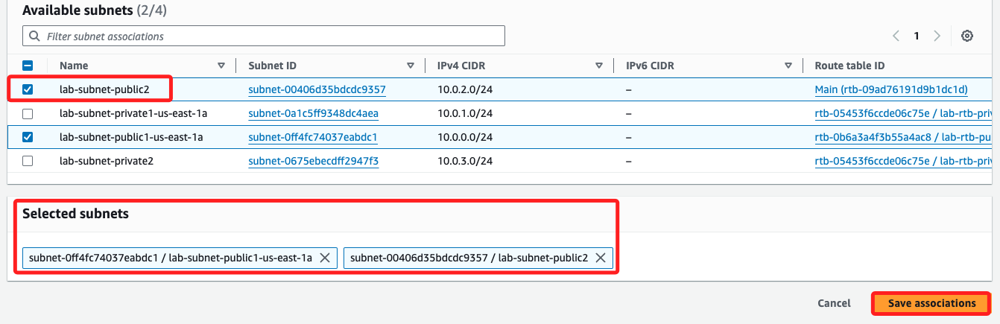

 

3. 完成後，可看到在路由表清單中，這兩個路由都有兩個子網。

    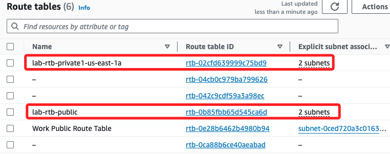

 

___

_END_