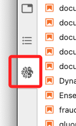
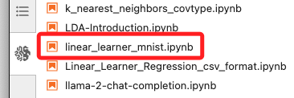
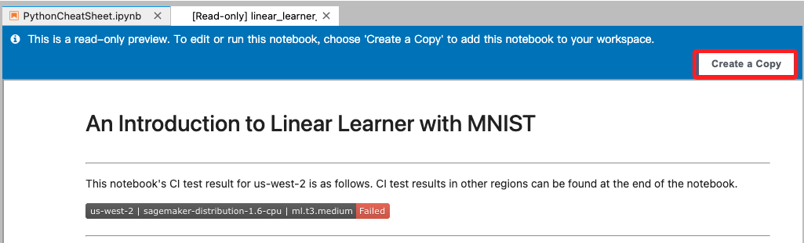
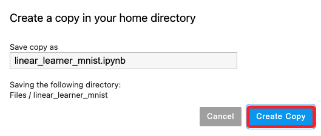
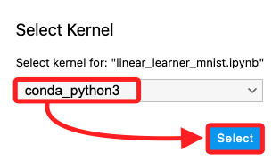
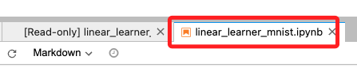
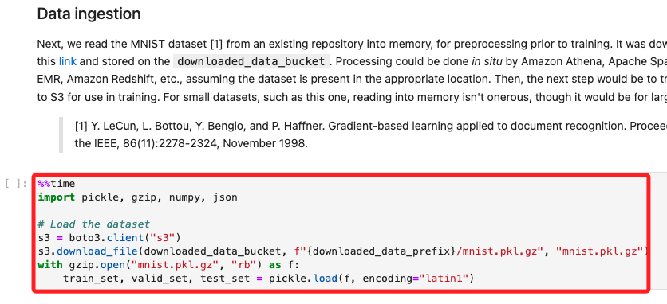
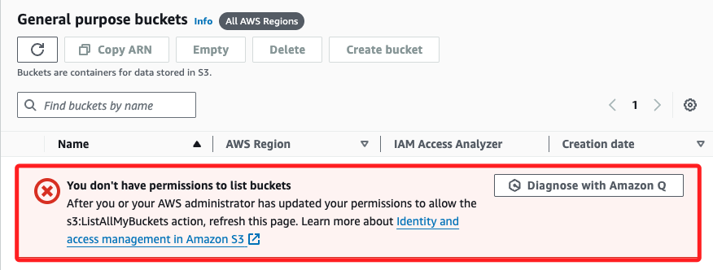

# 操作官方範例

 

## 步驟

1. 在左側欄中切換到 `Amazon SageMaker Samples`；這是預設功能選單中最下方一個。

    

 

2. 找到 `linear_learner_mnist.ipynb` 腳本並點擊開啟。

    

 

3. 點擊右側 `Create a Copy`。

    

 

4. 在彈窗中再次點擊 `Create Copy`。

    

 

5. 使用預設的 `conda_python3`，然後點擊 `Select`。

    

 

6. 然後就會建立新的同名頁籤，原本的腳本則是備註 `Read-only` 的。

    

 

## 特別注意

1. 雖然可查看筆記本的內容，但由於 Lab 中未設置 `S3 Bucket`，無法運行該筆記本的代碼。

    

 

2. 可進入 S3 查看，顯示無權限。

    

 

___

_END_