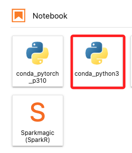
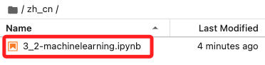

# Task 2：在筆記本實例中開啟筆記本

 

## 步驟

1. 選擇 `conda_python3`。

    

 

2. 選擇合適的語系，這裡進入 `zh_cn` 簡中。

    

 

3. 進入後會有一個腳本 `3_2-machinelearning.jpynb`。

    

 

4. 雙擊可開啟文件，預設會使用核心 `conda_python3`，若要切換可點擊核心進行選擇；接下來依照腳本指引操作即可。

    

 

___

_END_