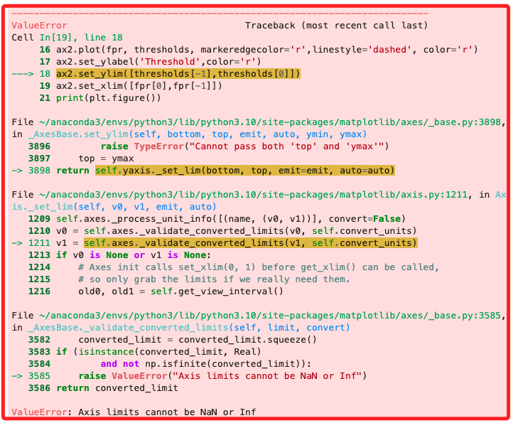

# 腳本說明

_僅先修正腳本中的錯誤_

## 錯誤説明

1. 在以下代碼區塊運行後會出現錯誤。

```python
fpr, tpr, thresholds = roc_curve(test_labels, target_predicted)
roc_auc = auc(fpr, tpr)

plt.figure()
plt.plot(fpr, tpr, label='ROC curve (area = %0.2f)' % (roc_auc))
plt.plot([0, 1], [0, 1], 'k--')
plt.xlim([0.0, 1.0])
plt.ylim([0.0, 1.05])
plt.xlabel('False Positive Rate')
plt.ylabel('True Positive Rate')
plt.title('Receiver operating characteristic')
plt.legend(loc="lower right")

# create the axis of thresholds (scores)
ax2 = plt.gca().twinx()
ax2.plot(fpr, thresholds, markeredgecolor='r',linestyle='dashed', color='r')
ax2.set_ylabel('Threshold',color='r')
ax2.set_ylim([thresholds[-1],thresholds[0]])
ax2.set_xlim([fpr[0],fpr[-1]])

print(plt.figure())
```



2. 原因是 `thresholds` 陣列中可能包含了 `NaN` 或 `Inf` 的值，而 `set_ylim()` 無法使用這些值作為軸的範圍。


## 錯誤排除

1. 為了解決此問題，可以在設置 `y 軸` 範圍之前，先檢查 `thresholds` 陣列中的值，確保它們是有效的數值。

```python
import numpy as np

fpr, tpr, thresholds = roc_curve(test_labels, target_predicted)
roc_auc = auc(fpr, tpr)

plt.figure()
plt.plot(fpr, tpr, label='ROC curve (area = %0.2f)' % roc_auc)
plt.plot([0, 1], [0, 1], 'k--')
plt.xlim([0.0, 1.0])
plt.ylim([0.0, 1.05])
plt.xlabel('False Positive Rate')
plt.ylabel('True Positive Rate')
plt.title('Receiver operating characteristic')
plt.legend(loc="lower right")

ax2 = plt.gca().twinx()
ax2.plot(fpr, thresholds, markeredgecolor='r', linestyle='dashed', color='r')
ax2.set_ylabel('Threshold', color='r')

# 過濾掉 NaN 和 Inf
valid_thresholds = thresholds[np.isfinite(thresholds)]

# 確認 valid_thresholds 是非空的，且至少有一個有效值
if len(valid_thresholds) > 0:
    ax2.set_ylim([valid_thresholds[-1], valid_thresholds[0]])
else:
    print("警告：沒有有效的閾值範圍")

ax2.set_xlim([fpr[0], fpr[-1]])
plt.show()
```