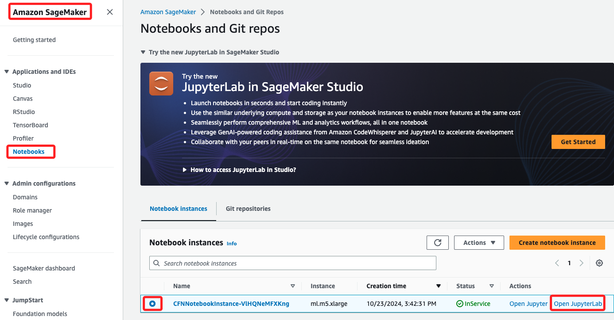
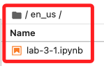

# Lab 3.1：從網頁和圖像中提取文本

_基本步驟與 `Lab 2.1` 相同，不再贅述_

 

## 基本步驟

1. 進入 `SageMaker`，左側切換到 `Notebooks` 頁籤，選取 Lab 準備好的 `CFNNotebookInstance-VlHQNeMFXKng` 實例，等候啟動後點擊 `Open JupyterLab.` 開啟。

    

 

2. 進入後按預設點擊開啟 `en_us/lab-3-1.ipynb` 腳本。

    

 

___

_END_