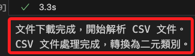
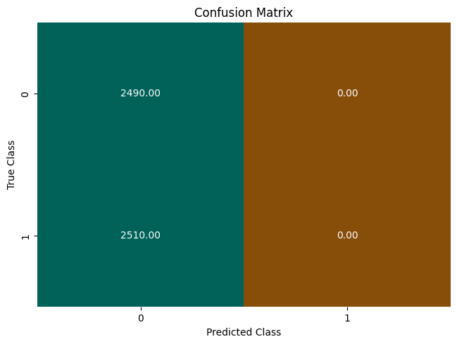
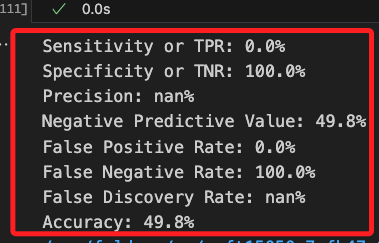

# 查看轉換結果

_回到官方範例繼續_

<br>

## 下載資料

1. 從 S3 取得批次轉換輸出的 CSV 文件，並將其中的預測值轉換為二元分類結果，這是一個二元分類結果的 `Series`。

    ```python
    import boto3
    import io
    import pandas as pd

    # 初始化 S3 客戶端
    s3 = boto3.client('s3')

    try:
        # 下載 CSV 文件
        obj = s3.get_object(
            Bucket=bucket,
            Key=f'{prefix}/batch-in.csv'
        )
        
        # 提示下載完成
        print("文件下載完成，開始解析 CSV 文件。")

        # 讀取 CSV 文件並轉為 DataFrame
        target_predicted = pd.read_csv(
            io.BytesIO(obj['Body'].read()), sep=',',
            names=['class']
        )

        # 定義二元轉換函數
        def binary_convert(x):
            threshold = 0.5
            return 1 if x > threshold else 0

        # 應用轉換
        target_predicted_binary = target_predicted['class'].apply(binary_convert)
        
        # 提示處理完成
        print("CSV 文件處理完成，轉換為二元類別。")

    except s3.exceptions.NoSuchKey:
        print("錯誤：指定的文件不存在，請確認 S3 路徑是否正確。")
    except Exception as e:
        print(f"發生錯誤：{e}")
    ```

    

<br>

2. 建立混淆矩陣；雖然產生混淆矩陣，但分類結果有嚴重偏差，暫時先不處理。

    ```python
    plot_confusion_matrix(test['label'], target_predicted_binary)
    ```

    

<br>

3. 評估指標顯示了模型的分類性能，從結果來看，模型的表現非常不理想；`True Positive Rate` 也稱為 `Sensitivity`，數據 `0.0%`表示模型對正類別（1）的敏感性為 0%，也就是說完全無法檢測出真實標籤為 `1` 的樣本，這是因為模型將所有樣本都錯誤地預測為 `0`，導致完全沒有檢測到任何 `真陽性`；`True Negative Rate` 也稱為 `Specificity`，數值 `100.0%`，這反應與 `TPR` 反向的資訊，暫時不予說明；`Precision (精確率)` 為 `nan%`，表示模型沒有任何 `正類別` 的預測；`Negative Predictive Value` 為 `49.8%`，這是指在所有被預測為負類別的樣本中，有多少是真實為負類別的樣本，此處的 `49.8%` 說明模型對負類別的預測準確度還不足 `50%`；`False Positive Rate` 為 `0.0%` 表示沒有任何真實為 `0` 的樣本被錯誤分類為 `1`，這與 `模型將所有樣本預測為 0` 一致，因此 `FPR` 為 `0`；`False Negative Rate` 為 `100.0%`，這表明模型錯誤地將所有實際為 `1` 的樣本都預測為 `0`；`False Discovery Rate` 為 `nan%`，`Accuracy (準確率)` 為 `49.8%`；這裡因為模型有誤，所以數值其實並無意義，先大概提一下。

    ```python
    print_metrics(test['label'], target_predicted_binary)
    ```

    

<br>

___

_END_